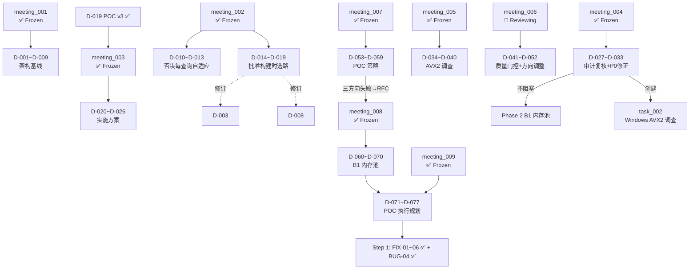

# Int32 查找算法项目

## 核心文档

| 文档 | 路径 | 状态 | 说明 |
|------|------|------|------|
| 📌 总需求文档 | `docs/requirements/总需求文档.md` | ✅ Frozen | 需求基线（Q1-Q3已确认，三轮POC完成，meeting_003方案确定） |
| 📌 技术路线文档 | `docs/architecture/技术路线.md` | ✅ Frozen | 技术选型：排序数组 + A+B1双路径 + 三阶段交付 |

## 归档文档

| 文档 | 归档路径 | 来源 | 归档日期 | 类型 |
|------|----------|------|----------|------|
| 验收检查 — Phase 1 MVP | [decisions/phase1_mvp_acceptance.md](decisions/phase1_mvp_acceptance.md) | task_001 | 2026-05-29 | acceptance |
| 项目总结 — Phase 1 MVP | [decisions/phase1_mvp_final.md](decisions/phase1_mvp_final.md) | task_001 | 2026-05-29 | final-report |
| 系统设计 — Phase 1.5 COW | [architecture/design_phase15_cow.md](architecture/design_phase15_cow.md) | task_002 | 2026-06-01 | design |
| 验收报告 — Phase 1.5 COW | [decisions/phase15_cow_acceptance.md](decisions/phase15_cow_acceptance.md) | task_002 | 2026-06-01 | acceptance |
| 系统设计 — Phase 2 A+B1 | [architecture/design_phase2_ab1.md](architecture/design_phase2_ab1.md) | task_003 | 2026-06-01 | design |
| 验收报告 — Phase 2 A+B1 | [decisions/phase2_ab1_acceptance.md](decisions/phase2_ab1_acceptance.md) | task_003 | 2026-06-01 | acceptance |
| POC 结果 — Int64 + Bloom Go/No-Go | [decisions/poc_int64_report.md](decisions/poc_int64_report.md) | meeting_014 | 2026-06-02 | go-nogo report |
| 系统设计 — Int64 Phase 2 COW | [architecture/design_int64_phase2_cow.md](architecture/design_int64_phase2_cow.md) | task_006 | 2026-06-08 | design |
| 验收报告 — Int64 Phase 2 COW Linux CI | [decisions/int64_phase2_cow_linux_ci_acceptance.md](decisions/int64_phase2_cow_linux_ci_acceptance.md) | task_006 | 2026-06-08 | acceptance |

## 会议记录

| 会议 | 日期 | 状态 | 决议摘要 |
|------|------|------|----------|
| [meeting_001](meetings/meeting_index/meeting_001_feasibility_review/meeting_README.md) | 2026-05-27 | ✅ Frozen | AVX2 SIMD 二分 5.1x；D-003/008/009 被 meeting_002 修订 |
| [meeting_002](meetings/meeting_index/meeting_002_adaptive_strategy_review/meeting_README.md) | 2026-05-27 | ✅ Frozen | 否决每查询自适应(D-010~D-013)；批准构建时一次性选路 A+B1 双路径(D-014~D-019) |
| [meeting_003](meetings/meeting_index/meeting_003_implementation_planning/meeting_README.md) | 2026-05-27 | ✅ Frozen | 四层模块架构(D-020)；单仓库三目标(D-022)；三阶段交付(D-023)；MVP=Path A(D-024)；安全左移(D-025) |
| [meeting_004](meetings/meeting_index/meeting_004_phase1_audit_review/meeting_README.md) | 2026-05-29 | ✅ Frozen | 审计复核 + Windows 异常调查。7/7 决议通过(D-027~D-033)。P0 文档修正已执行。Phase 2 不延期 |
| [meeting_005](meetings/meeting_index/meeting_005_windows_avx2_investigation_review/meeting_README.md) | 2026-05-29 | ✅ Frozen | AVX2 调查结果审查。7/7 全票。D-034~D-040。12/12 TODO + 4/4 SEC 全部关闭 ✅ |
| [meeting_006](meetings/meeting_index/meeting_006_wave4_linux_verification_review/meeting_README.md) | 2026-05-30 | ✅ Frozen | 第四波 Linux 验证评审。9/9 全票。D-041~D-052。质量门控通过；AVX2 方向调整；10M 阈值实质禁用 |
| [meeting_007](meetings/meeting_index/meeting_007_poc_strategy/meeting_README.md) | 2026-05-30 | ✅ Frozen | POC 策略讨论。7/7 全票。D-053~D-059。三方向全未达标 → 触发 RFC |
| [meeting_008](meetings/meeting_index/meeting_008_b1_memory_pool/meeting_README.md) | 2026-05-30 | ✅ Frozen | B1 内存池方案。5/5 全票。D-060~D-070。P0 先修 3 bug |
| [meeting_009](meetings/meeting_index/meeting_009_poc_execution_plan/meeting_README.md) | 2026-05-30 | ✅ Frozen | POC 执行规划。4/4 全票。D-071~D-077。Step 1 FIX-01~08 全部完成 ✅ |
| [meeting_010](meetings/meeting_index/meeting_010_crossover_results_review/meeting_README.md) | 2026-06-01 | ✅ Frozen | meeting_009 POC 执行结果评审。4/4 通过。D-078~D-084。阈值 150→2000。行动项 15/15 ✅ |
| [meeting_011](meetings/meeting_index/meeting_011_phase2_audit_review/meeting_README.md) | 2026-06-01 | ✅ Frozen | Phase 2 审计完成评审。条件通过（4⚠️+1✅）。D-085~D-089。P1 (C1+C2) ✅ Phase 3 可启动。10 项行动 2/10 完成 |

## 任务树

```
docs/tasks/
├── task_001_phase1_mvp/                     ← 顶层任务（Phase 1 MVP: Path A）✅ Freeze
│   ├── task_README.md                        — 📊 仪表盘（13/13 ✅, Phase 2 可启动）
│   ├── ALIGNMENT_task_001_phase1_mvp.md      — ✅ Frozen  需求理解确认
│   ├── CONSENSUS_task_001_phase1_mvp.md      — ✅ Frozen  最终共识
│   ├── DESIGN_task_001_phase1_mvp.md         — ✅ Frozen  系统架构（D-02/D-03 已修复）
│   ├── INVESTIGATION_windows_avx2_task_001_phase1_mvp.md — ✅ Frozen  Windows AVX2 异常调查
│   ├── TASK_task_001_phase1_mvp.md           — ✅ Frozen  原子任务拆分
│   ├── ACCEPTANCE_task_001_phase1_mvp.md     — ⛔ Archived  验收检查
│   ├── FINAL_task_001_phase1_mvp.md          — ✅ Frozen  项目总结
│   ├── TODO_task_001_phase1_mvp.md           — ✅ Frozen  待办清单（15 项）
│   ├── FIXPLAN_task_001_phase1_mvp.md        — ✅ Frozen  五波 25 项修复计划（第一~四波 ✅）
│   ├── ACCEPTANCE_FIXPLAN_wave1_task_001_phase1_mvp.md — ✅ Frozen  wave1 验收
│   ├── VERIFY_wave4_linux_task_001_phase1_mvp.md — ✅ Frozen  Linux 验证报告
│   ├── ASSESSMENT_cpu_supports_false_positive_task_001_phase1_mvp.md — ✅ Frozen  风险评估
│   └── FIXREPORT_meeting009_step1_task_001_phase1_mvp.md — ✅ Frozen  meeting_009 Step 1 修复报告
│
└── task_002_phase15_cow/                    ← 子任务（Phase 1.5: Path A COW）✅ Freeze
    ├── task_README.md                        — 📊 仪表盘（7/7 ✅, Phase 2 可启动）
    ├── ALIGNMENT_task_002_phase15_cow.md     — ✅ Frozen  需求对齐
    ├── CONSENSUS_task_002_phase15_cow.md     — ✅ Frozen  最终共识
    ├── DESIGN_task_002_phase15_cow.md        — ⛔ Archived  系统设计
    ├── TASK_task_002_phase15_cow.md          — ✅ Frozen  原子任务拆分
    └── ACCEPTANCE_task_002_phase15_cow.md    — ⛔ Archived  验收报告

└── task_003_phase2_ab1/                     ← 子任务（Phase 2: A+B1 双路径）✅ Freeze
    ├── task_README.md                        — 📊 仪表盘（11/11 ✅, v1.0.0）
    ├── ALIGNMENT_task_003_phase2_ab1.md      — ✅ Frozen  需求对齐
    ├── CONSENSUS_task_003_phase2_ab1.md      — ✅ Frozen  最终共识
    ├── DESIGN_task_003_phase2_ab1.md         — ⛔ Archived  系统设计
    └── TASK_task_003_phase2_ab1.md           — ✅ Frozen  原子任务拆分

├── task_004_phase3_v1_1/                    ← 子任务（Phase 3: v1.1 扩展）✅ Freeze
│   ├── task_README.md                        — 📊 仪表盘（✅ Freeze）
│   ├── ALIGNMENT_task_004_phase3_v1_1.md     — ✅ Frozen  需求对齐
│   ├── CONSENSUS_task_004_phase3_v1_1.md     — ✅ Frozen  最终共识
│   ├── DESIGN_task_004_phase3_v1_1.md        — ✅ Frozen  系统设计
│   ├── TASK_task_004_phase3_v1_1.md          — ✅ Frozen  原子任务拆分
│   ├── ACCEPTANCE_task_004_phase3_v1_1.md    — ✅ Frozen  验收检查
│   ├── FINAL_task_004_phase3_v1_1.md         — ✅ Frozen  项目总结
│   └── TODO_task_004_phase3_v1_1.md          — ✅ Frozen  待办清单
│
├── task_005_int64_extension/                ← 子任务（Int64 B1 扩展 Phase 1）✅ Freeze
│   ├── task_README.md                        — 📊 仪表盘（✅ SUCCESS）
│   ├── ALIGNMENT_int64_b1.md                 — ✅ Frozen  需求对齐
│   ├── CONSENSUS_int64_b1.md                 — ✅ Frozen  最终共识
│   ├── DESIGN_int64_b1.md                    — ⛔ Archived  系统设计
│   ├── TASK_int64_b1.md                      — ✅ Frozen  原子任务拆分
│   ├── ACCEPTANCE_int64_b1.md                — ✅ Frozen  验收检查
│   ├── FINAL_int64_b1.md                     — ✅ Frozen  项目总结
│   └── TODO_int64_b1.md                      — ✅ Frozen  待办清单
│
└── task_006_int64_phase2_cow/               ← 子任务（Int64 Phase 2: COW 多线程）✅ Freeze
    ├── task_README.md                        — 📊 仪表盘（11/11 ✅, v0.2.0）
    ├── ALIGNMENT_task_006_int64_phase2_cow.md — ✅ Frozen  需求对齐
    ├── DESIGN_task_006_int64_phase2_cow.md    — ⛔ Archived  系统设计
    ├── TASK_task_006_int64_phase2_cow.md      — ✅ Frozen  原子任务拆分
    ├── ACCEPTANCE_T1~T8 (x7)                  — ✅ Frozen  逐任务验收
    └── ACCEPTANCE_V1_V2_V3_linux_ci.md        — ⛔ Archived  端到端验证报告

状态统计: ✅ Frozen x34 | ⛔ Archived x6

三阶段交付（meeting_003 D-023，2026-05-27 修订：拆分为四阶段）：
  ├── ✅ Phase 1 MVP：AVX2 SIMD 二分（Path A 单路径）— 已交付，meeting_004 P0 修正完成
  ├── ✅ Phase 1.5 v0.2：多线程 — Path A COW（原子指针交换 + rebuild）— 已交付，7/7 ✅
  ├── ✅ Phase 2 v1.0：A+B1 双路径 + B1 COW + 自动选路 — 已交付，11/11 ✅，版本 1.0.0
  ├── ✅ Phase 3 v1.1：扩展（Bloom/Windows/find_range）— 已交付 ✅
  ├── ✅ Int64 Phase 1：Int64 B1 基本实现 — 已交付，task_005 ✅
  ├── ✅ Int64 Phase 2 (v0.2.0)：Int64 COW 多线程 + Bloom 重建 — 已交付，11/11 ✅，TSan 零告警
  └── ⏳ 未来：AVX-512 扩展（待 POC 验证）
```

## 技术方案全貌（最终确定）

```
Int32 查找算法
├── create() 构建阶段
│   ├── 排序数据
│   ├── 构建 high16 dir（临时，262KB）+ 一致性校验
│   ├── 分布分析：max_sz > 0.1×n ? max_bucket ≤ 150 ?
│   ├── → PATH_B1: 构建 lo16 数组（+50% 内存），保留 dir
│   └── → PATH_A:  释放 dir，仅保留 vals（40MB / 10M）
│
├── search() 查询阶段（零开销 dispatch）
│   ├── PATH_B1: high16 dir O(1) → lo16 SIMD 等值扫描
│   │   └── 性能：1M=75 cy（2.1x），1.6M crossover≈135 cy
│   └── PATH_A:  AVX2 8 路块状二分
│       └── 性能：5M=146 cy, 10M=172 cy（3.5x-5.1x vs 标量）
│
├── 性能速览
│   ├── 1M ~ 1.6M uniform:  B1 0.89x-2.1x vs A
│   ├── 1.6M ~ 10M uniform: A 1.18x-5.1x vs 标量
│   └── Skewed / 倾斜:      A 自动回退（max_sz > 0.1×n）
│
├── D-015 分布决策规则（POC v3 实测校准）
│   │   IF dir 一致性校验失败 → PATH_A
│   │   IF max_sz > 0.1 × n   → PATH_A  （倾斜检测）
│   │   IF max_bucket ≤ 2000   → PATH_B1 （小桶，B1 实测胜）
│   │   ELSE                  → PATH_A
│
└── 舍弃（两轮POC + 三轮会议证伪）
    ├── 有序链表（→ D-001）
    ├── 锚点索引 / 无条件 lo16 / 无条件 high16 dir
    ├── 每查询自适应多路径（→ D-010）
    └── mid8 二级目录（→ D-010）
```

## 模块架构（meeting_003 D-020）

```
include/int32_search.h          — 唯一公开头文件
src/
├── Layer 1: 平台抽象层 (PAL)
│   ├── platform_memory.c/h
│   ├── platform_cpu.c/h
│   └── platform_thread.c/h    — ✅ Phase 1.5（原子操作封装）
├── Layer 2: 构建与选路层
│   ├── build_sorted.c          — MVP
│   ├── build_dir.c             — ✅ Phase 2
│   ├── build_decision.c        — ✅ Phase 2
│   └── build_b1.c              — ✅ Phase 2
├── Layer 3: 查询引擎层
│   ├── search_scalar.c         — MVP（黄金基准）
│   ├── search_avx2.c           — MVP（主力）
│   └── search_b1.c             — ✅ Phase 2
├── Layer 4: 公开 API 层
│   ├── api.c                   — ✅ v1.0.0（A+B1 双路径）
│   └── internal.h              — ✅ v1.0.0
└── 扩展层
    ├── bloom_filter.c/h         — Phase 3
    └── xxhash/                  — 已有
```

## POC Benchmark 历史

| POC | 日期 | 文件 | 关键结论 |
|-----|------|------|---------|
| v1 | 2026-05-27 | [poc_benchmark.c](file:///c:/Users/Administrator/Documents/trae_projects/Int32_search_algorithm/src/poc_benchmark.c) | 方案A 3.5x-5.1x；锚点+lo16 负优化 |
| v2 | 2026-05-27 | [poc_benchmark_v2.c](file:///c:/Users/Administrator/Documents/trae_projects/Int32_search_algorithm/src/poc_benchmark_v2.c) | high16 dir B1/B2 均未超越 A |
| v3 | 2026-05-27 | [poc_benchmark_v3.c](file:///c:/Users/Administrator/Documents/trae_projects/Int32_search_algorithm/src/poc_benchmark_v3.c) | crossover=1.6M，阈值 max_bucket ≤ 150 |
| verify | 2026-05-30 | [verify_b1_fixed.c](file:///c:/Users/Administrator/Documents/trae_projects/Int32_search_algorithm/src/verify_b1_fixed.c) | FIX-01~06 修复验证，5 步全通过 + ASan/UBSan 11 规模零告警 |

## 全体会议决议依赖图



## 变更历史

| 日期 | 事件 |
|------|------|
| 2026-05-27 | 首次需求理解确认会议（meeting_001），评审原始方案可行性 |
| 2026-05-27 | Q1-Q3 人工确认：偶尔增删/范围查询预留/速度为王 |
| 2026-05-27 | POC v1 完成：方案A（AVX2 SIMD二分）3.5x-5.1x |
| 2026-05-27 | POC v2 完成：high16 directory (B1/B2) 均未超越 A |
| 2026-05-27 | meeting_001 Frozen（D-001~D-009全部通过） |
| 2026-05-27 | meeting_002 启动：讨论自适应 vs 单一算法 |
| 2026-05-27 | meeting_002：5/5 否决每查询自适应，批准构建时一次性选路 A+B1 |
| 2026-05-27 | POC v3 (D-019) 完成：crossover=1.6M，阈值修正为 max_bucket ≤ 150 |
| 2026-05-27 | meeting_003 实施方案讨论会：5/5 通过 D-020~D-026 |
| 2026-05-27 | 生成总需求文档 + 技术路线文档（Frozen） |
| 2026-05-27 | 立项工作流完成：task_001_phase1_mvp（13 原子任务） |
| 2026-05-27 | D-023 修订：拆原 Phase 2 COW → Phase 1.5（Path A 多线程独立交付） |
| 2026-05-29 | Phase 1 MVP 执行完成：13/13 原子任务，9 单元测试 + 18 边界 + 500K 正确性全部通过 |
| 2026-05-29 | 审计验收完成：ACCEPTANCE/FINAL 归档至 docs/decisions/，偏差 D-01（AVX2 算法重写）已修复 |
| 2026-05-29 | 性能达标：10M 168 cy/q（5.26x vs 标量），libint32search.a 静态库交付 |
| 2026-05-29 | Windows 基准异常发现：AVX2 0.49x-0.55x speedup（vs Linux 5.26x） |
| 2026-05-29 | **meeting_004** 审计复核会：7/7 决议通过。Phase 2 不延期。根因疑似 popcount 软件模拟。3 项 P0 文档修正待执行 |
| 2026-05-29 | **FIXPLAN 第一波代码修复完成**：5/5 修复 (7 文件改动)，编译零警告，测试 9/9 PASS。消除 D-05，推进 D-04/D-07 |
| 2026-05-29 | **P0 文档修正完成**：ACCEPTANCE L107 + TODO/FINAL 同步 + D-07 新增。生成 FIXPLAN（五波 25 项修复计划） |
| 2026-05-29 | **FIXPLAN 第二波文档完善完成**：4/4 修复（D-02/D-03/D-06/S-TODO-05 消除）。DESIGN §2.3.2 + §2.4.3 + README.txt MinGW + search_avx2.c 注释 |
| 2026-05-30 | **meeting_005 P0 全部完成**：TODO-01~04 全部完成。技术路线 D-008 加平台限定词 + §7 新增 AVX2 MinGW 退化风险；FINAL_task_001 §8 已知平台限制正式结构化 |
| 2026-05-30 | **meeting_005 P1 全部完成**：TODO-05~07 全部完成。INVESTIGATION 报告 §1/§7.1/§9 修正；platform_cpu.c 头部注释；Benchmark N=5 重复测量 ±σ |
| 2026-05-30 | **meeting_006** 第四波 Linux 验证评审：9/9 全票（D-041~D-052）。质量门控通过；AVX2 方向调整；Fuzz 测试纳入收尾 |
| 2026-05-30 | **meeting_007** POC 策略讨论：7/7 全票（D-053~D-059）。DEEP-05→Eytzinger→B1→S-tree 三方向全未达标 → 触发 RFC |
| 2026-05-30 | **meeting_008** B1 内存池方案讨论：5/5 全票（D-060~D-070）。采纳单内存池方案；P0 先修 3 项 bug |
| 2026-05-30 | **meeting_009** POC 执行规划：4/4 全票（D-071~D-077）。三文件 POC 结构确定；3 步执行顺序 |
| 2026-06-01 | Phase 1.5 COW 多线程交付：7/7 原子任务，8/8 并发测试 PASS。`int32_search_rebuild()` + `platform_thread.h` + COW 原子指针交换 |
| 2026-06-01 | **Phase 2 A+B1 双路径交付**：11/11 原子任务，全量测试 ZERO FAILURES。B1 正式集成 + B1 COW + D-015 自动选路 + v1.0.0 |
| 2026-05-30 | **POC Step 1 FIX-01~06 完成**：4 项代码修复 + dir_validate 增强 + 正确性验证 5 步全通过 + ASan/UBSan 11 规模零告警。修复 BUG-04（lo16 AVX2 越界）|
| 2026-06-04 | **Int64 Phase 2 COW 立项完成**：task_006 ALIGNMENT + DESIGN + TASK Frozen (meeting_016 D-116/D-117/D-118)。4 个关键决策确认 |
| 2026-06-04 | **Int64 Phase 2 T1-T5 执行完成**：COW find/destroy/rebuild + Bloom 重建 + 头文件警告移除。ASan/UBSan 0 告警 |
| 2026-06-08 | **Int64 Phase 2 T6-T8 执行完成**：TSan 并发测试 + L7-COW 行为测试 + Makefile/README。Windows MinGW + Linux GCC 11.4 双平台 |
| 2026-06-08 | **Int64 Phase 2 V1/V2/V3 Linux CI 端到端验证通过**：test_int64 49/49 PASS + TSan 3/3 零告警 + 10M perf 498 cy/query。task_006 归档至 docs/architecture/ + docs/decisions/ |
| 2026-06-08 | **文档管理整理**：task_README 状态板刷新，task_004/task_005/task_006 补充进全局任务树。status: Frozen x34 | Archived x6 |
| 2026-06-08 | **D-140 性能回归审计**：人工十轮测试发现 D-140（2x SIMD 展开）在 Windows GCC -O3 下产生 +25.7% 性能退化（Bloom OFF 50%: 140→176ns/q）。根因为 GCC 自动展开器二次展开导致 YMM 寄存器溢出。四位专家（Arch/Algo/Backend/Sec）并行分析确认。D-140 用 `#ifdef INT32_SEARCH_B1_UNROLL2` 条件编译包裹默认关闭，D-141/D-142/D-143 保留，D-143 加固（下界检查 + size_t 比较）。修复后性能完全恢复（141ns/q）。详见 meeting_017/05_d140_regression_audit.md。 |
