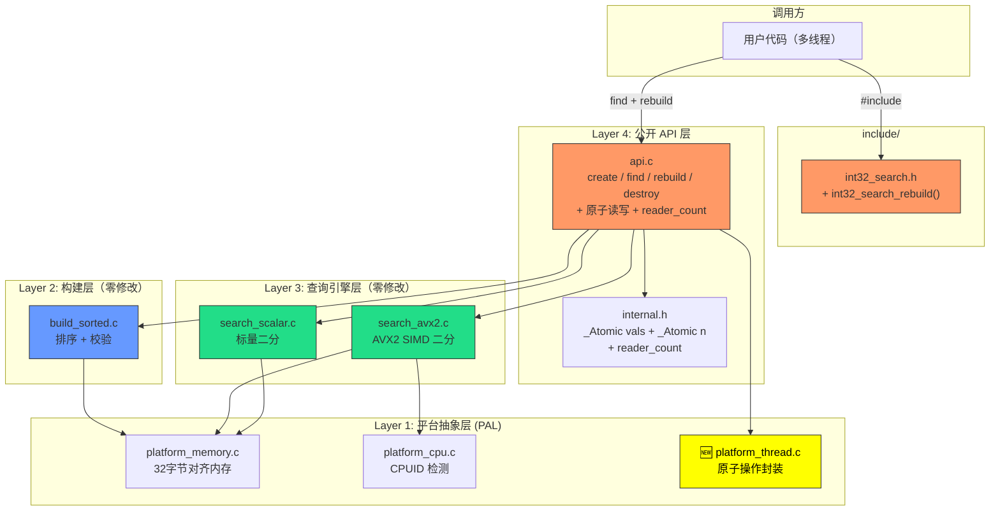
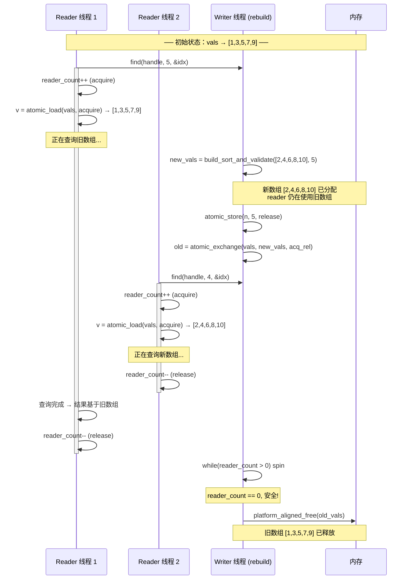
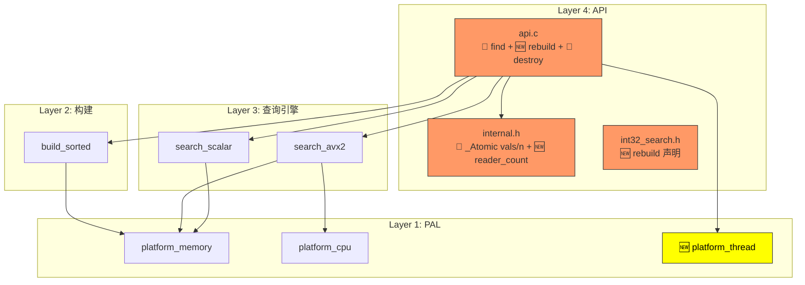

# 系统设计文档 — Phase 1.5 多线程 COW (Path A)

## 1. 整体架构图

Phase 1.5 在 Phase 1 四层架构中新增 `platform_thread` 模块，并改造 API 层：



**变更标记**：🆕 = 新增模块；黄色 = Phase 1.5 新增/修改；绿色/蓝色 = Phase 1 不变。

---

## 2. 分层设计

### 2.1 Layer 1: 平台抽象层 — 新增 platform_thread

#### 2.1.1 platform_thread.h — 原子操作封装

```c
#ifndef INT32_SEARCH_PLATFORM_THREAD_H
#define INT32_SEARCH_PLATFORM_THREAD_H

#include <stdatomic.h>
#include <stddef.h>
#include <stdint.h>

/* 原子指针操作 */
#define atomic_ptr_load(ptr, order)       atomic_load_explicit(ptr, order)
#define atomic_ptr_store(ptr, val, order) atomic_store_explicit(ptr, val, order)
#define atomic_ptr_exchange(ptr, val, order) atomic_exchange_explicit(ptr, val, order)

/* 原子 size_t 操作 */
#define atomic_size_load(ptr, order)       atomic_load_explicit(ptr, order)
#define atomic_size_store(ptr, val, order) atomic_store_explicit(ptr, val, order)
#define atomic_size_fetch_add(ptr, val, order) atomic_fetch_add_explicit(ptr, val, order)
#define atomic_size_fetch_sub(ptr, val, order) atomic_fetch_sub_explicit(ptr, val, order)

/* 平台让步（备用的自旋辅助，当前使用 busy-wait） */
static inline void platform_thread_yield(void)
{
    /* C11 无标准 yield，留空；Windows 可在 Phase 3 映射到 SwitchToThread */
}

#endif
```

| 项目 | 内容 |
|------|------|
| **文件** | `src/platform_thread.h`（新增） |
| **依赖** | `<stdatomic.h>`（C11 标准库） |
| **无 .c 文件** | 全部为宏和内联函数，无需独立编译单元 |
| **设计理由** | 直接封装 C11 atomic API，零开销抽象。不引入 pthread 依赖 |

#### 2.1.2 原子操作使用约定

| 操作 | 函数 | 内存序 | 场景 |
|------|------|--------|------|
| Reader 获取 vals | `atomic_ptr_load(&impl->vals, acquire)` | acquire | 与 writer release 配对 |
| Reader 获取 n | `atomic_size_load(&impl->n, acquire)` | acquire | 与 writer release 配对 |
| Reader 进入临界区 | `atomic_size_fetch_add(&reader_count, 1, acquire)` | acquire | 阻止 writer 提前释放 |
| Reader 退出临界区 | `atomic_size_fetch_sub(&reader_count, 1, release)` | release | 通知 writer 可释放 |
| Writer 发布 vals | `atomic_ptr_store(&impl->vals, new_vals, release)` | release | 确保数据先于指针可见 |
| Writer 发布 n | `atomic_size_store(&impl->n, new_n, release)` | release | 在 vals 发布前 |
| Writer 等待 reader | `while(atomic_size_load(&reader_count, acquire) > 0){}` | acquire | 自旋等待 |

---

### 2.2 Layer 4: 内部结构体 — internal.h 修改

#### 2.2.1 修改前（Phase 1）

```c
typedef struct {
    int32_t  *vals;
    size_t    n;
    int       path;
    int32_t   (*search_fn)(...);
    uint8_t   avx2_capable;
} int32_search_impl_t;
```

#### 2.2.2 修改后（Phase 1.5）

```c
typedef struct {
    _Atomic int32_t *vals;              /* 排序数组，COW 原子交换 */
    _Atomic size_t   n;                 /* 元素数量，与 vals 配对原子更新 */
    int              path;              /* PATH_A（不变） */
    int32_t         (*search_fn)(const int32_t *vals, size_t n, int32_t key, size_t *out_index);
    uint8_t          avx2_capable;      /* CPU 能力（不变） */
    _Atomic size_t   reader_count;      /* 当前活跃 reader 数量 */
} int32_search_impl_t;
```

| 字段 | 变更 | 说明 |
|------|------|------|
| `vals` | `int32_t*` → `_Atomic int32_t*` | COW 原子指针交换 |
| `n` | `size_t` → `_Atomic size_t` | 与 vals 配对原子更新，防止 reader 看到新 vals+旧 n |
| `reader_count` | **新增** `_Atomic size_t` | 读写计数，writer 等待其归零后释放旧 vals |
| `path` / `search_fn` / `avx2_capable` | 不变 | rebuild 不重新评估 |

**内存布局**：`_Atomic size_t` 在 x86-64 上是 8 字节且 lock-free，不影响对齐。总结构体大小从 ~40 字节增至 ~56 字节。

---

### 2.3 Layer 4: 公开 API 层 — api.c 修改

#### 2.3.1 int32_search_find — 并发安全改造

```c
int int32_search_find(int32_search_t handle, int32_t key,
                      size_t *out_index)
{
    if (handle == NULL) return INT32_SEARCH_ERR_NULL_HANDLE;
    if (out_index == NULL) return INT32_SEARCH_ERR_INVALID_ARG;

    int32_search_impl_t *impl = (int32_search_impl_t *)handle;

    DEBUG_LOG("int32_search_find: key=%d", key);

    /* ── 进入读临界区 ── */
    atomic_size_fetch_add(&impl->reader_count, 1, memory_order_acquire);

    /* 原子获取当前数据快照 */
    int32_t *v = atomic_ptr_load(&impl->vals, memory_order_acquire);
    size_t  _n = atomic_size_load(&impl->n, memory_order_acquire);

    /* 执行查询（与 Phase 1 相同的 search_fn 调用） */
    int32_t result = impl->search_fn(v, _n, key, out_index);

    /* ── 退出读临界区 ── */
    atomic_size_fetch_sub(&impl->reader_count, 1, memory_order_release);

    return result;
}
```

**关键安全保证**：
1. `reader_count++`（acquire）在读取 `vals` 之前 → 确保 writer 在交换 vals 后不会在 reader 仍使用旧 vals 时释放它
2. `vals` 原子读取（acquire）→ 与 writer 的 release store 配对，确保看到完整的新数组内容
3. `reader_count--`（release）在查询完成后 → 确保查询的所有内存访问在递减之前完成
4. 局部变量 `v` 和 `_n` 在 reader 临界区内保持一致快照

**性能影响**：热路径增加 3 条原子指令（fetch_add + load×2 + fetch_sub），在 x86-64 上 lock-free。对比 AVX2 二分 ~170 cycles，额外开销 < 5 cycles（< 3%）。

#### 2.3.2 int32_search_rebuild — 新增

```c
int int32_search_rebuild(int32_search_t handle,
                          const int32_t *data, size_t n)
{
    if (handle == NULL) return INT32_SEARCH_ERR_NULL_HANDLE;
    if (data == NULL || n == 0) return INT32_SEARCH_ERR_INVALID_ARG;

    int32_search_impl_t *impl = (int32_search_impl_t *)handle;

    DEBUG_LOG("int32_search_rebuild: n=%zu", n);

    /* Step 1: 构建新排序数组（可耗时，不阻塞 reader） */
    int32_t *new_vals = build_sort_and_validate(data, n);
    if (new_vals == NULL) {
        ERROR_LOG("int32_search_rebuild: build_sort_and_validate failed");
        return INT32_SEARCH_ERR_MEMORY;
    }

    /* Step 2: 先发布 n（在 vals 之前，防止 reader 用旧 n 读新 vals 越界） */
    atomic_size_store(&impl->n, n, memory_order_release);

    /* Step 3: 原子交换 vals 指针 */
    int32_t *old_vals = atomic_ptr_exchange(&impl->vals, new_vals, memory_order_acq_rel);

    DEBUG_LOG("int32_search_rebuild: vals swapped");

    /* Step 4: 等待所有活跃 reader 退出（自旋） */
    while (atomic_size_load(&impl->reader_count, memory_order_acquire) > 0) {
        platform_thread_yield();
    }

    /* Step 5: 安全释放旧数据 */
    if (old_vals != NULL) {
        platform_aligned_free(old_vals);
    }

    DEBUG_LOG("int32_search_rebuild: old vals freed, done");
    return INT32_SEARCH_OK;
}
```

**流程要点**：
- Step 1（构建）在交换前执行，reader 不受影响，继续使用旧 vals
- Step 2 的 `n` 先于 `vals` 发布：最坏情况 reader 看到 `新n + 旧vals`，不会越界（旧 vals 仍有效）
- Step 3 `exchange` 使用 `acq_rel`：同时获取旧值（用于释放）和发布新值（对 reader 可见）
- Step 4 自旋等待：临界区 ~50ns，等待时间可忽略
- Step 5 释放：此时保证无 reader 持有 `old_vals` 引用

#### 2.3.3 int32_search_destroy — 并发安全改造

```c
int int32_search_destroy(int32_search_t handle)
{
    if (handle == NULL) return INT32_SEARCH_OK;

    int32_search_impl_t *impl = (int32_search_impl_t *)handle;

    DEBUG_LOG("int32_search_destroy: n=%zu",
              atomic_size_load(&impl->n, memory_order_relaxed));

    /* 等待所有 reader 退出 */
    while (atomic_size_load(&impl->reader_count, memory_order_acquire) > 0) {
        platform_thread_yield();
    }

    /* 安全释放 */
    int32_t *v = atomic_ptr_load(&impl->vals, memory_order_relaxed);
    if (v != NULL) {
        platform_aligned_free(v);
    }

    memset(impl, 0, sizeof(*impl));
    free(impl);

    return INT32_SEARCH_OK;
}
```

**变更点**：Phase 1 直接 `free(impl->vals)`，现改为先等待 `reader_count == 0` 再释放。

#### 2.3.4 int32_search_create — 适配新字段

```c
int32_search_t int32_search_create(const int32_t *data, size_t n,
                                    const int32_search_config_t *cfg)
{
    /* ... 参数校验 + 构建 new_vals（与 Phase 1 相同） ... */

    impl->n = n;                          /* 非原子赋值（构造阶段单线程） */
    atomic_init(&impl->vals, new_vals);   /* 原子初始化 */
    atomic_init(&impl->reader_count, 0);  /* 原子初始化 */
    impl->path = PATH_A;
    /* ... avx2_capable + search_fn 设置（同 Phase 1） ... */

    return (int32_search_t)impl;
}
```

**注意**：`create` 阶段无并发 reader（句柄尚未返回），因此 `n` 用普通赋值，`vals` 和 `reader_count` 用 `atomic_init`（非原子初始化，C11 标准要求）。

---

### 2.4 公开头文件 — include/int32_search.h 修改

新增以下声明（加在 `destroy` 之后、`find_range` 之前）：

```c
/**
 * 重建查询数据（COW 方式，不阻塞并发查询）
 *
 * @param handle  int32_search_create 返回的句柄
 * @param data    新的 Int32 数组（调用方所有，不修改）
 * @param n       新数组长度 (>0)
 * @return        INT32_SEARCH_OK (成功)
 *                ERR_NULL_HANDLE (handle==NULL)
 *                ERR_MEMORY (内存不足)
 *                ERR_INVALID_ARG (data==NULL 或 n==0)
 *
 * 线程安全：
 *   - 可与 int32_search_find() 并发（COW 保证）
 *   - 不可与 create / destroy / 另一个 rebuild 并发
 *   - 失败时旧数据不受影响
 *
 * 复杂度：O(n log n) 排序 + O(1) 原子交换 + 等待 reader 退出
 */
int int32_search_rebuild(int32_search_t handle,
                          const int32_t *data, size_t n);
```

`find()` 注释中补充线程安全说明：

```c
/**
 * ...
 * 线程安全：多线程只读查询安全；可与 int32_search_rebuild() 并发；
 *           不可与 create / destroy 并发
 */
```

---

## 3. COW 数据流向图



---

## 4. 模块依赖关系图



🔄 = 修改  🆕 = 新增  无标记 = Phase 1 不变

---

## 5. 错误处理策略

### 5.1 错误码

| 错误码 | 值 | 触发函数 | 触发条件 |
|--------|-----|----------|----------|
| `INT32_SEARCH_OK` | 0 | find, rebuild, destroy | 成功 |
| `INT32_SEARCH_ERR_NOT_FOUND` | -1 | find | 目标值不在数组中 |
| `INT32_SEARCH_ERR_NULL_HANDLE` | -2 | find, rebuild, destroy | handle == NULL（destroy 中不触发，幂等返回 OK） |
| `INT32_SEARCH_ERR_MEMORY` | -3 | rebuild | 新数据排序/分配失败 |
| `INT32_SEARCH_ERR_INVALID_ARG` | -4 | find, rebuild | out_index==NULL / data==NULL / n==0 |

### 5.2 rebuild 失败回滚

```
rebuild 失败场景:
  Step 1 (build_sort_and_validate) 失败:
    → 返回 ERR_MEMORY
    → impl->vals 仍指向旧数组
    → impl->n 仍为旧值
    → reader 完全不受影响，继续正常工作

  无需回滚：COW 天然保证失败不影响现有数据。
```

### 5.3 destroy 幂等性

```
destroy(NULL)    → 立即返回 OK（与 Phase 1 一致）
destroy(handle)  → 等待 reader 退出 → 释放 vals → 释放 impl
重复 destroy     → 第二次 handle 已失效，调用方责任
```

---

## 6. 调试日志

在 Phase 1 日志点基础上新增：

| 位置 | 日志级别 | 内容 |
|------|----------|------|
| `api.c:find` 入口 | DEBUG | `key=%d`（不变） |
| `api.c:rebuild` 入口 | DEBUG | `n=%zu` |
| `api.c:rebuild` 失败 | ERROR | `build_sort_and_validate failed` |
| `api.c:rebuild` 交换 | DEBUG | `vals swapped` |
| `api.c:rebuild` 完成 | DEBUG | `old vals freed, done` |
| `api.c:destroy` 入口 | DEBUG | `n=%zu`（改为原子读取） |

---

## 7. 构建系统设计

### 7.1 Makefile 修改

平台线程头文件无对应 .c 编译单元（全宏 + 内联），但需要在 api.o 的依赖中添加：

```makefile
# 新增依赖
SRCS     = $(SRCDIR)/platform_memory.c \
           $(SRCDIR)/platform_cpu.c \
           $(SRCDIR)/build_sorted.c \
           $(SRCDIR)/search_scalar.c \
           $(SRCDIR)/api.c

# api.o 规则新增 platform_thread.h 依赖
$(SRCDIR)/api.o: $(SRCDIR)/api.c $(INCDIR)/int32_search.h $(SRCDIR)/internal.h \
                  $(SRCDIR)/platform_memory.h $(SRCDIR)/platform_cpu.h \
                  $(SRCDIR)/build_sorted.h $(SRCDIR)/search_scalar.h $(SRCDIR)/search_avx2.h \
                  $(SRCDIR)/platform_thread.h
	$(CC) -c $(CFLAGS) -I$(INCDIR) -I$(SRCDIR) $< -o $@

# 新增 test-thread 目标（TSan 编译）
test-thread: $(LIB_NAME).a $(TESTDIR)/test_thread.c
	$(CC) $(CFLAGS) -fsanitize=thread -g -DINT32_SEARCH_DEBUG \
		-I$(INCDIR) -I$(SRCDIR) $(TESTDIR)/test_thread.c $(LIB_NAME).a \
		-o int32search_thread_test -lm
	./int32search_thread_test

# clean 规则新增
	rm -f int32search_thread_test
```

**注意**：`test-thread` 使用 `-fsanitize=thread`（非 address,undefined），因为 ASan 和 TSan 不能同时使用。

### 7.2 README.txt 更新

```
多线程测试:
  make test-thread    # ThreadSanitizer 并发压力测试
```

---

## 8. 测试设计 — test/test_thread.c

### 8.1 测试用例

```
test_rebuild_basic           — 单线程 rebuild 后 find 返回新数据
test_rebuild_preserve_old    — rebuild 失败时旧数据不受影响
test_rebuild_null_handle     — rebuild(NULL, ...) → ERR_NULL_HANDLE
test_rebuild_invalid_arg     — rebuild(h, NULL, 0) → ERR_INVALID_ARG
test_concurrent_read_rebuild  — 1 reader + 1 writer 并发，TSan 零告警
test_concurrent_n_readers     — N readers + 1 writer 并发 (N≥4)
test_destroy_during_read      — reader 未退出时 destroy 等待
test_rebuild_loop_memory      — 循环 rebuild 100 次内存无增长
```

### 8.2 并发测试框架

使用 C11 `<threads.h>` 或 POSIX `<pthread.h>`（Linux 主力）：

```c
#include <threads.h>   /* C11 */
#include <stdatomic.h>

static atomic_int stop_flag = 0;
static atomic_size_t error_count = 0;

int reader_thread(void *arg) {
    int32_search_t handle = (int32_search_t)arg;
    while (!atomic_load(&stop_flag)) {
        size_t idx;
        int32_t key = rand() % 100000;
        int rc = int32_search_find(handle, key, &idx);
        if (rc != INT32_SEARCH_OK && rc != INT32_SEARCH_ERR_NOT_FOUND) {
            atomic_fetch_add(&error_count, 1);
        }
    }
    return 0;
}

int writer_thread(void *arg) {
    int32_search_t handle = (int32_search_t)arg;
    for (int i = 0; i < 10; i++) {
        int32_t *new_data = generate_sorted_data(100000);
        int rc = int32_search_rebuild(handle, new_data, 100000);
        if (rc != INT32_SEARCH_OK) {
            atomic_fetch_add(&error_count, 1);
        }
        free(new_data);
    }
    atomic_store(&stop_flag, 1);
    return 0;
}
```

---

## 9. 与现有系统的一致性检查

| 检查项 | 状态 | 说明 |
|--------|------|------|
| 技术路线 §5 并发模型 | ✅ | release/acquire 语义 + COW 原子交换完全对齐 |
| 技术路线 §2.1 四层架构 | ✅ | platform_thread 归入 Layer 1 |
| 总需求文档 Phase 1.5 范围 | ✅ | FR-04 rebuild + platform_thread + TSan 零告警全覆盖 |
| Phase 1 DESIGN 不破坏 | ✅ | 查询引擎/构建层零修改 |
| C11 标准 | ✅ | `stdatomic.h` + `_Atomic` + `memory_order_*` |
| 用户命名习惯 | ✅ | 下划线命名法 |
| API 不透明句柄 | ✅ | `void*` 不变，内部结构不暴露 |

---

## 10. 关键日志点总览（Phase 1.5 新增）

| 位置 | 日志级别 | 内容 |
|------|----------|------|
| `api.c:rebuild` 入口 | DEBUG | `n=%zu` |
| `api.c:rebuild` 失败 | ERROR | `build_sort_and_validate failed` |
| `api.c:rebuild` 交换完成 | DEBUG | `vals swapped` |
| `api.c:rebuild` 完成 | DEBUG | `old vals freed, done` |
| `api.c:destroy` 入口 | DEBUG | `n=%zu`（增加原子读取） |

---

## 11. 关联信息

- 父文档：[CONSENSUS_task_002_phase15_cow.md](CONSENSUS_task_002_phase15_cow.md)
- 前置设计：[DESIGN_task_001_phase1_mvp.md](file:///c:/Users/Administrator/Documents/trae_projects/Int32_search_algorithm/docs/tasks/task_001_phase1_mvp/DESIGN_task_001_phase1_mvp.md)
- 后续文档：TASK_task_002_phase15_cow.md
- 关联代码：
  - [api.c](file:///c:/Users/Administrator/Documents/trae_projects/Int32_search_algorithm/src/api.c) — 主要修改目标
  - [internal.h](file:///c:/Users/Administrator/Documents/trae_projects/Int32_search_algorithm/src/internal.h) — 结构体修改
  - [int32_search.h](file:///c:/Users/Administrator/Documents/trae_projects/Int32_search_algorithm/include/int32_search.h) — API 声明新增

---

## 归档元数据

| 属性 | 值 |
|------|-----|
| 源文件 | `docs/tasks/task_002_phase15_cow/DESIGN_task_002_phase15_cow.md` |
| 归档日期 | 2026-06-01 |
| 归档版本 | v0.2.0 (Phase 1.5) |
| 源任务 | task_002_phase15_cow |
