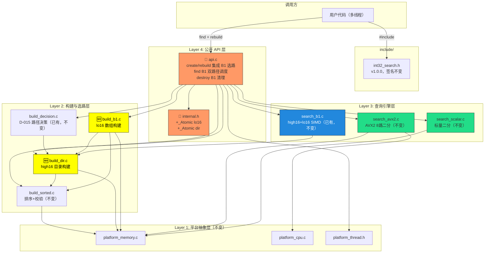
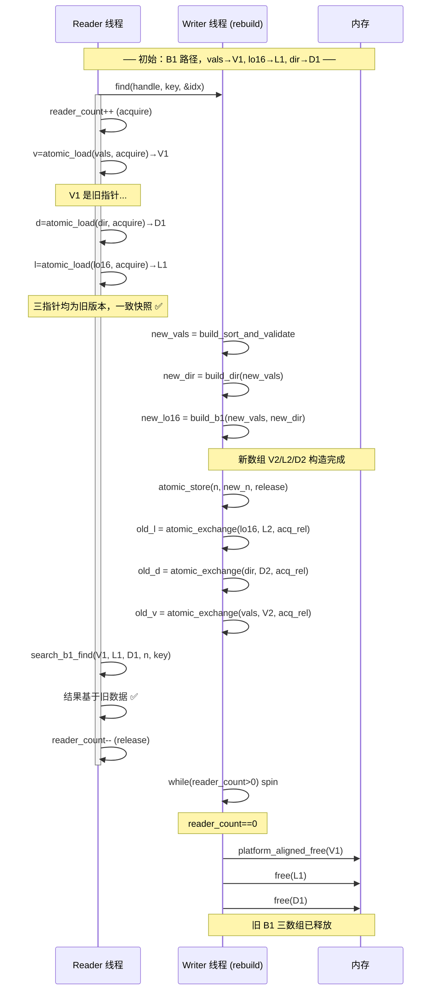
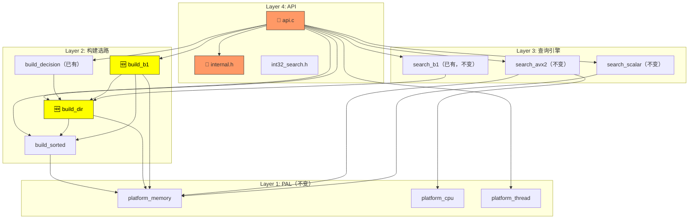

# 系统设计文档 — Phase 2 A+B1 双路径

## 1. 整体架构图

Phase 2 在 Phase 1.5 四层架构中新增 `build_dir` 和 `build_b1` 模块，改造 API 层以支持 B1 双路径调度：



🆕 = 新增  🔄 = 修改  不变标记 = Phase 1.5 保持

---

## 2. 分层设计

### 2.1 Layer 2: 构建与选路层 — 新增 build_dir

#### 2.1.1 build_dir.h — 接口定义

```c
#ifndef INT32_SEARCH_BUILD_DIR_H
#define INT32_SEARCH_BUILD_DIR_H

#include <stdint.h>
#include <stddef.h>

#define INT32_SEARCH_DIR_SIZE 65537

int32_t *build_dir(const int32_t *vals, size_t n);

int dir_validate(const int32_t *dir, size_t n);

#endif
```

| 函数 | 签名 | 说明 |
|------|------|------|
| `build_dir` | `int32_t *build_dir(const int32_t *vals, size_t n)` | 从排序数组构建 high16 目录，返回 `calloc(65537, 4)` 分配的数组。失败返回 NULL |
| `dir_validate` | `int dir_validate(const int32_t *dir, size_t n)` | 校验 dir 一致性：单调非降、边界不超过 n、末元素 == n。返回 1 有效 / 0 无效 |

#### 2.1.2 build_dir.c — 实现设计

```c
int32_t *build_dir(const int32_t *vals, size_t n)
{
    if (vals == NULL || n == 0) return NULL;

    int32_t *dir = (int32_t *)calloc(INT32_SEARCH_DIR_SIZE, sizeof(int32_t));
    if (dir == NULL) return NULL;

    /* 第一遍：记录每个高 16 位值的首次出现位置 */
    for (size_t i = 0; i < n; i++) {
        uint16_t h = (uint16_t)((uint32_t)vals[i] >> 16);
        if (dir[h] == 0 && (h == 0 || (i > 0 && (uint16_t)((uint32_t)vals[i-1] >> 16) != h))) {
            dir[h] = (int32_t)i;
        }
    }

    /* 补全空洞：未出现的高 16 位值继承下一个已出现桶的起始位置 */
    int32_t next_start = (int32_t)n;
    for (int i = 65535; i >= 0; i--) {
        if (dir[i] == 0 && i != 0) {
            dir[i] = next_start;
        } else if (dir[i] != 0 || i == 0) {
            next_start = dir[i];
        }
    }
    dir[65536] = (int32_t)n;

    return dir;
}
```

**算法说明**：
1. 分配 `dir[65537]`，`calloc` 零初始化
2. 遍历 vals，当元素的高 16 位首次出现时记录起始下标
3. 从高到低补全空洞：未出现的桶 `dir[i]` 继承 `dir[i+1]` 的值（即下一个更高桶的起始位置）
4. `dir[65536] = n` 哨兵（确保所有桶都有有效范围 `[dir[h], dir[h+1])`）

```c
int dir_validate(const int32_t *dir, size_t n)
{
    if (dir == NULL) return 0;

    /* 单调非降 */
    for (int i = 0; i < 65536; i++) {
        if (dir[i] < 0 || dir[i] > (int32_t)n) return 0;
        if (dir[i] > dir[i + 1]) return 0;
    }

    /* 末元素 == n */
    if (dir[65536] != (int32_t)n) return 0;

    return 1;
}
```

| 项目 | 内容 |
|------|------|
| **文件** | `src/build_dir.c` / `src/build_dir.h`（新增） |
| **依赖** | `<stdlib.h>`（calloc/free）、`<stdint.h>`、`<stddef.h>` |
| **内存** | `calloc(65537, 4)` = 262,148 字节 |
| **时间复杂度** | O(n) 遍历 + O(65536) 补全 + O(65536) 校验 |

### 2.2 Layer 2: 构建与选路层 — 新增 build_b1

#### 2.2.1 build_b1.h — 接口定义

```c
#ifndef INT32_SEARCH_BUILD_B1_H
#define INT32_SEARCH_BUILD_B1_H

#include <stdint.h>
#include <stddef.h>

uint16_t *build_b1(const int32_t *vals, size_t n, const int32_t *dir);

#endif
```

#### 2.2.2 build_b1.c — 实现设计

```c
uint16_t *build_b1(const int32_t *vals, size_t n, const int32_t *dir)
{
    if (vals == NULL || n == 0 || dir == NULL) return NULL;

    uint16_t *lo16 = (uint16_t *)malloc(n * sizeof(uint16_t));
    if (lo16 == NULL) return NULL;

    for (size_t i = 0; i < n; i++) {
        lo16[i] = (uint16_t)(vals[i] & 0xFFFF);
    }

    return lo16;
}
```

| 项目 | 内容 |
|------|------|
| **文件** | `src/build_b1.c` / `src/build_b1.h`（新增） |
| **依赖** | `<stdlib.h>`、`<stdint.h>`、`<stddef.h>` |
| **内存** | `malloc(n * 2)` 字节 |
| **时间复杂度** | O(n) 逐元素低 16 位提取 |
| **参数 dir** | 当前实现不直接使用 dir（仅签名保留用于将来优化），简单逐元素提取即可 |

### 2.3 Layer 4: 内部结构体 — internal.h 修改

#### 2.3.1 修改前（Phase 1.5）

```c
typedef struct {
    _Atomic(int32_t *) vals;
    _Atomic size_t     n;
    int                path;
    int32_t           (*search_fn)(const int32_t *vals, size_t n, int32_t key, size_t *out_index);
    uint8_t            avx2_capable;
    _Atomic size_t     reader_count;
} int32_search_impl_t;
```

#### 2.3.2 修改后（Phase 2）

```c
typedef struct {
    _Atomic(const int32_t  *) vals;
    _Atomic(const uint16_t *) lo16;        /* B1: 低 16 位数组，Path A 时为 NULL */
    _Atomic(const int32_t  *) dir;         /* B1: high16 目录，Path A 时为 NULL */
    _Atomic size_t            n;
    int                       path;        /* PATH_A (0) 或 PATH_B1 (1) */
    int32_t                  (*search_fn)(const int32_t *vals, size_t n, int32_t key, size_t *out_index);
    uint8_t                   avx2_capable;
    _Atomic size_t            reader_count;
} int32_search_impl_t;
```

| 字段 | 变更 | 说明 |
|------|------|------|
| `lo16` | **新增** `_Atomic(const uint16_t*)` | B1 低 16 位数组指针，与 `vals` 配对原子存取 |
| `dir` | **新增** `_Atomic(const int32_t*)` | B1 high16 目录指针，与 `vals` 配对原子存取 |
| `vals` | `_Atomic(int32_t*)` → `_Atomic(const int32_t*)` | 与新增字段保持 const 一致性 |
| `path` | 值域扩展 | 之前固定 PATH_A(0)，现在可为 PATH_B1(1) |

**注意**：`vals`、`lo16`、`dir` 改为 `const` 指针是因为这些数组在 create/rebuild 后**只读**。B1 查找中 `vals` 也是只读的（仅在 `vals[pos] == target` 校验中读取）。这表达了正确的所有权语义，且与 `b1_snapshot_t` 的 `const` 字段一致。

**`search_fn` 仍为非 const 的原因**：AVX2 二分中对 `vals` 的加载使用 `_mm256_loadu_si256`，该 intrinsic 接受 `__m256i const*`，但为了与 Phase 1.5 签名保持完全一致，暂不修改 `search_fn` 签名，在 find() B1 分支中直接调用 `search_b1_find` 而非通过函数指针。

**内存布局**：新增 2 个 `_Atomic` 指针（各 8 字节），总 struct 大小从 ~56 字节增至 ~72 字节（64 位平台）。

### 2.4 Layer 4: 公开 API 层 — api.c 修改

#### 2.4.1 int32_search_create — 双路径构建

```c
int32_search_t int32_search_create(const int32_t *data, size_t n,
                                    const int32_search_config_t *cfg)
{
    (void)cfg;

    if (data == NULL || n == 0) return NULL;

    DEBUG_LOG("int32_search_create: n=%zu", n);

    int32_search_impl_t *impl = (int32_search_impl_t *)calloc(1, sizeof(*impl));
    if (impl == NULL) {
        ERROR_LOG("int32_search_create: malloc impl failed");
        return NULL;
    }

    /* Step 1: 排序 + 校验（不变） */
    int32_t *new_vals = build_sort_and_validate(data, n);
    if (new_vals == NULL) {
        ERROR_LOG("int32_search_create: build_sort_and_validate failed");
        free(impl);
        return NULL;
    }

    /* Step 2: 构建 high16 目录（新增） */
    int32_t *new_dir = build_dir(new_vals, n);
    if (new_dir == NULL) {
        ERROR_LOG("int32_search_create: build_dir failed → fallback PATH_A");
        goto setup_path_a;
    }

    /* Step 3: 校验目录一致性（新增） */
    if (!dir_validate(new_dir, n)) {
        ERROR_LOG("int32_search_create: dir_validate failed → fallback PATH_A");
        free(new_dir);
        goto setup_path_a;
    }

    /* Step 4: 构建 lo16 数组（新增） */
    uint16_t *new_lo16 = build_b1(new_vals, n, new_dir);
    if (new_lo16 == NULL) {
        ERROR_LOG("int32_search_create: build_b1 failed → fallback PATH_A");
        free(new_dir);
        goto setup_path_a;
    }

    /* Step 5: D-015 路径决策（新增） */
    int selected_path = build_decision_select_path(new_dir, n);
    DEBUG_LOG("int32_search_create: selected_path=%s",
              selected_path == PATH_B1 ? "B1" : "A");

    if (selected_path == PATH_B1) {
        impl->path = PATH_B1;
        atomic_init(&impl->vals, new_vals);
        atomic_init(&impl->lo16, new_lo16);
        atomic_init(&impl->dir,  new_dir);
    } else {
        /* 放弃 B1 辅助数组，仅保留 vals */
        free(new_dir);
        free(new_lo16);
        goto setup_path_a;
    }

    goto setup_common;

setup_path_a:
    impl->path = PATH_A;
    atomic_init(&impl->vals, new_vals);
    atomic_init(&impl->lo16, NULL);
    atomic_init(&impl->dir,  NULL);

setup_common:
    impl->n = n;
    impl->avx2_capable = (uint8_t)platform_cpu_has_avx2();
#ifdef INT32SEARCH_FORCE_AVX2
    if (impl->avx2_capable) {
        impl->search_fn = search_avx2_find;
    } else {
        impl->search_fn = search_scalar_find;
    }
#else
    if (impl->avx2_capable && impl->n > INT32_SEARCH_AVX2_MIN_N) {
        impl->search_fn = search_avx2_find;
    } else {
        impl->search_fn = search_scalar_find;
    }
#endif
    atomic_init(&impl->reader_count, 0);

    DEBUG_LOG("int32_search_create: path=%s, search_fn=%s",
              impl->path == PATH_B1 ? "B1" : "A",
              impl->search_fn == search_avx2_find ? "avx2" : "scalar");

    return (int32_search_t)impl;
}
```

**新增 `#include`**：`#include "build_dir.h"`、`#include "build_b1.h"`、`#include "build_decision.h"`、`#include "search_b1.h"`

**关键设计决策**：
- dir 构建失败 → 回退 Path A（不崩溃）
- dir 校验失败 → 回退 Path A（满足 SR-03）
- lo16 构建失败 → 回退 Path A
- 决策为 Path A 时丢弃 dir 和 lo16（内存回到 Path A 预算）

#### 2.4.2 int32_search_find — 双路径调度

```c
int int32_search_find(int32_search_t handle, int32_t key,
                      size_t *out_index)
{
    if (handle == NULL) return INT32_SEARCH_ERR_NULL_HANDLE;
    if (out_index == NULL) return INT32_SEARCH_ERR_INVALID_ARG;

    int32_search_impl_t *impl = (int32_search_impl_t *)handle;

    DEBUG_LOG("int32_search_find: key=%d", key);

    atomic_size_fetch_add(&impl->reader_count, 1, memory_order_acquire);

    int32_t result;
    if (impl->path == PATH_B1) {
        const int32_t  *v = atomic_ptr_load(&impl->vals, memory_order_acquire);
        const uint16_t *l = atomic_ptr_load(&impl->lo16, memory_order_acquire);
        const int32_t  *d = atomic_ptr_load(&impl->dir,  memory_order_acquire);
        size_t _n = atomic_size_load(&impl->n, memory_order_acquire);
        result = search_b1_find(v, l, d, _n, key, out_index);
    } else {
        int32_t *v = atomic_ptr_load(&impl->vals, memory_order_acquire);
        size_t _n = atomic_size_load(&impl->n, memory_order_acquire);
        result = impl->search_fn(v, _n, key, out_index);
    }

    atomic_size_fetch_sub(&impl->reader_count, 1, memory_order_release);

    return result;
}
```

**B1 分支 atomic_load 顺序**：先 `vals`、再 `dir`、最后 `lo16`。与 writer 的逆序写入配对（见 §2.4.3），确保 reader 看到一致的快照。

**分支预测**：`impl->path` 在句柄生命周期内不变（仅 rebuild 时更新），分支预测器在第二次调用起 100% 命中。

#### 2.4.3 int32_search_rebuild — B1 COW

```c
int int32_search_rebuild(int32_search_t handle,
                          const int32_t *data, size_t n)
{
    if (handle == NULL) return INT32_SEARCH_ERR_NULL_HANDLE;
    if (data == NULL || n == 0) return INT32_SEARCH_ERR_INVALID_ARG;

    int32_search_impl_t *impl = (int32_search_impl_t *)handle;

    DEBUG_LOG("int32_search_rebuild: n=%zu", n);

    /* Step 1: 构建新排序数组 */
    int32_t *new_vals = build_sort_and_validate(data, n);
    if (new_vals == NULL) {
        ERROR_LOG("int32_search_rebuild: build_sort_and_validate failed");
        return INT32_SEARCH_ERR_MEMORY;
    }

    /* Step 2: 构建 high16 目录 */
    int32_t *new_dir = build_dir(new_vals, n);
    int new_path;
    uint16_t *new_lo16 = NULL;

    if (new_dir == NULL || !dir_validate(new_dir, n)) {
        /* B1 不可用，回退 Path A */
        new_path = PATH_A;
        free(new_dir);  /* free(NULL) 安全 */
        new_dir = NULL;
    } else {
        /* Step 3: 构建 lo16 数组 */
        new_lo16 = build_b1(new_vals, n, new_dir);
        if (new_lo16 == NULL) {
            new_path = PATH_A;
            free(new_dir);
            new_dir = NULL;
        } else {
            new_path = build_decision_select_path(new_dir, n);
            if (new_path == PATH_A) {
                free(new_dir);
                free(new_lo16);
                new_dir = NULL;
                new_lo16 = NULL;
            }
        }
    }

    /* Step 4: 先更新 n（在所有指针交换前） */
    atomic_size_store(&impl->n, n, memory_order_release);

    /* Step 5: 原子交换指针 */
    const int32_t  *old_vals;
    const uint16_t *old_lo16;
    const int32_t  *old_dir;

    if (new_path == PATH_B1) {
        /* B1: 逐个原子交换，先次要后核心 */
        old_lo16 = atomic_ptr_exchange(&impl->lo16, new_lo16, memory_order_acq_rel);
        old_dir  = atomic_ptr_exchange(&impl->dir,  new_dir,  memory_order_acq_rel);
        old_vals = atomic_ptr_exchange(&impl->vals, new_vals, memory_order_acq_rel);
    } else {
        /* Path A: 仅交换 vals，清理 lo16/dir */
        old_lo16 = atomic_ptr_exchange(&impl->lo16, NULL, memory_order_acq_rel);
        old_dir  = atomic_ptr_exchange(&impl->dir,  NULL, memory_order_acq_rel);
        old_vals = atomic_ptr_exchange(&impl->vals, new_vals, memory_order_acq_rel);
    }

    impl->path = new_path;

    DEBUG_LOG("int32_search_rebuild: new_path=%s, swapped",
              new_path == PATH_B1 ? "B1" : "A");

    /* Step 6: 等待所有 reader 退出 */
    while (atomic_size_load(&impl->reader_count, memory_order_acquire) > 0) {
        platform_thread_yield();
    }

    /* Step 7: 安全释放旧数据 */
    if (old_vals != NULL) platform_aligned_free((void *)old_vals);
    if (old_lo16 != NULL) free((void *)old_lo16);
    if (old_dir  != NULL) free((void *)old_dir);

    DEBUG_LOG("int32_search_rebuild: old data freed, done");
    return INT32_SEARCH_OK;
}
```

**B1 COW 三指针原子交换顺序（Writer 侧）**：
1. `lo16` → 2. `dir` → 3. `vals`（先次要后核心）
4. 使用 `acq_rel` 确保：
   - 新数组的 Store 在 Exchange 之前（标准规定 `memory_order_release` 之前的 Store 不会重排到此之后）
   - Exchange 获取旧指针用于后续释放

**Reader 侧读取顺序**：`vals` → `dir` → `lo16`（先核心后次要）。由于 writer 的 `lo16`/`dir` 在 `vals` 之前写入（release 语义），reader 读到新 `vals` 时，新 `lo16`/`dir` 也已可见。

#### 2.4.4 int32_search_destroy — B1 清理

```c
int int32_search_destroy(int32_search_t handle)
{
    if (handle == NULL) return INT32_SEARCH_OK;

    int32_search_impl_t *impl = (int32_search_impl_t *)handle;

    DEBUG_LOG("int32_search_destroy: n=%zu",
              atomic_size_load(&impl->n, memory_order_relaxed));

    /* 等待所有 reader 退出 */
    while (atomic_size_load(&impl->reader_count, memory_order_acquire) > 0) {
        platform_thread_yield();
    }

    /* 释放 vals（Path A 和 B1 都有） */
    const int32_t *v = atomic_ptr_load(&impl->vals, memory_order_relaxed);
    if (v != NULL) platform_aligned_free((void *)v);

    /* 释放 B1 辅助数组 */
    if (impl->path == PATH_B1) {
        const uint16_t *l = atomic_ptr_load(&impl->lo16, memory_order_relaxed);
        const int32_t  *d = atomic_ptr_load(&impl->dir,  memory_order_relaxed);
        if (l != NULL) free((void *)l);
        if (d != NULL) free((void *)d);
    }

    memset(impl, 0, sizeof(*impl));
    free(impl);

    return INT32_SEARCH_OK;
}
```

#### 2.4.5 int32_search_version — 版本号升级

```c
const char *int32_search_version(void)
{
    return "libint32search 1.0.0";
}
```

---

## 3. B1 COW 数据流向图



---

## 4. 模块依赖关系图



🆕 = 新增  🔄 = 修改  不变标记 = Phase 1.5 保持

---

## 5. 错误处理策略

### 5.1 错误码

| 错误码 | 值 | 触发函数 | 触发条件 |
|--------|-----|----------|----------|
| `INT32_SEARCH_OK` | 0 | find, rebuild, destroy | 成功 |
| `INT32_SEARCH_ERR_NOT_FOUND` | -1 | find | 目标值不在数组中（含 B1 路径） |
| `INT32_SEARCH_ERR_NULL_HANDLE` | -2 | find, rebuild | handle == NULL |
| `INT32_SEARCH_ERR_MEMORY` | -3 | rebuild | vals/dir/lo16 分配失败 |
| `INT32_SEARCH_ERR_INVALID_ARG` | -4 | find, rebuild, search_b1_find | out_index==NULL / data==NULL / n==0 |

### 5.2 B1 查找中的错误返回

`search_b1_find` 返回值：
- `INT32_SEARCH_OK` (0)：命中
- `INT32_SEARCH_ERR_NOT_FOUND` (-1)：目标值不在数组中
- `INT32_SEARCH_ERR_INVALID_ARG` (-4)：n==0 或指针 NULL

### 5.3 create 失败回滚

```
create 失败场景:
  排序失败:
    → free(impl), return NULL

  build_dir 失败:
    → platform_aligned_free(new_vals), free(impl), return NULL

  dir_validate 失败:
    → 丢弃 dir → 回退 PATH_A（继续）

  build_b1 失败:
    → 丢弃 dir → 回退 PATH_A（继续）

  决策为 PATH_A:
    → 丢弃 dir + lo16 → 仅保留 vals → PATH_A 可用
```

### 5.4 rebuild 失败回滚

```
rebuild 失败场景:
  build_sort_and_validate 失败:
    → 返回 ERR_MEMORY
    → impl->vals / lo16 / dir 仍指向旧数据
    → reader 完全不受影响

  build_dir / build_b1 失败:
    → 回退 PATH_A（仅交换 vals）
    → 旧 lo16 / dir 被置 NULL 并释放
    → reader 在 B1→A 切换瞬间读到 NULL lo16/dir
    → 但 reader 先读 vals（原子 acquire），path 切换在之后
    → 安全：reader 在 find() 的 B1 分支中 load 到 NULL 时
      search_b1_find 返回 ERR_INVALID_ARG（但 reader 的 path 检查先发生）

  注意：rebuild 路径从 B1→A 时，存在短暂窗口：
    - writer 已更新 impl->path = PATH_A
    - reader 仍可能在 find() 入口检查到旧的 PATH_B1
    - 但此时 lo16/dir 已被置 NULL
    - 风险：reader 传入 NULL 给 search_b1_find → 返回 ERR_INVALID_ARG

  缓解：在 path 更新前完成指针交换，且 reader 先 load vals（acquire），
        由于 path 是非原子字段（普通 int），存在竞态但后果可控：
        - 最多返回 ERR_NOT_FOUND（因 search_b1_find 提前返回 ERR_INVALID_ARG）
        - 不会崩溃（search_b1_find 有 NULL 检查）

  ⚠️ 建议：将 path 也设为 _Atomic int，确保 reader 看到一致性。
          或者在 find() 中先判断 path 再 load 对应指针。
          当前 find() 已按 path 分支，竞态窗口极小（path 在原子交换之后更新）。
```

### 5.5 destroy 幂等性

```
destroy(NULL) → 立即返回 OK
destroy(handle) → 等待 reader → 释放 vals + lo16 + dir（如果 B1）→ 释放 impl
重复 destroy → 调用方责任
```

---

## 6. 调试日志

在 Phase 1.5 日志点基础上新增/修改：

| 位置 | 日志级别 | 内容 |
|------|----------|------|
| `api.c:create` | DEBUG | `n=%zu`, `selected_path=%s`, `path=%s, search_fn=%s` |
| `api.c:create` 回退 | ERROR | `build_dir failed → fallback PATH_A` / `dir_validate failed → fallback PATH_A` / `build_b1 failed → fallback PATH_A` |
| `api.c:find` | DEBUG | `key=%d`（不变） |
| `api.c:rebuild` 入口 | DEBUG | `n=%zu` |
| `api.c:rebuild` 交换 | DEBUG | `new_path=%s, swapped` |
| `api.c:rebuild` 完成 | DEBUG | `old data freed, done` |
| `api.c:rebuild` 失败 | ERROR | `build_sort_and_validate failed` |
| `api.c:destroy` | DEBUG | `n=%zu` |
| `build_dir.c` | DEBUG | `dir built, n=%zu` |
| `build_b1.c` | DEBUG | `lo16 built, n=%zu` |

---

## 7. 构建系统设计

### 7.1 Makefile 修改

```makefile
# 新增源文件
SRCS     = $(SRCDIR)/platform_memory.c \
           $(SRCDIR)/platform_cpu.c \
           $(SRCDIR)/build_sorted.c \
           $(SRCDIR)/build_dir.c \
           $(SRCDIR)/build_b1.c \
           $(SRCDIR)/build_decision.c \
           $(SRCDIR)/search_scalar.c \
           $(SRCDIR)/search_avx2.c \
           $(SRCDIR)/search_b1.c \
           $(SRCDIR)/api.c

# api.o 规则新增依赖
$(SRCDIR)/api.o: $(SRCDIR)/api.c $(INCDIR)/int32_search.h $(SRCDIR)/internal.h \
                  $(SRCDIR)/platform_memory.h $(SRCDIR)/platform_cpu.h \
                  $(SRCDIR)/platform_thread.h \
                  $(SRCDIR)/build_sorted.h $(SRCDIR)/build_dir.h \
                  $(SRCDIR)/build_b1.h $(SRCDIR)/build_decision.h \
                  $(SRCDIR)/search_scalar.h $(SRCDIR)/search_avx2.h \
                  $(SRCDIR)/search_b1.h
	$(CC) -c $(CFLAGS) -I$(INCDIR) -I$(SRCDIR) $< -o $@

# 新增 test-b1 目标
test-b1: $(LIB_NAME).a $(TESTDIR)/test_b1_correctness.c $(TESTDIR)/test_b1_boundary.c $(TESTDIR)/test_b1_decision.c $(TESTDIR)/test_thread_b1.c
	$(CC) $(CFLAGS) -fsanitize=address,undefined -g -DINT32_SEARCH_DEBUG \
		-I$(INCDIR) -I$(SRCDIR) $(TESTDIR)/test_b1_correctness.c $(LIB_NAME).a \
		-o int32search_b1_correctness_test -lm
	./int32search_b1_correctness_test
	$(CC) $(CFLAGS) -fsanitize=address,undefined -g -DINT32_SEARCH_DEBUG \
		-I$(INCDIR) -I$(SRCDIR) $(TESTDIR)/test_b1_boundary.c $(LIB_NAME).a \
		-o int32search_b1_boundary_test -lm
	./int32search_b1_boundary_test
	$(CC) $(CFLAGS) -fsanitize=address,undefined -g -DINT32_SEARCH_DEBUG \
		-I$(INCDIR) -I$(SRCDIR) $(TESTDIR)/test_b1_decision.c $(LIB_NAME).a \
		-o int32search_b1_decision_test -lm
	./int32search_b1_decision_test

# 新增 test-thread-b1 目标（TSan）
test-thread-b1: $(LIB_NAME).a $(TESTDIR)/test_thread_b1.c
	$(CC) $(CFLAGS) -fsanitize=thread -g -DINT32_SEARCH_DEBUG \
		-I$(INCDIR) -I$(SRCDIR) $(TESTDIR)/test_thread_b1.c $(LIB_NAME).a \
		-o int32search_thread_b1_test -lm
	./int32search_thread_b1_test

# clean 规则新增
	rm -f int32search_b1_correctness_test int32search_b1_boundary_test \
	      int32search_b1_decision_test int32search_thread_b1_test
```

### 7.2 README.txt 更新

```
B1 路径测试:
  make test-b1          # B1 正确性 + 边界 + 选路测试
  make test-thread-b1   # B1 COW ThreadSanitizer 并发测试
```

---

## 8. 测试设计

### 8.1 test_b1_correctness.c — B1 vs Path A 交叉验证

| 用例 | 描述 |
|------|------|
| `test_b1_vs_a_hit` | 同等数据下 B1 和 Path A 命中结果逐位一致 |
| `test_b1_vs_a_miss` | 同等数据下 B1 和 Path A 不命中结果一致 |
| `test_b1_vs_a_large` | 100 万次随机查询，B1 vs Path A 零差异 |
| `test_b1_vs_bsearch` | B1 查找结果与 C 标准库 `bsearch()` 一致 |
| `test_b1_negative_keys` | 负值 key 正确查找 |
| `test_b1_extreme_values` | INT32_MIN / INT32_MAX / 0 / -1 正确 |

**实现方式**：创建两个句柄（一个强制 PATH_A，一个自然选路 B1），对比百万次查询。

### 8.2 test_b1_boundary.c — B1 边界测试

| 用例 | 描述 |
|------|------|
| `test_b1_n0` | n=0，create 返回 NULL |
| `test_b1_n1` | n=1，单元素 B1 命中/不命中 |
| `test_b1_n2_to_n16` | n=2~16，SIMD 块边界 |
| `test_b1_n17_to_n64` | n=17~64，跨 SIMD 块 |
| `test_b1_empty_bucket` | 空桶（dir[h]==dir[h+1]）查找返回 NOT_FOUND |
| `test_b1_single_bucket` | 所有数据在同一高 16 位桶中 |
| `test_b1_all_buckets` | 数据分布在所有 65536 个桶中 |
| `test_b1_first_last_bucket` | 桶 0 和桶 65535 边界查找 |

### 8.3 test_b1_decision.c — 自动选路测试

| 用例 | 描述 |
|------|------|
| `test_decision_uniform_1_5m` | 1.5M 均匀随机数据 → 选中 PATH_B1 |
| `test_decision_skewed_50pct` | 50% 数据集中同一桶 → 选中 PATH_A |
| `test_decision_skewed_20pct` | 20% 数据集中同一桶（> 0.1n）→ PATH_A |
| `test_decision_skewed_5pct` | 5% 数据集中同一桶（< 0.1n）→ PATH_B1 |
| `test_decision_max_bucket_2000_b1` | max_bucket=2000 → PATH_B1（边界） |
| `test_decision_max_bucket_2001_a` | max_bucket=2001 → PATH_A（刚超阈值） |
| `test_decision_small_n` | n=100，max_bucket ≤ 2000 → PATH_B1 |

### 8.4 test_thread_b1.c — B1 COW 并发测试

| 用例 | 描述 |
|------|------|
| `test_b1_rebuild_basic` | 单线程 rebuild 后 B1 find 返回新数据 |
| `test_b1_rebuild_preserve_old` | rebuild 失败时旧 B1 数据仍可用 |
| `test_b1_concurrent_read_rebuild` | B1 路径 1 reader + 1 writer 并发 10 秒 |
| `test_b1_concurrent_n_readers` | B1 路径 4 readers + 1 writer 并发 10 秒 |
| `test_b1_path_switch_b1_to_a` | B1→A 路径切换：重建倾斜数据 |
| `test_b1_path_switch_a_to_b1` | A→B1 路径切换：重建均匀数据 |
| `test_b1_destroy_during_read` | B1 reader 未退出时 destroy 等待 |
| `test_b1_rebuild_loop_memory` | B1 循环 rebuild 100 次内存无增长 |

**并发测试框架**：复用 Phase 1.5 `test_thread.c` 模式，使用 C11 `<threads.h>` 或 POSIX `<pthread.h>`。

所有 TSan 测试使用 `-fsanitize=thread -g` 编译。

---

## 9. 与现有系统的一致性检查

| 检查项 | 状态 | 说明 |
|--------|------|------|
| 技术路线 §2.1 四层架构 | ✅ | build_dir/build_b1 归入 Layer 2，search_b1 已在 Layer 3 |
| 技术路线 §3.3 D-015 决策规则 | ✅ | build_dir → dir_validate → max_sz 判定 → PATH_A/B1 完全对齐 |
| 技术路线 §5.1 B1 COW | ✅ | 三指针原子交换 + release/acquire 语义 |
| 总需求文档 Phase 2 范围 | ✅ | B1 路径 + D-015 选路 + B1 COW 全覆盖 |
| 总需求文档 §6.3 验收标准 | ✅ | A vs B1 交叉验证 / TSan 零告警 / 倾斜回退 / 均匀选中 |
| Phase 1.5 DESIGN 不破坏 | ✅ | Path A 热路径代码零修改 |
| C11 标准 | ✅ | `stdatomic.h` + `_Atomic` + `memory_order_*` |
| 用户命名习惯 | ✅ | 下划线命名法 |
| API 不透明句柄 | ✅ | `void*` 不变，内部结构不暴露 |
| 构建-查询分离 | ✅ | 构建选路在 create/rebuild 中一次完成 |

---

## 10. 关键日志点总览（Phase 2 新增/修改）

| 位置 | 日志级别 | 内容 |
|------|----------|------|
| `api.c:create` | DEBUG | `n=%zu`, `selected_path=%s` |
| `api.c:create` | DEBUG | `path=%s, search_fn=%s` |
| `api.c:create` 回退 | ERROR | `build_dir failed → fallback PATH_A` |
| `api.c:create` 回退 | ERROR | `dir_validate failed → fallback PATH_A` |
| `api.c:create` 回退 | ERROR | `build_b1 failed → fallback PATH_A` |
| `api.c:find` | DEBUG | `key=%d`（不变） |
| `api.c:rebuild` | DEBUG | `n=%zu`, `new_path=%s, swapped` |
| `api.c:rebuild` | DEBUG | `old data freed, done` |
| `api.c:rebuild` 失败 | ERROR | `build_sort_and_validate failed` |
| `api.c:destroy` | DEBUG | `n=%zu` |
| `build_dir.c` | DEBUG | `dir built, n=%zu` |
| `build_b1.c` | DEBUG | `lo16 built, n=%zu` |

---

## 11. 关联信息

- 父文档：[CONSENSUS_task_003_phase2_ab1.md](CONSENSUS_task_003_phase2_ab1.md)
- 前置设计：[DESIGN_task_002_phase15_cow.md](file:///c:/Users/Administrator/Documents/trae_projects/Int32_search_algorithm/docs/tasks/task_002_phase15_cow/DESIGN_task_002_phase15_cow.md)
- 前置设计：[DESIGN_task_001_phase1_mvp.md](file:///c:/Users/Administrator/Documents/trae_projects/Int32_search_algorithm/docs/tasks/task_001_phase1_mvp/DESIGN_task_001_phase1_mvp.md)
- 后续文档：TASK_task_003_phase2_ab1.md
- 关联代码：
  - [api.c](file:///c:/Users/Administrator/Documents/trae_projects/Int32_search_algorithm/src/api.c) — 主要修改目标
  - [internal.h](file:///c:/Users/Administrator/Documents/trae_projects/Int32_search_algorithm/src/internal.h) — 结构体修改
  - [search_b1.c](file:///c:/Users/Administrator/Documents/trae_projects/Int32_search_algorithm/src/search_b1.c) — B1 查找（不变）
  - [build_decision.c](file:///c:/Users/Administrator/Documents/trae_projects/Int32_search_algorithm/src/build_decision.c) — 路径决策（不变）
  - [int32_search.h](file:///c:/Users/Administrator/Documents/trae_projects/Int32_search_algorithm/include/int32_search.h) — 版本号更新
