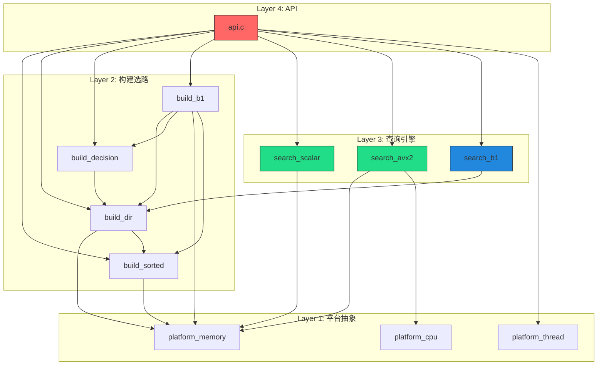

# 技术路线文档 — Int32 查找算法库

## 1. 技术选型

| 维度 | 选型 | 理由 |
|------|------|------|
| **语言** | C11 | 零运行时开销、SIMD intrinsic 直接可用、跨平台 |
| **编译器** | GCC ≥ 8.0（主力） | 用户习惯 `gcc` 直接编译 |
| **构建系统** | Makefile（主）+ CMakeLists.txt（辅） | 符合 D-026 决议 |
| **SIMD 指令集** | AVX2（主力）、标量（回退）、SSE2/AVX-512（扩展） | 编译时多版本 + CPUID 运行时检测 |
| **数据结构** | 排序数组 `int32_t[]`（零额外索引） | D-001：缓存友好、40MB/10M、SIMD 友好 |
| **查询算法** | AVX2 8 路块状 SIMD 二分（Path A） | D-008：Linux GCC 3.5x-5.1x vs 标量；Windows MinGW 已知退化（0.45x-0.55x，见 §7 风险） |
| **优化路径** | high16 dir + lo16 SIMD 扫描（Path B1，条件启用） | D-014：构建时一次性选路，热路径零开销 |
| **多线程** | 构建-查询分离 + COW 原子交换 | D-005：查询路径零锁 |
| **哈希** | xxHash（已有） | 布隆过滤器可选依赖 |
| **命名规范** | 下划线命名法（snake_case） | 用户习惯 |

---

## 2. 模块拆分

### 2.1 四层架构（meeting_003 D-020）

```
include/int32_search.h          — 唯一公开头文件（不透明句柄 + 错误码 + API 声明）

src/
├── Layer 1: 平台抽象层 (PAL)        [MVP]
│   ├── platform_memory.c/h          — 跨平台 32 字节对齐内存分配
│   ├── platform_cpu.c/h             — CPUID 运行时 SIMD 能力检测
│   └── platform_thread.c/h          — 平台原子操作封装 [Phase 1.5]
│
├── Layer 2: 构建与选路层
│   ├── build_sorted.c               — 排序 + 数据完整性校验 [MVP]
│   ├── build_dir.c                  — high16 directory 构建 + 一致性校验 [Phase 2]
│   ├── build_decision.c             — D-015 分布分析 + 路径决策 [Phase 2]
│   └── build_b1.c                   — B1 路径 lo16 数组构建 [Phase 2]
│
├── Layer 3: 查询引擎层
│   ├── search_scalar.c              — 标量二分（黄金正确性基准）[MVP]
│   ├── search_avx2.c                — AVX2 8 路块状 SIMD 二分 [MVP]
│   └── search_b1.c                  — high16 dir + lo16 SIMD 扫描 [Phase 2]
│
├── Layer 4: 公开 API 层             [MVP]
│   ├── api.c                        — create/search/destroy/rebuild 统一入口
│   └── internal.h                   — 内部结构体（不安装到系统 include）
│
└── 扩展层                            [Phase 3]
    ├── bloom_filter.c/h             — 布隆过滤器 (#ifdef USE_BLOOM_FILTER)
    └── xxhash/                      — 已有哈希库（无修改）
```

### 2.2 模块依赖关系



---

## 3. 接口约定

### 3.1 公开 API（include/int32_search.h）

```c
/* 错误码 */
#define INT32_SEARCH_OK              0
#define INT32_SEARCH_ERR_NOT_FOUND   -1
#define INT32_SEARCH_ERR_NULL_HANDLE -2
#define INT32_SEARCH_ERR_MEMORY      -3
#define INT32_SEARCH_ERR_INVALID_ARG -4

/* 不透明句柄 */
typedef void* int32_search_t;

/* 构建配置 */
typedef struct {
    int use_bloom;
    int reserved[7];    /* ABI 兼容预留 */
} int32_search_config_t;

/* API 函数 */
int32_search_t int32_search_create(const int32_t *data, size_t n,
                                    const int32_search_config_t *cfg);
int int32_search_find(int32_search_t handle, int32_t key,
                      size_t *out_index);
int int32_search_find_range(int32_search_t handle, int32_t low,
                             int32_t high, size_t *out_first,
                             size_t *out_count);   /* Phase 3: reserved */
int int32_search_destroy(int32_search_t handle);
int int32_search_rebuild(int32_search_t handle,
                          const int32_t *data, size_t n);  /* Phase 1.5 */
const char *int32_search_version(void);
```

### 3.2 内部结构（src/internal.h，不暴露）

```c
/* 路径类型 */
#define PATH_A  0
#define PATH_B1 1

/* B1 快照 — COW 原子交换单元 */
typedef struct {
    const int32_t  *vals;
    const uint16_t *lo16;
    const int32_t  *dir;
    size_t          n;
} b1_snapshot_t;

/* 不透明句柄内部实现 */
typedef struct {
    int             path;
    size_t          n;
    const int32_t  *vals;
    const uint16_t *lo16;        /* B1 only */
    const int32_t  *dir;         /* B1 only */
    void           *bloom;       /* Phase 3 */
} int32_search_impl_t;
```

### 3.3 D-015 路径决策规则（Phase 2 实现）

```
输入: sorted array vals[0..n-1]

1. dir = high16_dir_build(vals, n)
2. IF dir_validate(dir, n) FAIL → PATH_A
3. max_sz = max(dir[i+1] - dir[i]) for i in 0..65535
4. IF max_sz > 0.1 × n  → PATH_A       (倾斜分布)
5. IF max_sz ≤ 2000      → PATH_B1      (小桶均匀)
6. ELSE                  → PATH_A       (回退)
```

阈值来源：meeting_010 crossover 实测校准（D-078），crossover 点 ≈ max_bucket 2000（受控构造 B 级验证）。旧值 150 基于 BUG-02 污染数据作废。

---

## 4. SIMD 多版本策略（meeting_003 D-021）

### 4.1 编译时多版本

同一源文件 `search_avx2.c`，通过编译宏分段：

```c
#if defined(INT32_SEARCH_AVX512)
    /* 16 路并行二分 — Phase 3 */
#elif defined(INT32_SEARCH_AVX2)
    /* 8 路并行二分 — MVP */
#elif defined(INT32_SEARCH_SSE2)
    /* 4 路并行二分 — Phase 3 */
#endif
/* 标量回退 — 无条件编译，所有平台可用 */
```

### 4.2 编译命令示例

```bash
# AVX2 版本（MVP 主力）
gcc -c -O3 -std=c11 -mavx2 -DINT32_SEARCH_AVX2 search_avx2.c -o search_avx2.o

# 标量版本（回退 + 非 AVX 平台）
gcc -c -O3 -std=c11 search_avx2.c -o search_avx2_scalar.o

# AVX-512 版本（Phase 3）
gcc -c -O3 -std=c11 -mavx512f -mavx512cd -DINT32_SEARCH_AVX512 search_avx2.c
```

### 4.3 运行时派发

```c
typedef size_t (*search_func_t)(const int32_t*, size_t, int32_t);

search_func_t active_search;  /* CPUID 初始化时设置 */

void platform_cpu_init(void) {
    if (cpu_has_avx512())  active_search = search_avx2_binary_avx512;
    else if (cpu_has_avx2()) active_search = search_avx2_binary_avx2;
    else if (cpu_has_sse2()) active_search = search_avx2_binary_sse2;
    else                    active_search = search_avx2_binary_scalar;
}
```

---

## 5. 并发模型

### 5.1 基本模型：构建-查询分离 + COW

```
Writer 线程: 创建新版本 → COW 原子交换 → 旧版本延迟回收
Reader 线程: 读取当前快照 → 零锁查询

Path A (单数组):  atomic_store(&g_vals_ptr, new_vals)
Path B1 (三数组): atomic_store(&g_snapshot, &new_snapshot)  [struct 级, D-017]
```

### 5.2 内存序要求（安全专家建议）

- Writer: `memory_order_release` — 确保新数组内容在指针更新前对读者可见
- Reader: `memory_order_acquire` — 确保读取指针后能看到完整的新数组内容
- 旧版本回收: Phase 1.5 (Path A) + Phase 2 (B1) 分别实现引用计数或降级读写锁

---

## 6. 部署架构

### 6.1 交付物

```
Phase 1 MVP:
  ├── include/int32_search.h        # 公开头文件
  ├── libint32search.a              # 静态库（AVX2 版本，单线程）
  ├── int32search_test              # 测试可执行文件
  ├── int32search_bench             # Benchmark 可执行文件
  └── README.txt                    # 编译命令

Phase 1.5 v0.2:
  └── (上述 + Path A COW 多线程 + int32_search_rebuild)

Phase 2 v1.0:
  └── (上述 + B1 路径 + B1 COW)

Phase 3 v1.1:
  └── (上述 + SSE2/AVX-512/Bloom/Windows)
```

### 6.2 集成方式

```bash
# 用户侧编译
gcc -O3 -std=c11 -mavx2 -o myapp myapp.c -L. -lint32search -lm
```

---

## 7. 已知风险与缓解

| 风险 | 等级 | 缓解措施 |
|------|------|----------|
| AVX2 MinGW 代码生成退化 (0.45x vs 标量) | 高 | Phase 2 构建时 microbenchmark 自检；Phase 3 多编译器评估；短期不阻塞 Linux 交付 |
| AVX2 二分 GCC vs MSVC 行为差异 | 中 | Phase 3 Windows 移植时验证 |
| B1 lo16 扫描极端倾斜退化 | 中 | D-015 max_sz > 0.1n 倾斜检测已覆盖 |
| COW 旧版本回收在 Windows 困难 | 中 | D-005 降级为 SRWLOCK 方案已确认 |
| AVX-512 在旧 CPU 触发 SIGILL | 低 | CPUID 运行时检测 + 标量回退 |
| `search_avx2.c` 中 `block=hi-8` 下溢 | 高 | 安全专家已发现，MVP 阶段必须修复 |

---

## 8. 关联文档

| 文档 | 路径 |
|------|------|
| 总需求文档 | `docs/requirements/总需求文档.md` |
| 可行性评审决议 | `docs/meetings/meeting_index/meeting_001_feasibility_review/03_decisions.md` |
| 自适应策略评审决议 | `docs/meetings/meeting_index/meeting_002_adaptive_strategy_review/03_decisions.md` |
| 实施方案决议 | `docs/meetings/meeting_index/meeting_003_implementation_planning/03_decisions.md` |
