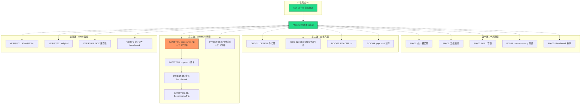

# 修复执行计划 — Phase 1 收尾

> 本文档为 meeting_004 审计复核后，除 P0 文档修正（已完成）外的全部待办事项执行计划。
> P0 文档修正已在 `meeting_004 D-028/D-029/D-030` 执行完毕：
> - ✅ ACT-01: ACCEPTANCE L107 诊断修正
> - ✅ ACT-02: TODO（+6 项）+ FINAL（+2 风险项）同步
> - ✅ ACT-03: 新增偏差 D-07

---

## 第一波：代码修复（可直接执行，约 0.3 天）

> 无依赖，全部可并行。建议 Phase 2 启动后同步进行。

| 编号 | 待办 | 文件 | 改动内容 | 类型 |
|------|------|------|----------|------|
| FIX-01 | TODO-05 | `src/internal.h` | `#include "../include/int32_search.h"` 统一错误码 | 修复 |
| FIX-01b | TODO-05 | `src/search_scalar.c` | 删除 `#define INT32_SEARCH_OK/ERR_*` 三行 | 修复 |
| FIX-01c | TODO-05 | `src/search_avx2.c` | 删除 `#define INT32_SEARCH_OK/ERR_*` 三行 | 修复 |
| FIX-02 | S-TODO-01 | `src/build_sorted.c` | 在 `malloc` 前加 `if (n > SIZE_MAX / sizeof(int32_t)) return NULL;` | 安全 |
| FIX-03 | S-TODO-02 | `src/platform_memory.c` | `_mm_free(ptr)` 前加 `if (ptr != NULL)` 守卫 | 安全 |
| FIX-04 | TODO-07 | `test/test_unit.c` | 新增 `test_double_destroy` 用例（ASan 运行验证） | 测试 |
| FIX-05 | S-TODO-04 | `benchmark/bench_main.c` | `srand(time(NULL))` 改为 `getenv("INT32SEARCH_BENCH_SEED") ? atoi(...) : time(NULL)` | 工程 |

**验证方式**：
```bash
gcc -O3 -std=c11 -Wall -Wextra -c -Isrc src/internal.h  # FIX-01
gcc -O3 -std=c11 -Wall -Wextra -c -Isrc src/build_sorted.c  # FIX-02
gcc -O3 -std=c11 -Wall -Wextra -c -Isrc src/platform_memory.c  # FIX-03
gcc -O3 -std=c11 -fsanitize=address test/test_unit.c src/*.c -o test_unit && ./test_unit  # FIX-04
```

---

## 第二波：文档完善（约 0.2 天）

> 消除 3 个 Minor 偏差（D-02/D-03/D-06），可与第一波并行。

| 编号 | 待办 | 文件 | 改动内容 |
|------|------|------|----------|
| DOC-01 | TODO-06 | `DESIGN_task_001_phase1_mvp.md` §2.3.2 | 伪代码 `_mm256_cmpgt_epi32(key, vec)` → `_mm256_cmpgt_epi32(vec, key)` |
| DOC-02 | TODO-09 | `DESIGN_task_001_phase1_mvp.md` §2.4.3 | 标注 MVP 实际实现了 CPU 检测回退（优于原始设计） |
| DOC-03 | TODO-08 | `README.txt` | 增加 Windows MinGW 环境下 gcc 逐条编译命令 |
| DOC-04 | S-TODO-05 | `src/search_avx2.c` | `_mm256_movemask_ps` 行增加注释 "Intel 标准惯用法，Haswell+ 无跨域惩罚" |

---

## 第三波：Windows AVX2 异常调查（与 Phase 2 并行，关键路径）

> meeting_004 D-032/D-033 决议，由 `task_002_windows_avx2_investigation` 独立跟踪。

### 阶段 3a：人工验证（~15 分钟，需 Windows 环境）

| 编号 | 行动 | 命令/方法 | 产出 |
|------|------|----------|------|
| INVEST-01 | popcount 指令发射验证 | `gcc -O3 -mavx2 -S src/search_avx2.c` → grep `popcnt` vs `__popcountsi2` | 确认是否走软件模拟 |
| INVEST-02 | CPU 检测状态确认 | 编译运行 benchmark，观察 `platform_cpu_has_avx2()` 输出 | 排除假阴性回退 |

### 阶段 3b：若 INVEST-01 证实 popcount 软件模拟

| 编号 | 行动 | 文件 | 改动 |
|------|------|------|------|
| INVEST-03 | 替换 popcount | `src/search_avx2.c` | `__builtin_popcount` → `_mm_popcnt_u32()`，添加 `#include <nmmintrin.h>` |
| INVEST-04 | Windows 重新 benchmark | 编译运行，对比修复前后 | 确认加速比是否恢复 |

### 阶段 3c：Benchmark 公平改造（无论 3b 结果都要做）

| 编号 | 行动 | 文件 | 改动 |
|------|------|------|------|
| INVEST-05 | 5 组公平对照 | `benchmark/bench_main.c` | 新增 API+AVX2 / API+Scalar / Raw AVX2 / Raw Scalar / Inline Scalar |
| INVEST-06 | 计时改进 | `benchmark/bench_main.c` | `__rdtsc()` → `__rdtscp()` + `_mm_lfence()` |
| INVEST-07 | 长 warmup | `benchmark/bench_main.c` | 100ms+ 循环预热，消除 Turbo ramp-up 偏差 |
| INVEST-08 | CPU 信息打印 | `benchmark/bench_main.c` | 型号、频率、AVX2 检测状态、编译器版本 |

---

## 第四波：Linux 环境验证（需 Linux 服务器，人工执行）

| 编号 | 待办 | 命令 | 产出 |
|------|------|------|------|
| VERIFY-01 | TODO-01 | `gcc -O3 -std=c11 -mavx2 -fsanitize=address,undefined src/*.c test/*.c -o test_asan && ./test_asan` | ASan/UBSan 零告警确认 |
| VERIFY-02 | TODO-02 | `valgrind --leak-check=full --track-origins=yes ./int32search_test` | 内存泄漏检测报告 |
| VERIFY-03 | TODO-03 | GCC 8/9/10/11 分别编译全项目 | 多版本兼容性矩阵 |
| VERIFY-04 | TODO-04 | Xeon Gold 6226 完整 benchmark（1M/5M/10M, uniform/skewed） | 官方性能数据 |

---

## 第五波：深度调查与评估（P2-P3，Phase 2 完成后）

| 编号 | 待办 | 说明 |
|------|------|------|
| DEEP-01 | ACT-11 | 反汇编深度对比：Windows vs Linux `objdump -d search_avx2.o` |
| DEEP-02 | ACT-12 | 跨编译器对比：Windows GCC/Clang/MSVC 同机 benchmark |
| DEEP-03 | ACT-13 | WSL2 内 Linux benchmark vs 裸机 Windows 同机对比 |
| DEEP-04 | S-TODO-03 | `__builtin_cpu_supports` 假阳性风险评估文档 | ✅ 已完成（[ASSESSMENT](ASSESSMENT_cpu_supports_false_positive_task_001_phase1_mvp.md)） |

---

## 执行依赖图



---

## 工作量估算

| 波次 | 项目数 | 工作量 | 执行人 |
|------|--------|--------|--------|
| 第一波（代码修复） | 5 | 0.3 天 | Agent_Executor |
| 第二波（文档完善） | 4 | 0.2 天 | Agent_Executor + Agent_Architect |
| 第三波（Windows 调查） | 8 | 0.5 天 Agent + 15 分钟 人工 | Agent_Executor + 人工 |
| 第四波（Linux 验证） | 4 | 0.3 天 | 人工 (Linux) |
| 第五波（深度调查） | 4 | 2 天 | 人工 |
| **合计** | **25** | **~3.3 天** | |

---

## 推荐执行策略

1. **Phase 2 启动后立即并行**：第一波 + 第二波（Agent 全自动，约 0.5 天）
2. **人工协调窗口**：INVEST-01/02（15 分钟）→ 决定 INVEST-03 是否需要
3. **Linux 验证**：在 Phase 2 Path B1 完成后统一跑一轮
4. **深度调查**：Phase 2 交付后，视 INVEST 结果决定是否必要

> **本次审计后续修复计划结束，无更多自动处理。**
> 所有待办项已可回流至 Execute 阶段。

---

## 归档元数据

| 字段 | 值 |
|------|-----|
| 原始路径 | docs/tasks/task_001_phase1_mvp/FIXPLAN_task_001_phase1_mvp.md |
| 归档日期 | 2026-05-30 |
| 归档版本 | meeting_006 Reviewed (第一~四波完成，第五波取消) |
| task_id | task_001_phase1_mvp |
