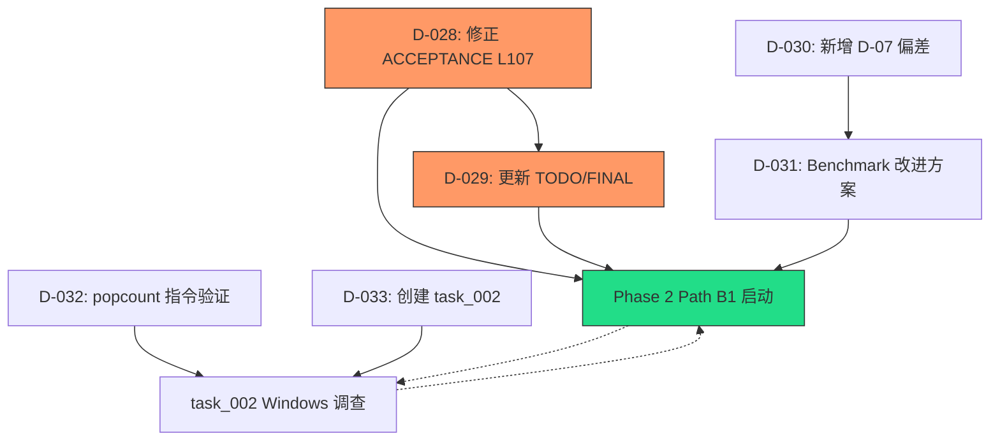

# 决议记录 — Phase 1 审计复核与 Windows 基准异常调查会

## 决议清单

### D-027：Phase 2 不延期，与 Windows 调查并行推进

| 项目 | 内容 |
|------|------|
| **决议** | Phase 2 (Path B1 + COW + rebuild) 按原计划启动，不因 Windows 性能异常延期 |
| **依据** | 1. Linux 生产环境 5.26x 加速比达标；2. 全部正确性/边界测试在 Windows 上通过；3. Path B1 内核使用不同 SIMD 原语组合（`_mm256_movemask_epi8`），不依赖争议的 `movemask_ps` 路径；4. 算法正确性经 500K 交叉验证证实 |
| **前提条件** | ACCEPTANCE L107 修正 + TODO/FINAL 同步（见 D-028, D-029） |
| **投票** | 4/4 通过 (Architect ✅ Algorithm ✅ Backend ✅ Security ✅) |

### D-028：修正 ACCEPTANCE 文档第 107 行诊断

| 项目 | 内容 |
|------|------|
| **决议** | 删除 "原因是此 Windows 环境中 `__builtin_cpu_supports("avx2")` 可能返回 0，导致 API 回退到 `search_scalar_find`" 的错误诊断。替换为实事求是描述 + 待验证假说列表 |
| **严重程度** | Major — 错误诊断留在审计文档中会传播错误认知 |
| **执行** | Agent_Auditor 执行，作为 Phase 2 启动硬前置 |
| **投票** | 4/4 通过 |

### D-029：同步更新 TODO 和 FINAL 文档

| 项目 | 内容 |
|------|------|
| **决议** | 1. TODO 新增 TODO-10 (Windows AVX2 性能异常调查)、S-TODO-01~04 (安全遗漏项)；2. FINAL 新增 Windows 异常风险项，标注 "不影响 Phase 2 启动，需跟踪" |
| **执行** | Agent_Auditor 执行 |
| **投票** | 4/4 通过 |

### D-030：新增 Benchmark 方法论偏差 D-07

| 项目 | 内容 |
|------|------|
| **决议** | 在偏差清单中新增 D-07：当前 benchmark 的 "AVX2" 路径走完整 API（多次分支检查 + 函数调用），而 "Scalar 基线" 是内联裸循环，两者非公平比较 |
| **严重程度** | Medium — 影响基准数据的解读，但不影响功能性正确 |
| **修复建议** | Phase 2 中增加公平对照组（API+Scalar / Raw AVX2 / Raw Scalar），详见 D-031 |
| **投票** | 4/4 通过 |

### D-031：Benchmark 改进方案

| 项目 | 内容 |
|------|------|
| **决议** | 采纳 Backend 工程师的 5 组对照方案 + 时序改进建议 |
| **实施方案** | 1. 增加 Raw AVX2 + Raw Scalar + API Scalar 对照组；2. 使用 `__rdtscp()` + `_mm_lfence()` 替代 `__rdtsc()`；3. 增加实质性 warmup (100ms+)；4. 支持 `INT32SEARCH_BENCH_SEED` 环境变量；5. 增加 CPU 特性打印 |
| **优先级** | P1 — Phase 2 开发中同步改进，不阻塞 Phase 2 核心交付 |
| **投票** | 4/4 通过 |

### D-032：根因调查第一步 — popcount 指令发射验证

| 项目 | 内容 |
|------|------|
| **决议** | Algorithm 工程师提出的 popcount 假说是当前最可能根因。第一步调查为对比汇编输出 |
| **实施** | 人工在 Windows 上执行 `gcc -O3 -mavx2 -S src/search_avx2.c` + `grep popcnt\|call search_avx2.s`；同时在 Linux 上做同样对比 |
| **如果证实** | 将 `__builtin_popcount` 替换为 `_mm_popcnt_u32()`（来自 `<nmmintrin.h>`），重新 benchmark 验证 |
| **执行时间** | 10 分钟，零代码改动 |
| **投票** | 4/4 通过 |

### D-033：新增独立调查子任务

| 项目 | 内容 |
|------|------|
| **决议** | 创建 `task_002_windows_avx2_investigation` 顶层任务，独立跟踪 Windows 异常调查 |
| **内容** | 包含 7 步调查实验（按 Backend 优先级排序）+ 反汇编对比 + popcount 修复验证 |
| **执行时机** | 与 Phase 2 并行推进，不阻塞 Phase 2 启动 |
| **投票** | 4/4 通过 |

## 决议依赖关系图

