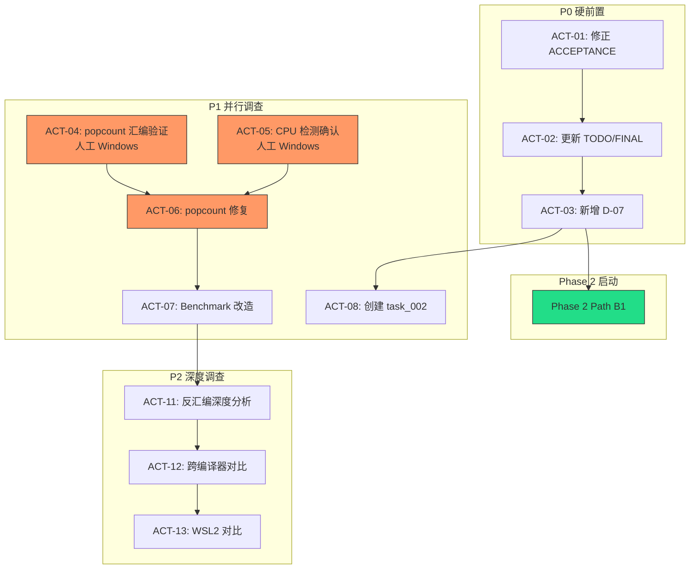

# 行动项 — Phase 1 审计复核与 Windows 基准异常调查会

## 按优先级排序

### 一、P0 — Phase 2 硬前置（立即执行）

| 编号 | 任务 | 类型 | 执行人 | 关联决议 | 预计耗时 | 产出物 |
|------|------|------|--------|----------|----------|--------|
| ACT-01 | 修正 ACCEPTANCE L107 诊断文字 | 文档 | Agent_Auditor | D-028 | 0.1 天 | 更新后的 ACCEPTANCE_task_001_phase1_mvp.md |
| ACT-02 | TODO 新增 5 项 + FINAL 新增风险项 | 文档 | Agent_Auditor | D-029 | 0.1 天 | 更新后的 TODO/FINAL 文档 |
| ACT-03 | 新增偏差 D-07 (Benchmark 方法论) | 文档 | Agent_Auditor | D-030 | 0.05 天 | 更新后的 ACCEPTANCE 偏差清单 |

### 二、P1 — Windows 异常调查（与 Phase 2 并行）

| 编号 | 任务 | 类型 | 执行人 | 关联决议 | 预计耗时 | 产出物 |
|------|------|------|--------|----------|----------|--------|
| ACT-04 | **popcount 指令验证**：Windows + Linux 分别 `gcc -S` 生成汇编，对比 `popcnt` vs `call __popcountsi2` | 调查 | **人工** (需 Windows) | D-032 | 10 分钟 | 汇编对比截图 / 文本 |
| ACT-05 | **CPU 检测确认**：在 bench_main.c 增加 `printf("AVX2 detected: %d\n", platform_cpu_has_avx2())`，Windows 重新编译运行 | 调查 | **人工** (需 Windows) | — | 5 分钟 | 确认 AVX2 是否执行 |
| ACT-06 | 若 ACT-04 证实：替换 `__builtin_popcount` 为 `_mm_popcnt_u32()`，Windows 重新 benchmark | 修复 | Agent_Executor | D-032 | 0.2 天 | 修改后的 search_avx2.c + 新基准数据 |
| ACT-07 | Benchmark 公平对比改造（5 组对照 + RDTSCP + 绑核 + 长 warmup） | 工程 | Agent_Executor | D-031 | 0.5 天 | 改造后的 bench_main.c |
| ACT-08 | 创建 `task_002_windows_avx2_investigation` 任务结构 | 管理 | Agent_Architect | D-033 | 0.2 天 | task_002 ALIGNMENT + DESIGN + TASK |

### 三、P1 — 安全改进（Phase 2 开发中同步）

| 编号 | 任务 | 类型 | 执行人 | 关联发现 | 预计耗时 | 产出物 |
|------|------|------|--------|----------|----------|--------|
| ACT-09 | `build_sort_and_validate` 增加 `n > SIZE_MAX / sizeof(int32_t)` 溢出检查 | 安全 | Agent_Executor | S-TODO-01 | 0.1 天 | 修改后的 build_sorted.c |
| ACT-10 | `platform_aligned_free` 增加显式 `if (ptr != NULL)` 守卫 | 安全 | Agent_Executor | S-TODO-02 | 0.05 天 | 修改后的 platform_memory.c |

### 四、P2 — 深度调查（Phase 2 完成后）

| 编号 | 任务 | 类型 | 执行人 | 关联决议 | 预计耗时 | 产出物 |
|------|------|------|--------|----------|----------|--------|
| ACT-11 | 反汇编深度分析（Windows `objdump -d` search_avx2.o vs Linux） | 调查 | 人工 | — | 0.5 天 | 差异报告 |
| ACT-12 | 跨编译器对比（Windows 上 GCC 14.2 / Clang / MSVC 同机 benchmark） | 调查 | 人工 | — | 1 天 | 对比报告 |
| ACT-13 | WSL2 内 Linux benchmark 同机对比 | 调查 | 人工 | — | 0.5 天 | 对比数据 |

### 五、P3 — 文档与改进（持续）

| 编号 | 任务 | 类型 | 执行人 | 关联发现 | 预计耗时 | 产出物 |
|------|------|------|--------|----------|----------|--------|
| ACT-14 | Benchmark `srand` 支持 `INT32SEARCH_BENCH_SEED` 环境变量 | 工程 | Agent_Executor | S-TODO-04 | 0.1 天 | 修改后的 bench_main.c |
| ACT-15 | `__builtin_cpu_supports` 假阳性安全风险评估文档 | 文档 | Agent_Architect | S-TODO-03 | 0.1 天 | 风险评估文档 |
| ACT-16 | `search_avx2.c` popcount 域转换增加 "Intel 标准惯用法" 注释 | 文档 | Agent_Executor | S-TODO-05 | 0.05 天 | 修改后的 search_avx2.c |

---

## 执行人汇总

| 执行人 | 任务数 | 任务列表 |
|--------|--------|----------|
| Agent_Auditor | 3 | ACT-01, ACT-02, ACT-03 |
| Agent_Executor | 6 | ACT-06, ACT-07, ACT-09, ACT-10, ACT-14, ACT-16 |
| Agent_Architect | 2 | ACT-08, ACT-15 |
| 人工 (Windows) | 5 | ACT-04, ACT-05, ACT-11, ACT-12, ACT-13 |

---

## 任务依赖图

> **下一步**：人工确认后，Agent_Auditor 执行 ACT-01~03，Agent_Architect 准备 Phase 2 立项文档。人工在 Windows 上并行执行 ACT-04 和 ACT-05（总计 15 分钟）。
