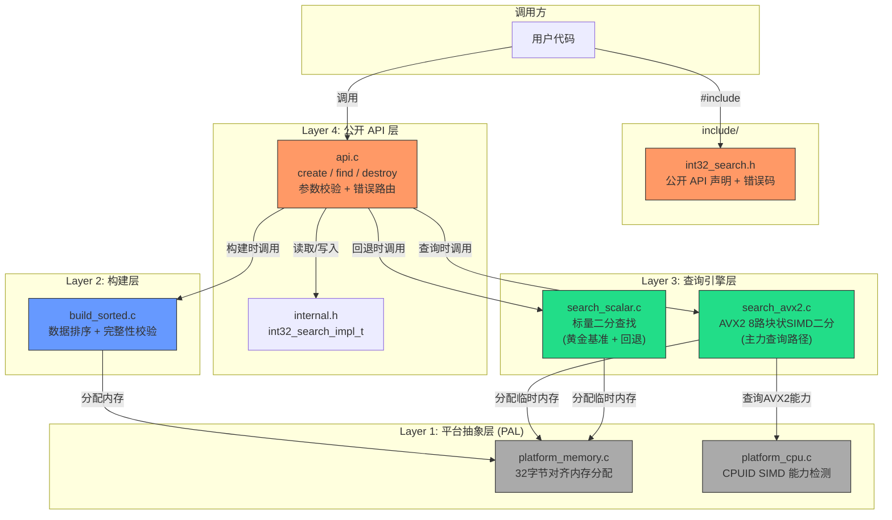
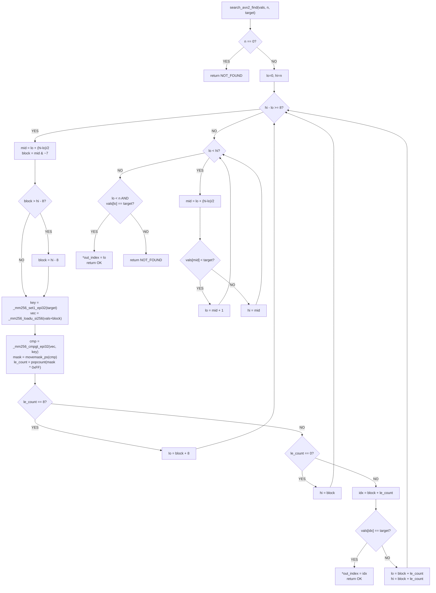
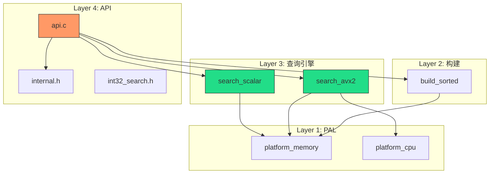
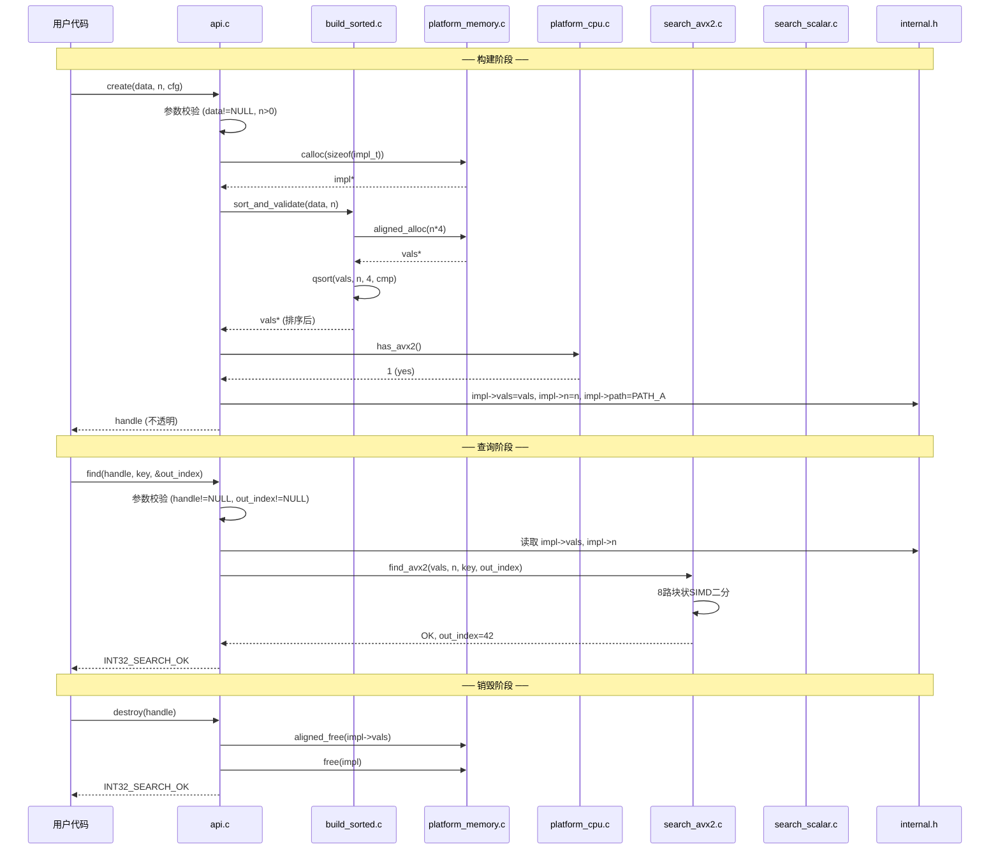

# 系统设计文档 — Phase 1 MVP (Path A 单路径)

## 1. 整体架构图



## 2. 分层设计

### 2.1 Layer 1: 平台抽象层 (PAL)

**职责**：隔离操作系统和硬件差异，为上层提供统一接口。

#### 2.1.1 platform_memory.c — 对齐内存分配

| 项目 | 内容 |
|------|------|
| **公开接口** | `void *platform_aligned_alloc(size_t size)` |
| | `void platform_aligned_free(void *ptr)` |
| **实现方式** | 封装 `_mm_malloc(size, 32)` / `_mm_free(ptr)` |
| **对齐保证** | 32 字节（AVX2 `__m256i` 要求） |
| **错误处理** | 分配失败返回 `NULL` |
| **内部依赖** | `<mm_malloc.h>` (Intel intrinsic) |

```c
// 接口契约
void *platform_aligned_alloc(size_t size);
//   输入: size — 分配字节数 (>0)
//   输出: 32 字节对齐的内存指针，失败返回 NULL
//   错误: 无 errno 设置，仅返回 NULL

void platform_aligned_free(void *ptr);
//   输入: ptr — 由 platform_aligned_alloc 返回的指针，可为 NULL
//   输出: 无
//   错误: 无（NULL 输入幂等）
```

#### 2.1.2 platform_cpu.c — CPU 能力检测

| 项目 | 内容 |
|------|------|
| **公开接口** | `int platform_cpu_has_avx2(void)` |
| **实现方式** | GCC: `__builtin_cpu_supports("avx2")` |
| **返回值** | `1` — 支持 AVX2，`0` — 不支持 |
| **调用时机** | 库初始化时调用一次，结果缓存 |

```c
// 接口契约
int platform_cpu_has_avx2(void);
//   输入: 无
//   输出: 1 (支持 AVX2) / 0 (不支持)
//   错误: 无（保守返回 0 表示不安全使用 AVX2）
```

---

### 2.2 Layer 2: 构建层

#### 2.2.1 build_sorted.c — 排序与校验

| 项目 | 内容 |
|------|------|
| **公开接口** | `int32_t *build_sort_and_validate(const int32_t *data, size_t n)` |
| **实现方式** | `qsort()` 排序 + 单调性校验 |
| **返回值** | 32 字节对齐的新排序数组，失败返回 NULL |
| **数据校验** | 排序后逐项检查 `vals[i] <= vals[i+1]` |

```c
// 接口契约
int32_t *build_sort_and_validate(const int32_t *data, size_t n);
//   输入:
//     data — 原始 Int32 数组指针（调用方所有，不修改）
//     n    — 元素数量 (>= 1)
//   输出:
//     成功 → 32 字节对齐的新排序数组（调用方需用 platform_aligned_free 释放）
//     失败 → NULL（内存不足）
//   副作用:
//     内部通过 qsort 排序新副本，不修改原始 data
//   错误码:
//     无显式错误码，通过 NULL 表示失败
//   日志点:
//     [DEBUG] n=%zu, first=%d, last=%d
//     [ERROR] malloc failed, size=%zu
```

---

### 2.3 Layer 3: 查询引擎层

#### 2.3.1 search_scalar.c — 标量二分查找

| 项目 | 内容 |
|------|------|
| **公开接口** | `int32_t search_scalar_find(const int32_t *vals, size_t n, int32_t target, size_t *out_index)` |
| **实现方式** | 标准二分查找（`lo=0, hi=n` 左闭右开） |
| **角色** | 正确性黄金基准 + 非 AVX 平台回退 |

```c
// 接口契约
int32_t search_scalar_find(const int32_t *vals, size_t n,
                           int32_t target, size_t *out_index);
//   输入:
//     vals      — 升序 Int32 数组指针
//     n         — 元素数量 (>= 0)
//     target    — 查找目标值
//     out_index — 输出索引的指针（可为 NULL）
//   输出:
//     返回 INT32_SEARCH_OK (0): 找到，*out_index = 第一个匹配索引
//     返回 INT32_SEARCH_ERR_NOT_FOUND (-1): 未找到
//     返回 INT32_SEARCH_ERR_INVALID_ARG (-4): vals==NULL 且 n>0
//   算法复杂度: O(log n) 比较，O(1) 空间
//   示例输入: vals=[2,5,8,12], n=4, target=8
//   示例输出: 返回 0, *out_index=2
```

#### 2.3.2 search_avx2.c — AVX2 8 路块状 SIMD 二分

| 项目 | 内容 |
|------|------|
| **公开接口** | `int32_t search_avx2_find(const int32_t *vals, size_t n, int32_t target, size_t *out_index)` |
| **实现方式** | 8 路块状 AVX2 二分 + 标量二分尾部回退 |
| **编译要求** | `-mavx2`，需要 `<immintrin.h>` |
| **关键修复** | `block = hi - 8` 下溢保护 |

```c
// 接口契约
int32_t search_avx2_find(const int32_t *vals, size_t n,
                         int32_t target, size_t *out_index);
//   输入:
//     vals      — 升序 Int32 数组指针（32 字节对齐推荐，非强制）
//     n         — 元素数量 (>= 0)
//     target    — 查找目标值
//     out_index — 输出索引的指针（可为 NULL）
//   输出:
//     返回 INT32_SEARCH_OK (0): 找到
//     返回 INT32_SEARCH_ERR_NOT_FOUND (-1): 未找到
//     返回 INT32_SEARCH_ERR_INVALID_ARG (-4): vals==NULL 且 n>0
//   算法复杂度: O(log8 n) 步，每步 O(1) SIMD 操作
//   边界行为:
//     n == 0 → 立即返回 NOT_FOUND
//     n < 8  → 直接走标量二分路径（无 SIMD）
//   安全:
//     block=hi-8 增加下溢保护: if (block > hi - 8) block = hi - 8
//     等价: if (hi < 8) goto scalar_fallback
//     使用 _mm256_loadu_si256 (非对齐加载)，不强制 32 字节对齐
//
//   示例输入: vals=[2,5,8,12,15,18,22,25,30,35], n=10, target=22
//   示例输出: 返回 0, *out_index=6
//
//   日志点:
//     [DEBUG] search_avx2_find: n=%zu, target=%d
//     [TRACE] block=%zu, lo=%zu, hi=%zu, mask=0x%02x, le_count=%d
```

**算法流程图**：



---

### 2.4 Layer 4: 公开 API 层

#### 2.4.1 include/int32_search.h — 公开头文件

```c
// 接口契约（完整声明）
#ifndef INT32_SEARCH_H
#define INT32_SEARCH_H

#include <stdint.h>
#include <stddef.h>

#ifdef __cplusplus
extern "C" {
#endif

/* ── 错误码 ── */
#define INT32_SEARCH_OK              0
#define INT32_SEARCH_ERR_NOT_FOUND   -1
#define INT32_SEARCH_ERR_NULL_HANDLE -2
#define INT32_SEARCH_ERR_MEMORY      -3
#define INT32_SEARCH_ERR_INVALID_ARG -4

/* ── 不透明句柄 ── */
typedef void* int32_search_t;

/* ── 构建配置 ── */
typedef struct {
    int reserved[8];    /* Phase 2/3 扩展预留 */
} int32_search_config_t;

/* ── API 函数 ── */

/**
 * 构建查询索引
 * @param data  原始 Int32 数组（调用方所有，不修改）
 * @param n     元素数量 (>= 1)
 * @param cfg   构建配置（MVP 阶段可传 NULL）
 * @return      不透明句柄，失败返回 NULL
 */
int32_search_t int32_search_create(const int32_t *data, size_t n,
                                    const int32_search_config_t *cfg);

/**
 * 精确查找
 * @param handle    由 create 返回的句柄
 * @param key       查找目标值
 * @param out_index 输出索引（调用方提供指针，不可为 NULL）
 * @return          INT32_SEARCH_OK / ERR_NOT_FOUND / ERR_NULL_HANDLE / ERR_INVALID_ARG
 */
int int32_search_find(int32_search_t handle, int32_t key,
                      size_t *out_index);

/**
 * 销毁查询索引（幂等）
 * @param handle  由 create 返回的句柄，可为 NULL
 * @return        INT32_SEARCH_OK
 */
int int32_search_destroy(int32_search_t handle);

/**
 * 返回库版本字符串
 * @return "libint32search x.y.z"
 */
const char *int32_search_version(void);

/* ── Phase 3 预留接口 ── */

/**
 * [reserved] 范围查询 — Phase 3 实现
 */
int int32_search_find_range(int32_search_t handle, int32_t low,
                             int32_t high, size_t *out_first,
                             size_t *out_count);

#ifdef __cplusplus
}
#endif

#endif /* INT32_SEARCH_H */
```

#### 2.4.2 src/internal.h — 内部结构体

```c
// 接口契约
#ifndef INT32_SEARCH_INTERNAL_H
#define INT32_SEARCH_INTERNAL_H

#include <stdint.h>
#include <stddef.h>

/* 路径类型 */
#define PATH_A  0
#define PATH_B1 1   /* Phase 2 */

/* 不透明句柄内部实现 — MVP 极简版 */
typedef struct {
    int32_t  *vals;    /* 排序数组，32 字节对齐 */
    size_t    n;       /* 元素数量 */
    int       path;    /* PATH_A (MVP 硬编码) */
} int32_search_impl_t;

#endif /* INT32_SEARCH_INTERNAL_H */
```

#### 2.4.3 api.c — API 实现

```c
// 接口契约 — int32_search_create
//   输入: 同头文件声明
//   输出: 同头文件声明
//   内部流程:
//     1. if (data == NULL || n == 0) return NULL;
//     2. impl = calloc(1, sizeof(int32_search_impl_t))
//        if (!impl) return NULL;  [日志: ERROR]
//     3. impl->vals = build_sort_and_validate(data, n)
//        if (!impl->vals) { free(impl); return NULL; }  [日志: ERROR]
//     4. impl->n = n; impl->path = PATH_A;
//     5. 检测 AVX2 可用性 (platform_cpu_has_avx2)
//        [日志: DEBUG] CPU has AVX2: yes/no
//     6. return (int32_search_t)impl;
//   失败回滚:
//     任一步失败 → 释放所有已分配资源 → 返回 NULL
//   日志点:
//     [DEBUG] int32_search_create: n=%zu
//     [ERROR] int32_search_create: malloc failed
//     [ERROR] int32_search_create: build_sort_and_validate failed

// 接口契约 — int32_search_find
//   输入: 同头文件声明
//   输出: 同头文件声明
//   内部流程:
//     1. if (handle == NULL) return ERR_NULL_HANDLE;
//     2. if (out_index == NULL) return ERR_INVALID_ARG;
//     3. impl = (int32_search_impl_t*)handle;
//     4. if (impl->path == PATH_A) {
//          if (platform_cpu_has_avx2())
//            return search_avx2_find(impl->vals, impl->n, key, out_index);
//          else
//            return search_scalar_find(impl->vals, impl->n, key, out_index);
//        }
//     5. (Phase 2 扩展: else if (impl->path == PATH_B1) ...)
//     6. return ERR_INVALID_ARG; // unreachable in MVP
//   MVP 实现优于原始设计：find() 内实际实现了 CPU 检测回退逻辑
//   (platform_cpu_has_avx2() 运行时检测 → AVX2 或 Scalar 自动切换)，
//   无需调用方关注硬件差异

// 接口契约 — int32_search_destroy
//   输入: 同头文件声明
//   输出: 同头文件声明
//   内部流程:
//     1. if (handle == NULL) return OK;  // 幂等
//     2. impl = (int32_search_impl_t*)handle;
//     3. if (impl->vals) platform_aligned_free(impl->vals);
//     4. memset(impl, 0, sizeof(*impl));  // 防 use-after-free
//     5. free(impl);
//     6. return OK;
//   日志点:
//     [DEBUG] int32_search_destroy: n=%zu
```

---

## 3. 模块依赖关系图



**依赖方向**：仅向下依赖。Layer 4 → Layer 3 → Layer 2 → Layer 1。无循环依赖。

---

## 4. 数据流向图



---

## 5. 错误处理策略

### 5.1 错误码映射

| 错误码 | 值 | 触发条件 | 返回函数 |
|--------|-----|----------|----------|
| `INT32_SEARCH_OK` | 0 | 操作成功 | `find`（命中）、`destroy` |
| `INT32_SEARCH_ERR_NOT_FOUND` | -1 | 目标值不在数组中 | `find` |
| `INT32_SEARCH_ERR_NULL_HANDLE` | -2 | `handle == NULL` | `find` |
| `INT32_SEARCH_ERR_MEMORY` | -3 | 内存分配失败 | `create`（返回 NULL 代替） |
| `INT32_SEARCH_ERR_INVALID_ARG` | -4 | `out_index == NULL` 或 `vals==NULL && n>0` | `find` |

### 5.2 资源回滚策略

```
int32_search_create 失败处理:
  Step 1 (calloc impl) 失败 → 直接返回 NULL
  Step 2 (build_sort_and_validate) 失败 → free(impl) → 返回 NULL
  Step 3 (任何后续失败) → aligned_free(vals) → free(impl) → 返回 NULL

int32_search_destroy:
  handle==NULL → 直接返回 OK（幂等）
  正常路径 → aligned_free(vals) → free(impl)
```

### 5.3 调试开关

通过编译宏 `INT32_SEARCH_DEBUG` 控制日志输出：

```c
#ifdef INT32_SEARCH_DEBUG
  #define DEBUG_LOG(fmt, ...) fprintf(stderr, "[DEBUG] " fmt "\n", ##__VA_ARGS__)
  #define TRACE_LOG(fmt, ...) fprintf(stderr, "[TRACE] " fmt "\n", ##__VA_ARGS__)
  #define ERROR_LOG(fmt, ...) fprintf(stderr, "[ERROR] " fmt "\n", ##__VA_ARGS__)
#else
  #define DEBUG_LOG(...)  ((void)0)
  #define TRACE_LOG(...)  ((void)0)
  #define ERROR_LOG(...)  ((void)0)
#endif
```

默认编译不开启 `INT32_SEARCH_DEBUG`，减少热路径开销。

---

## 6. 构建系统设计

### 6.1 Makefile 目标

| 目标 | 命令 | 产物 | 说明 |
|------|------|------|------|
| `lib` | `make lib` | `libint32search.a` | 静态库（AVX2 版本） |
| `test` | `make test` | `int32search_test` | 运行单元测试 |
| `bench` | `make bench` | `int32search_bench` | 运行性能基准 |
| `clean` | `make clean` | (清理) | 删除 .o/.a/可执行文件 |

### 6.2 编译配置

```makefile
# 基础标志
CFLAGS_BASE  = -O3 -std=c11 -Wall -Wextra

# AVX2 源文件
search_avx2.o: src/search_avx2.c
    gcc -c $(CFLAGS_BASE) -mavx2 $< -o $@

# 标量源文件
%.o: src/%.c
    gcc -c $(CFLAGS_BASE) $< -o $@

# 安全编译 (test 目标)
test: CFLAGS_BASE += -fsanitize=address,undefined -g -DINT32_SEARCH_DEBUG
```

### 6.3 README.txt 内容模板

```
libint32search — Int32 高性能查找库

编译:
  gcc -O3 -std=c11 -mavx2 -c src/search_avx2.c -o search_avx2.o
  gcc -O3 -std=c11 -c src/platform_memory.c -o platform_memory.o
  gcc -O3 -std=c11 -c src/platform_cpu.c -o platform_cpu.o
  gcc -O3 -std=c11 -c src/build_sorted.c -o build_sorted.o
  gcc -O3 -std=c11 -c src/search_scalar.c -o search_scalar.o
  gcc -O3 -std=c11 -c src/api.c -o api.o
  ar rcs libint32search.a *.o

链接:
  gcc -O3 -std=c11 -mavx2 -o myapp myapp.c -L. -lint32search

或使用 Makefile:
  make lib    # 编译静态库
  make test   # 编译并运行测试
  make bench  # 编译并运行 benchmark
```

---

## 7. 与现有系统的一致性检查

| 检查项 | 状态 | 说明 |
|--------|------|------|
| 技术路线文档对齐 | 通过 | 四层架构完全匹配 D-020 |
| 总需求文档对齐 | 通过 | FR-01/02/03 全部覆盖 |
| meeting_001 决议对齐 | 通过 | D-001/D-007/D-008 严格遵守 |
| meeting_002 决议对齐 | 通过 | MVP 不引入 B1 路径（D-024） |
| meeting_003 决议对齐 | 通过 | D-020~D-026 全部对齐 |
| POC 代码对齐 | 通过 | 算法源于 poc_benchmark_v3.c |
| C11 标准对齐 | 通过 | 使用 `stdint.h`、`stddef.h`，无 GNU 扩展 |
| 用户命名习惯 | 通过 | 下划线命名法全文件统一 |

---

## 8. 关键日志点总览

| 位置 | 日志级别 | 内容 |
|------|----------|------|
| `api.c:create` 入口 | DEBUG | `n=%zu` |
| `api.c:create` 失败 | ERROR | `malloc failed` / `build_sort_and_validate failed` |
| `api.c:find` 入口 | DEBUG | `key=%d` |
| `api.c:destroy` 入口 | DEBUG | `n=%zu` |
| `build_sorted.c` 入口 | DEBUG | `n=%zu, first=%d, last=%d` |
| `build_sorted.c` 失败 | ERROR | `malloc failed, size=%zu` |
| `search_avx2.c` 入口 | DEBUG | `n=%zu, target=%d` |
| `search_avx2.c` 循环 | TRACE | `block=%zu, lo=%zu, hi=%zu, mask=0x%02x, le_count=%d` |
| `platform_cpu.c` 初始化 | DEBUG | `CPU has AVX2: yes/no` |
| `platform_memory.c` 失败 | ERROR | `aligned_alloc(%zu) failed` |

---

## 9. 关联信息

- 父文档：[CONSENSUS_task_001_phase1_mvp.md](CONSENSUS_task_001_phase1_mvp.md)
- 子任务：暂无（待 TASK 拆分）
- 后续文档：TASK_task_001_phase1_mvp.md
- 关联代码：[poc_benchmark_v3.c L114-L148](file:///c:/Users/Administrator/Documents/trae_projects/Int32_search_algorithm/src/poc_benchmark_v3.c#L114-L148) — 核心算法参考
