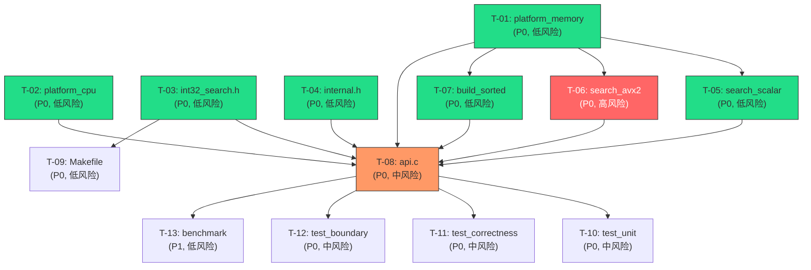

# 原子任务拆分 — Phase 1 MVP (Path A 单路径)

## 1. 任务总览

| 任务ID | 任务名称 | 优先级 | 风险 | 关键路径 | 预估行数 | 依赖 |
|--------|----------|--------|------|----------|----------|------|
| T-01 | 平台内存抽象 | P0 | 低 | 是 | ~30 | 无 |
| T-02 | CPU 能力检测 | P0 | 低 | 是 | ~30 | 无 |
| T-03 | 公开 API 头文件 | P0 | 低 | 是 | ~80 | 无 |
| T-04 | 内部结构体定义 | P0 | 低 | 是 | ~30 | 无 |
| T-05 | 标量二分查找 | P0 | 低 | 是 | ~50 | T-01 |
| T-06 | AVX2 SIMD 二分查找 | P0 | **高** | 是 | ~120 | T-01 |
| T-07 | 数据排序与校验 | P0 | 低 | 是 | ~60 | T-01 |
| T-08 | API 集成层 | P0 | 中 | 是 | ~120 | T-01,T-02,T-03,T-04,T-05,T-06,T-07 |
| T-09 | 构建系统 | P0 | 低 | 是 | ~100 | T-03 |
| T-10 | 单元测试 | P0 | 中 | 否 | ~100 | T-08 |
| T-11 | 正确性交叉验证 | P0 | 中 | 否 | ~80 | T-08 |
| T-12 | SIMD 边界测试 | P0 | 中 | 否 | ~80 | T-08 |
| T-13 | 性能基准 | P1 | 低 | 否 | ~120 | T-08 |

---

## 2. 任务依赖图



**并行执行建议**：
- 第一波（并行）：T-01、T-02、T-03、T-04
- 第二波（并行）：T-05、T-06（依赖 T-01）、T-07（依赖 T-01）
- 第三波：T-08（依赖前两波全部完成）
- 第四波（并行）：T-09、T-10、T-11、T-12、T-13（依赖 T-08）

---

## 3. 原子任务详细定义

---

### T-01: platform_memory.c — 平台内存抽象

| 属性 | 值 |
|------|-----|
| **优先级** | P0 |
| **风险等级** | 低 |
| **关键路径** | 是 |
| **预估行数** | ~30 行 |
| **依赖** | 无 |

#### 输入契约

| 输入项 | 类型 | 说明 |
|--------|------|------|
| 设计文档 | DESIGN 2.1.1 节 | 接口定义：`platform_aligned_alloc`、`platform_aligned_free` |
| POC 参考 | [poc_benchmark_v3.c L10-L16](file:///c:/Users/Administrator/Documents/trae_projects/Int32_search_algorithm/src/poc_benchmark_v3.c#L10-L16) | `_mm_malloc`/`_mm_free` 用法 |

#### 输出契约

| 输出项 | 类型 | 说明 |
|--------|------|------|
| `src/platform_memory.h` | 文件 | 头文件声明 |
| `src/platform_memory.c` | 文件 | 实现文件 |
| 编译验证 | 命令 | `gcc -c -O3 -std=c11 src/platform_memory.c` 通过 |

#### 实现约束

- 函数签名严格按 DESIGN 2.1.1 定义
- `platform_aligned_free(NULL)` 必须幂等（不崩溃）
- 使用 `_mm_malloc(size, 32)` / `_mm_free(ptr)`
- 命名：`platform_aligned_alloc` / `platform_aligned_free`（下划线命名法）

#### 验收标准

- [ ] 编译通过，零警告
- [ ] `platform_aligned_alloc(0)` 行为明确（允许返回 NULL 或有效指针）
- [ ] `platform_aligned_free(NULL)` 不崩溃
- [ ] 返回的指针地址低 5 位全零（32 字节对齐验证）
- [ ] 分配后可写入不崩溃

---

### T-02: platform_cpu.c — CPU 能力检测

| 属性 | 值 |
|------|-----|
| **优先级** | P0 |
| **风险等级** | 低 |
| **关键路径** | 是 |
| **预估行数** | ~30 行 |
| **依赖** | 无 |

#### 输入契约

| 输入项 | 类型 | 说明 |
|--------|------|------|
| 设计文档 | DESIGN 2.1.2 节 | 接口定义：`platform_cpu_has_avx2` |

#### 输出契约

| 输出项 | 类型 | 说明 |
|--------|------|------|
| `src/platform_cpu.h` | 文件 | 头文件声明 |
| `src/platform_cpu.c` | 文件 | 实现文件 |
| 编译验证 | 命令 | `gcc -c -O3 -std=c11 src/platform_cpu.c` 通过 |

#### 实现约束

- 使用 GCC built-in: `__builtin_cpu_supports("avx2")`
- 返回值缓存（静态变量），避免重复 CPUID 调用
- 命名：`platform_cpu_has_avx2`（下划线命名法）

#### 验收标准

- [ ] 编译通过，零警告
- [ ] 返回 0 或 1（无其他值）
- [ ] 多次调用返回一致
- [ ] 在支持 AVX2 的机器上返回 1

---

### T-03: include/int32_search.h — 公开 API 头文件

| 属性 | 值 |
|------|-----|
| **优先级** | P0 |
| **风险等级** | 低 |
| **关键路径** | 是 |
| **预估行数** | ~80 行 |
| **依赖** | 无 |

#### 输入契约

| 输入项 | 类型 | 说明 |
|--------|------|------|
| 设计文档 | DESIGN 2.4.1 节 | 完整 API 声明 + 错误码定义 |
| 技术路线 | 3.1 节 | 公开 API 契约 |

#### 输出契约

| 输出项 | 类型 | 说明 |
|--------|------|------|
| `include/int32_search.h` | 文件 | 唯一公开头文件 |
| 编译验证 | 命令 | `gcc -c -O3 -std=c11 -Iinclude test_dummy.c` 通过 |

#### 实现约束

- 包含 `extern "C"` 块（C++ 兼容）
- 错误码宏定义：5 个（OK/NOT_FOUND/NULL_HANDLE/MEMORY/INVALID_ARG）
- `int32_search_t` = `void*`
- `int32_search_config_t` 预留 8 个 int
- `find_range` 声明标注 `/* reserved, Phase 3 */`
- 命名：`int32_search_*` 前缀（下划线命名法）

#### 验收标准

- [ ] 编译通过（`#include "int32_search.h"` 不报错）
- [ ] C++ 编译器也可编译（`g++ -c -std=c++11`）
- [ ] 所有错误码值明确
- [ ] `find_range` 已声明但标注 reserved
- [ ] 头文件保护宏正确（`#ifndef INT32_SEARCH_H`）

---

### T-04: src/internal.h — 内部结构体定义

| 属性 | 值 |
|------|-----|
| **优先级** | P0 |
| **风险等级** | 低 |
| **关键路径** | 是 |
| **预估行数** | ~30 行 |
| **依赖** | 无 |

#### 输入契约

| 输入项 | 类型 | 说明 |
|--------|------|------|
| 设计文档 | DESIGN 2.4.2 节 | `int32_search_impl_t` 结构定义 |
| 技术路线 | 3.2 节 | 内部结构定义 |

#### 输出契约

| 输出项 | 类型 | 说明 |
|--------|------|------|
| `src/internal.h` | 文件 | 内部头文件（不安装） |
| 编译验证 | 命令 | `gcc -c -O3 -std=c11 -Isrc test_impl.c` 通过 |

#### 实现约束

- 定义 `PATH_A=0`、`PATH_B1=1` 宏
- `int32_search_impl_t` 包含 `vals`、`n`、`path` 三个字段
- MVP 不包含 `lo16`/`dir`/`bloom` 指针（Phase 2/3 扩展）
- 命名：`int32_search_impl_t`（下划线命名法）

#### 验收标准

- [ ] 编译通过
- [ ] `sizeof(int32_search_impl_t)` 合理（24 字节以内）
- [ ] 字段顺序符合 DESIGN
- [ ] `PATH_A` = 0

---

### T-05: search_scalar.c — 标量二分查找

| 属性 | 值 |
|------|-----|
| **优先级** | P0 |
| **风险等级** | 低 |
| **关键路径** | 是 |
| **预估行数** | ~50 行 |
| **依赖** | T-01（platform_memory.h，仅编译依赖） |

#### 输入契约

| 输入项 | 类型 | 说明 |
|--------|------|------|
| 设计文档 | DESIGN 2.3.1 节 | `search_scalar_find` 接口契约 |
| POC 参考 | [poc_benchmark_v3.c L141-L147](file:///c:/Users/Administrator/Documents/trae_projects/Int32_search_algorithm/src/poc_benchmark_v3.c#L141-L147) | 标量二分尾部逻辑 |

#### 输出契约

| 输出项 | 类型 | 说明 |
|--------|------|------|
| `src/search_scalar.h` | 文件 | 头文件声明 |
| `src/search_scalar.c` | 文件 | 实现文件 |
| 编译验证 | 命令 | `gcc -c -O3 -std=c11 src/search_scalar.c` 通过 |

#### 实现约束

- 标准二分查找：`lo=0, hi=n`，`mid = lo + (hi-lo)/2`
- 返回 `int32_t`：命中返回索引，未命中返回 `-1`（内部错误码）
- 命名：`search_scalar_find`（下划线命名法）
- `out_index` 为 NULL 时仅返回状态不写索引

#### 验收标准

- [ ] 编译通过，零警告
- [ ] `n=0` 返回 NOT_FOUND
- [ ] 单元素命中/不命中正确
- [ ] 多元素命中返回第一个匹配位置
- [ ] 与标准 `bsearch()` 结果一致（至少 1000 次随机测试）

---

### T-06: search_avx2.c — AVX2 SIMD 二分查找

| 属性 | 值 |
|------|-----|
| **优先级** | P0 |
| **风险等级** | **高** |
| **关键路径** | 是 |
| **预估行数** | ~120 行 |
| **依赖** | T-01（platform_memory.h，编译依赖） |

#### 输入契约

| 输入项 | 类型 | 说明 |
|--------|------|------|
| 设计文档 | DESIGN 2.3.2 节 + 算法流程图 | `search_avx2_find` 完整算法 |
| POC 参考 | [poc_benchmark_v3.c L114-L148](file:///c:/Users/Administrator/Documents/trae_projects/Int32_search_algorithm/src/poc_benchmark_v3.c#L114-L148) | 已验证的核心算法 |

#### 输出契约

| 输出项 | 类型 | 说明 |
|--------|------|------|
| `src/search_avx2.h` | 文件 | 头文件声明 |
| `src/search_avx2.c` | 文件 | 实现文件 |
| 编译验证 | 命令 | `gcc -c -O3 -std=c11 -mavx2 src/search_avx2.c` 通过 |

#### 实现约束

- 使用 AVX2 intrinsic（`<immintrin.h>`）
- 编译需要 `-mavx2`
- **必须修复**：`block = hi - 8` 下溢保护（`if (block > hi - 8) block = hi - 8`）
- `_mm256_loadu_si256`（非对齐加载，兼容非 32 字节对齐输入）
- `_mm256_cmpgt_epi32` + `_mm256_movemask_ps` + `__builtin_popcount`
- n < 8 时直接走标量路径
- n == 0 立即返回
- 命名：`search_avx2_find`（下划线命名法）
- `out_index` 为 NULL 时仅返回状态不写索引

#### 验收标准

- [ ] `gcc -O3 -std=c11 -mavx2` 编译通过，零警告
- [ ] `-fsanitize=address,undefined` 编译零告警
- [ ] 与 `search_scalar_find` 结果 100% 一致（100 万次随机测试交叉验证）
- [ ] n=0~64 所有值测试通过（边界矩阵）
- [ ] `block=hi-8` 下溢保护生效（n < 8 时不会越界读取）
- [ ] 性能：10M 数据 ~172 cy/query（benchmark 回归验证）

---

### T-07: build_sorted.c — 数据排序与校验

| 属性 | 值 |
|------|-----|
| **优先级** | P0 |
| **风险等级** | 低 |
| **关键路径** | 是 |
| **预估行数** | ~60 行 |
| **依赖** | T-01（platform_memory.h） |

#### 输入契约

| 输入项 | 类型 | 说明 |
|--------|------|------|
| 设计文档 | DESIGN 2.2.1 节 | `build_sort_and_validate` 接口契约 |
| POC 参考 | [poc_benchmark_v3.c L22-L35](file:///c:/Users/Administrator/Documents/trae_projects/Int32_search_algorithm/src/poc_benchmark_v3.c#L22-L35) | 排序 + 比较函数 |

#### 输出契约

| 输出项 | 类型 | 说明 |
|--------|------|------|
| `src/build_sorted.h` | 文件 | 头文件声明 |
| `src/build_sorted.c` | 文件 | 实现文件 |
| 编译验证 | 命令 | `gcc -c -O3 -std=c11 src/build_sorted.c` 通过 |

#### 实现约束

- 使用 `platform_aligned_alloc` 分配新内存
- `qsort()` 排序，不修改原始 `data`
- 排序后校验单调性：`vals[i] <= vals[i+1]` for all i
- 失败时返回 NULL（上层负责回滚）
- 命名：`build_sort_and_validate`（下划线命名法）
- 比较函数：`compare_int32`（静态函数）

#### 验收标准

- [ ] 编译通过，零警告
- [ ] 输入升序数组 → 输出完全一致
- [ ] 输入乱序数组 → 输出升序数组
- [ ] 单调性校验正确（输入降序数组检测为已排序）
- [ ] 内存不足时返回 NULL（可模拟 `platform_aligned_alloc` 返回 NULL）

---

### T-08: api.c — API 集成层

| 属性 | 值 |
|------|-----|
| **优先级** | P0 |
| **风险等级** | 中 |
| **关键路径** | 是 |
| **预估行数** | ~120 行 |
| **依赖** | T-01, T-02, T-03, T-04, T-05, T-06, T-07 |

#### 输入契约

| 输入项 | 类型 | 说明 |
|--------|------|------|
| 设计文档 | DESIGN 2.4.3 节 | `create`/`find`/`destroy`/`version` 完整流程 |
| T-03 输出 | `include/int32_search.h` | API 声明 |
| T-04 输出 | `src/internal.h` | 结构体定义 |
| T-01 输出 | `src/platform_memory.h` | 内存函数 |
| T-02 输出 | `src/platform_cpu.h` | CPU 检测 |
| T-05 输出 | `src/search_scalar.h` | 标量查询 |
| T-06 输出 | `src/search_avx2.h` | AVX2 查询 |
| T-07 输出 | `src/build_sorted.h` | 排序构建 |

#### 输出契约

| 输出项 | 类型 | 说明 |
|--------|------|------|
| `src/api.c` | 文件 | API 实现 |
| 编译验证 | 命令 | 与其他 .o 链接，编译通过 |

#### 实现约束

- `create`：
  - 参数校验（`data==NULL || n==0` → NULL）
  - `calloc` 分配 `impl`
  - 调用 `build_sort_and_validate`
  - 调用 `platform_cpu_has_avx2`（日志记录）
  - 失败回滚：释放所有已分配资源
- `find`：
  - 参数校验（`handle==NULL` → ERR_NULL_HANDLE，`out_index==NULL` → ERR_INVALID_ARG）
  - MVP 直接调用 `search_avx2_find`（MVP 仅有 PATH_A，硬编码）
- `destroy`：
  - `handle==NULL` → 幂等返回 OK
  - `platform_aligned_free(impl->vals)`
  - `free(impl)`
- `version`：返回 `"libint32search 0.1.0"`
- 命名：`int32_search_*`（下划线命名法）
- 调试日志宏（`INT32_SEARCH_DEBUG` 编译开关）

#### 验收标准

- [ ] 编译通过，链接成功
- [ ] `create(NULL, 0, NULL)` 返回 NULL
- [ ] `create`→`find`→`destroy` 完整链路正确
- [ ] `find(NULL, ...)` 返回 ERR_NULL_HANDLE
- [ ] `find(handle, key, NULL)` 返回 ERR_INVALID_ARG
- [ ] `destroy(NULL)` 不崩溃
- [ ] `destroy` 两次调用不崩溃
- [ ] `version()` 返回非空字符串
- [ ] ASan/UBSan 零告警

---

### T-09: 构建系统 — Makefile + CMakeLists.txt + README.txt

| 属性 | 值 |
|------|-----|
| **优先级** | P0 |
| **风险等级** | 低 |
| **关键路径** | 是 |
| **预估行数** | ~100 行 |
| **依赖** | T-03（int32_search.h，需知道文件名） |

#### 输入契约

| 输入项 | 类型 | 说明 |
|--------|------|------|
| 设计文档 | DESIGN 第 6 节 | 构建系统设计 |
| 技术路线 | D-022/D-026 | 三编译目标 |

#### 输出契约

| 输出项 | 类型 | 说明 |
|--------|------|------|
| `Makefile` | 文件 | 三目标 Makefile |
| `CMakeLists.txt` | 文件 | CMake 辅助构建 |
| `README.txt` | 文件 | gcc 编译命令记录 |

#### 实现约束

- Makefile 三目标：`lib`、`test`、`bench`、`clean`
- `search_avx2.o` 单独编译规则（需要 `-mavx2`）
- `test` 目标开启 `-fsanitize=address,undefined -g -DINT32_SEARCH_DEBUG`
- README.txt 记录 gcc 单行编译命令
- CMakeLists.txt 最低可行（`cmake_minimum_required` + 基本 target）

#### 验收标准

- [ ] `make lib` 成功产出 `libint32search.a`
- [ ] `make test` 编译成功（即使测试文件尚未实现，编译通过即可）
- [ ] `make bench` 编译成功（即使 benchmark 文件尚未实现，编译通过即可）
- [ ] `make clean` 清理所有产物
- [ ] `cmake .. && make` 也能正常编译

---

### T-10: test/test_unit.c — 单元测试

| 属性 | 值 |
|------|-----|
| **优先级** | P0 |
| **风险等级** | 中 |
| **关键路径** | 否 |
| **预估行数** | ~100 行 |
| **依赖** | T-08（api.c） |

#### 输入契约

| 输入项 | 类型 | 说明 |
|--------|------|------|
| API 契约 | T-03 `int32_search.h` | 所有 API 签名 |
| 验收标准 | CONSENSUS 4.4 节 | API 契约验收 |

#### 输出契约

| 输出项 | 类型 | 说明 |
|--------|------|------|
| `test/test_unit.c` | 文件 | 单元测试（链接 `libint32search.a`） |
| 运行验证 | 命令 | `make test` 零 FAIL |

#### 测试用例（最小集合）

```
test_create_null_input         — create(NULL, 0, NULL) → NULL
test_create_normal             — create 正常数据 → 非 NULL 句柄
test_find_null_handle          — find(NULL, 42, &idx) → ERR_NULL_HANDLE
test_find_null_out_index       — find(h, 42, NULL) → ERR_INVALID_ARG
test_find_hit                  — 单元素 find 命中 → OK, idx=0
test_find_miss                 — 单元素 find 不命中 → ERR_NOT_FOUND
test_destroy_null              — destroy(NULL) → OK
test_destroy_twice             — destroy(h); destroy(h) → OK
test_version                   — version() 返回非空
```

#### 验收标准

- [ ] 所有测试用例 PASS
- [ ] `make test` 运行后退出码 0
- [ ] ASan/UBSan 编译无告警

---

### T-11: test/test_correctness.c — 正确性交叉验证

| 属性 | 值 |
|------|-----|
| **优先级** | P0 |
| **风险等级** | 中 |
| **关键路径** | 否 |
| **预估行数** | ~80 行 |
| **依赖** | T-08（api.c） |

#### 输入契约

| 输入项 | 类型 | 说明 |
|--------|------|------|
| 验收标准 | CONSENSUS 4.2 节 | 100 万次随机查询 vs bsearch() |

#### 输出契约

| 输出项 | 类型 | 说明 |
|--------|------|------|
| `test/test_correctness.c` | 文件 | 交叉验证测试 |

#### 测试矩阵

```
规模:  100, 10000, 1000000
命中:  50%, 100%, 0%
数据:  升序有序, 乱序后排序
对比:  int32_search_find() vs 标准 bsearch()
```

#### 验收标准

- [ ] 所有测试用例 100% 一致
- [ ] 不命中情况下两种方法都返回 `NULL`/`NOT_FOUND` 一致
- [ ] ASan/UBSan 零告警

---

### T-12: test/test_boundary.c — SIMD 边界测试

| 属性 | 值 |
|------|-----|
| **优先级** | P0 |
| **风险等级** | 中 |
| **关键路径** | 否 |
| **预估行数** | ~80 行 |
| **依赖** | T-08（api.c） |

#### 输入契约

| 输入项 | 类型 | 说明 |
|--------|------|------|
| 安全需求 | 总需求文档 SR-01 | n=0~64 每个值不越界 |
| 安全需求 | D-025 第 5 条 | SIMD 边界测试矩阵 |

#### 输出契约

| 输出项 | 类型 | 说明 |
|--------|------|------|
| `test/test_boundary.c` | 文件 | 边界测试 |

#### 测试矩阵

```
n 值: 0, 1, 2, 3, 4, 5, 6, 7, 8, 9, 15, 16, 17, 31, 32, 33, 63, 64
查询: 命中 (target=data[n/2]), 不命中 (target < data[0]), 不命中 (target > data[n-1])
```

总计 18 x 3 = 54 个测试用例。对每个 n 值生成 [0, n*10) 的升序数据。

#### 验收标准

- [ ] 所有 54 个测试用例 PASS
- [ ] ASan 编译时无 heap-buffer-overflow
- [ ] UBSan 编译时无未定义行为
- [ ] n < 8 全部走标量路径，AVX2 代码路径正确跳过

---

### T-13: benchmark/ — 性能基准

| 属性 | 值 |
|------|-----|
| **优先级** | P1 |
| **风险等级** | 低 |
| **关键路径** | 否 |
| **预估行数** | ~120 行 |
| **依赖** | T-08（api.c） |

#### 输入契约

| 输入项 | 类型 | 说明 |
|--------|------|------|
| 性能需求 | 总需求文档 NFR-01/02/03 | 10M ~172 cy/q, ≥3.5x 加速比 |
| POC 参考 | [poc_benchmark_v3.c](file:///c:/Users/Administrator/Documents/trae_projects/Int32_search_algorithm/src/poc_benchmark_v3.c) | Benchmark 框架 |

#### 输出契约

| 输出项 | 类型 | 说明 |
|--------|------|------|
| `benchmark/bench_main.c` | 文件 | Benchmark 入口 |
| `benchmark/bench_data_gen.h` | 文件 | 测试数据生成函数声明 |
| `benchmark/bench_data_gen.c` | 文件 | 测试数据生成 |

#### 测试矩阵

```
数据规模: 1M, 5M, 10M
命中率:   50%
分布:     uniform random
指标:     cycles/query (__rdtsc), AVX2 加速比 vs 标量二分
```

#### 验收标准

- [ ] `make bench` 编译并运行成功
- [ ] 10M uniform 50% 命中率 < 200 cy/query
- [ ] 10M AVX2 加速比 ≥ 3.5x vs 标量二分
- [ ] 输出格式清晰易读

---

## 4. 执行顺序建议

```
阶段 A（并行，无依赖）:
  □ T-01: platform_memory.c       [P0, 低风险, ~30行]
  □ T-02: platform_cpu.c          [P0, 低风险, ~30行]
  □ T-03: include/int32_search.h  [P0, 低风险, ~80行]
  □ T-04: src/internal.h          [P0, 低风险, ~30行]

阶段 B（并行，依赖 T-01）:
  □ T-05: search_scalar.c         [P0, 低风险, ~50行]
  □ T-06: search_avx2.c           [P0, 高风险, ~120行]  ← 核心
  □ T-07: build_sorted.c          [P0, 低风险, ~60行]

阶段 C（串行，依赖 A+B）:
  □ T-08: api.c                   [P0, 中风险, ~120行]

阶段 D（并行，依赖 C）:
  □ T-09: Makefile/CMake/README   [P0, 低风险, ~100行]
  □ T-10: test_unit.c             [P0, 中风险, ~100行]
  □ T-11: test_correctness.c      [P0, 中风险, ~80行]
  □ T-12: test_boundary.c         [P0, 中风险, ~80行]
  □ T-13: benchmark/              [P1, 低风险, ~120行]
```

---

## 5. 风险汇总

| 风险 | 关联任务 | 等级 | 缓解 |
|------|----------|------|------|
| AVX2 块状二分 `block=hi-8` 下溢 | T-06 | **高** | DESIGN 中已明确修复方案，T-06 验收标准包含边界矩阵 |
| AVX2 intrinsic 在不同 GCC 版本行为差异 | T-06 | 低 | GCC 8.0+ 均已稳定支持 AVX2 intrinsic |
| API 层失败回滚不完整 | T-08 | 中 | DESIGN 2.4.3 已定义完整回滚路径 |
| 测试未覆盖依赖注入失败场景 | T-10 | 低 | 可在 T-10 中 mock `platform_aligned_alloc` 返回 NULL |

---

## 6. 关联信息

- 父文档：[DESIGN_task_001_phase1_mvp.md](DESIGN_task_001_phase1_mvp.md)
- 后续流程：人工审批（Approve 阶段）
- 关联代码：所有任务完成后产出约 1000 行新代码（含测试）
