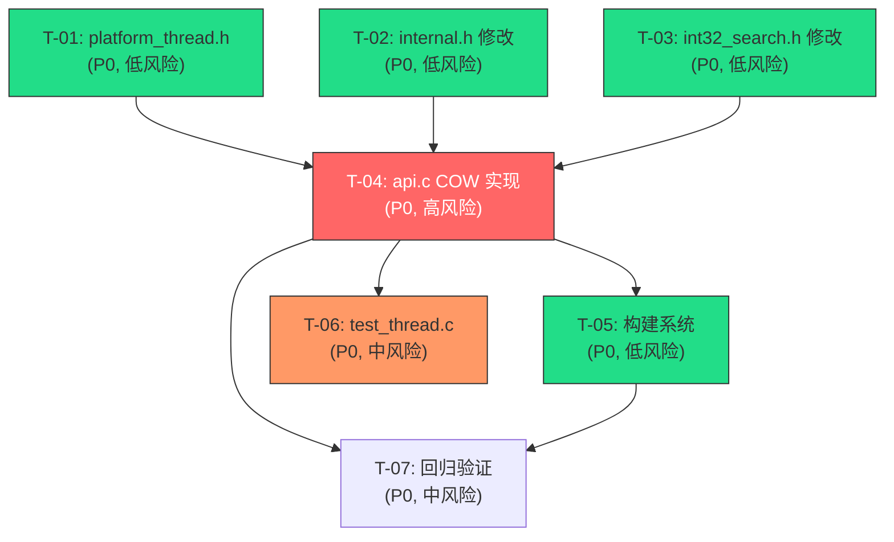

# 原子任务拆分 — Phase 1.5 多线程 COW (Path A)

## 1. 任务总览

| 任务ID | 任务名称 | 优先级 | 风险 | 关键路径 | 预估行数 | 依赖 |
|--------|----------|--------|------|----------|----------|------|
| T-01 | platform_thread.h 原子操作封装 | P0 | 低 | 是 | ~30 | 无 |
| T-02 | internal.h 结构体修改 | P0 | 低 | 是 | ~10 | 无 |
| T-03 | int32_search.h API 声明新增 | P0 | 低 | 是 | ~20 | 无 |
| T-04 | api.c COW 逻辑实现 | P0 | **高** | 是 | ~80（+60新/-20改） | T-01, T-02, T-03 |
| T-05 | 构建系统更新 | P0 | 低 | 是 | ~10 | T-04 |
| T-06 | test_thread.c 并发测试 | P0 | 中 | 否 | ~120 | T-04 |
| T-07 | 回归验证 | P0 | 中 | 否 | 0 | T-04, T-05 |

**总预估**：~270 行新代码 + ~20 行修改。

---

## 2. 任务依赖图



**并行执行建议**：
- 第一波（并行）：T-01、T-02、T-03（无依赖，各自独立）
- 第二波：T-04（依赖前三者全部完成）
- 第三波（并行）：T-05、T-06、T-07（依赖 T-04）

---

## 3. 原子任务详细定义

---

### T-01: platform_thread.h — 原子操作封装

| 属性 | 值 |
|------|-----|
| **优先级** | P0 |
| **风险等级** | 低 |
| **关键路径** | 是 |
| **预估行数** | ~30 行 |
| **依赖** | 无 |

#### 输入契约

| 输入项 | 类型 | 说明 |
|--------|------|------|
| 设计文档 | DESIGN §2.1.1 | platform_thread.h 完整接口定义 |

#### 输出契约

| 输出项 | 类型 | 说明 |
|--------|------|------|
| `src/platform_thread.h` | 文件 | 原子操作封装头文件 |
| 编译验证 | 命令 | `gcc -c -O3 -std=c11 -Isrc test_thread_h.c` 通过 |

#### 实现约束

- 仅头文件（无 .c），全部宏 + 内联函数
- 依赖 `<stdatomic.h>`（C11 标准库）
- 宏定义：
  - `atomic_ptr_load(ptr, order)` → `atomic_load_explicit(ptr, order)`
  - `atomic_ptr_store(ptr, val, order)` → `atomic_store_explicit(ptr, val, order)`
  - `atomic_ptr_exchange(ptr, val, order)` → `atomic_exchange_explicit(ptr, val, order)`
  - `atomic_size_load(ptr, order)` → `atomic_load_explicit(ptr, order)`
  - `atomic_size_store(ptr, val, order)` → `atomic_store_explicit(ptr, val, order)`
  - `atomic_size_fetch_add(ptr, val, order)` → `atomic_fetch_add_explicit(ptr, val, order)`
  - `atomic_size_fetch_sub(ptr, val, order)` → `atomic_fetch_sub_explicit(ptr, val, order)`
- 内联函数：`platform_thread_yield()` — 空函数体（备用的自旋辅助）
- 头文件保护宏：`INT32_SEARCH_PLATFORM_THREAD_H`
- 命名：下划线命名法

#### 验收标准

- [ ] `gcc -c -O3 -std=c11 -Isrc -include platform_thread.h` 编译通过
- [ ] 所有宏可正常展开（简单测试：声明 `atomic_int ptr` 并使用宏）
- [ ] 头文件保护宏正确

---

### T-02: internal.h — 结构体修改

| 属性 | 值 |
|------|-----|
| **优先级** | P0 |
| **风险等级** | 低 |
| **关键路径** | 是 |
| **预估行数** | ~10 行修改 |
| **依赖** | 无 |

#### 输入契约

| 输入项 | 类型 | 说明 |
|--------|------|------|
| 设计文档 | DESIGN §2.2.2 | 修改后 `int32_search_impl_t` 结构定义 |
| 现有代码 | [src/internal.h](file:///c:/Users/Administrator/Documents/trae_projects/Int32_search_algorithm/src/internal.h) | 当前结构体定义 |

#### 输出契约

| 输出项 | 类型 | 说明 |
|--------|------|------|
| `src/internal.h` | 文件 | 修改后的内部头文件 |
| 编译验证 | 命令 | `gcc -c -O3 -std=c11 -Isrc test_impl.c` 通过 |

#### 实现约束

- 修改 `vals`：`int32_t *vals` → `_Atomic int32_t *vals`
- 修改 `n`：`size_t n` → `_Atomic size_t n`
- 新增 `reader_count`：`_Atomic size_t reader_count`
- 新增 `#include <stdatomic.h>`（如果尚未包含）
- `b1_snapshot_t` 保持不变
- 字段顺序：`vals`、`n`、`path`、`search_fn`、`avx2_capable`、`reader_count`
- 不修改 `PATH_A`/`PATH_B1`/`INT32_SEARCH_AVX2_MIN_N` 宏

#### 验收标准

- [ ] 编译通过
- [ ] `_Atomic` 字段可使用 `atomic_init` / `atomic_load` / `atomic_store` 操作
- [ ] Phase 1 的 `api.c` 用旧字段名（`impl->vals`、`impl->n`）的地方全部编译报错（强制开发者适配新类型）

---

### T-03: int32_search.h — API 声明新增

| 属性 | 值 |
|------|-----|
| **优先级** | P0 |
| **风险等级** | 低 |
| **关键路径** | 是 |
| **预估行数** | ~20 行新增 |
| **依赖** | 无 |

#### 输入契约

| 输入项 | 类型 | 说明 |
|--------|------|------|
| 设计文档 | DESIGN §2.4 | `int32_search_rebuild()` 声明 + `find()` 注释更新 |
| 现有代码 | [include/int32_search.h](file:///c:/Users/Administrator/Documents/trae_projects/Int32_search_algorithm/include/int32_search.h) | 当前公开头文件 |

#### 输出契约

| 输出项 | 类型 | 说明 |
|--------|------|------|
| `include/int32_search.h` | 文件 | 修改后的公开头文件 |
| 编译验证 | 命令 | `gcc -c -O3 -std=c11 -Iinclude test_api_h.c` 通过 |

#### 实现约束

- 在 `int32_search_destroy()` 之后、`int32_search_find_range()` 之前插入 `int32_search_rebuild()` 声明
- 函数签名严格按 DESIGN §2.4：
  ```c
  int int32_search_rebuild(int32_search_t handle,
                            const int32_t *data, size_t n);
  ```
- 注释中包含：参数说明、返回值、线程安全约束、失败无副作用
- `find()` 注释中补充"可与 rebuild 并发"说明
- 不新增错误码（复用现有 `ERR_NULL_HANDLE`/`ERR_MEMORY`/`ERR_INVALID_ARG`）

#### 验收标准

- [ ] 编译通过（`#include "int32_search.h"` 不报错）
- [ ] `rebuild` 声明存在且签名正确
- [ ] 文档注释完整（参数、返回值、线程安全）
- [ ] C++ 兼容（`g++ -c -std=c++11` 仍可编译）

---

### T-04: api.c — COW 逻辑实现

| 属性 | 值 |
|------|-----|
| **优先级** | P0 |
| **风险等级** | **高** |
| **关键路径** | 是 |
| **预估行数** | ~80 行（~60 新增 + ~20 修改） |
| **依赖** | T-01, T-02, T-03 |

#### 输入契约

| 输入项 | 类型 | 说明 |
|--------|------|------|
| 设计文档 | DESIGN §2.3 | api.c 四个函数的完整实现契约 |
| T-01 输出 | `src/platform_thread.h` | 原子操作宏 |
| T-02 输出 | `src/internal.h` | 新结构体定义 |
| T-03 输出 | `include/int32_search.h` | 新 API 声明 |
| 现有代码 | [src/api.c](file:///c:/Users/Administrator/Documents/trae_projects/Int32_search_algorithm/src/api.c) | 当前实现 |

#### 输出契约

| 输出项 | 类型 | 说明 |
|--------|------|------|
| `src/api.c` | 文件 | 修改后的 API 实现 |
| 编译验证 | 命令 | `gcc -c -O3 -std=c11 -Iinclude -Isrc src/api.c` 通过 |

#### 子任务 4a: int32_search_create 适配

**修改点**：
- `impl->vals = new_vals;` → `atomic_init(&impl->vals, new_vals);`
- `impl->n = n;` → 保持普通赋值（单线程构造阶段安全）
- 新增 `atomic_init(&impl->reader_count, 0);`
- 新增 `#include "platform_thread.h"`

#### 子任务 4b: int32_search_find 并发改造

**修改点**：
- 替换 `return impl->search_fn(impl->vals, impl->n, key, out_index);`
- 改为：
  ```c
  atomic_size_fetch_add(&impl->reader_count, 1, memory_order_acquire);
  int32_t *v = atomic_ptr_load(&impl->vals, memory_order_acquire);
  size_t _n = atomic_size_load(&impl->n, memory_order_acquire);
  int32_t result = impl->search_fn(v, _n, key, out_index);
  atomic_size_fetch_sub(&impl->reader_count, 1, memory_order_release);
  return result;
  ```

#### 子任务 4c: int32_search_rebuild 新增

**完整实现**（按 DESIGN §2.3.2）：

```c
int int32_search_rebuild(int32_search_t handle,
                          const int32_t *data, size_t n)
{
    if (handle == NULL) return INT32_SEARCH_ERR_NULL_HANDLE;
    if (data == NULL || n == 0) return INT32_SEARCH_ERR_INVALID_ARG;

    int32_search_impl_t *impl = (int32_search_impl_t *)handle;

    DEBUG_LOG("int32_search_rebuild: n=%zu", n);

    int32_t *new_vals = build_sort_and_validate(data, n);
    if (new_vals == NULL) {
        ERROR_LOG("int32_search_rebuild: build_sort_and_validate failed");
        return INT32_SEARCH_ERR_MEMORY;
    }

    atomic_size_store(&impl->n, n, memory_order_release);

    int32_t *old_vals = atomic_ptr_exchange(&impl->vals, new_vals, memory_order_acq_rel);

    DEBUG_LOG("int32_search_rebuild: vals swapped");

    while (atomic_size_load(&impl->reader_count, memory_order_acquire) > 0) {
        platform_thread_yield();
    }

    if (old_vals != NULL) {
        platform_aligned_free(old_vals);
    }

    DEBUG_LOG("int32_search_rebuild: old vals freed, done");
    return INT32_SEARCH_OK;
}
```

#### 子任务 4d: int32_search_destroy 并发改造

**修改点**：
- 在 `platform_aligned_free(impl->vals)` 之前增加 reader 等待：
  ```c
  while (atomic_size_load(&impl->reader_count, memory_order_acquire) > 0) {
      platform_thread_yield();
  }
  ```
- `impl->vals` 读取改为 `atomic_ptr_load(&impl->vals, memory_order_relaxed)`
- 其他逻辑不变（NULL 检查、memset、free）

#### 验收标准

- [ ] `gcc -O3 -std=c11 -mavx2` 编译通过，零警告
- [ ] `create` → `find` 命中/不命中正确（与 Phase 1 行为一致）
- [ ] `create` → `rebuild` → `find` 返回新数据结果
- [ ] `rebuild` 失败后 `find` 仍返回旧数据结果
- [ ] `rebuild(NULL, ...)` 返回 `ERR_NULL_HANDLE`
- [ ] `rebuild(handle, NULL, 0)` 返回 `ERR_INVALID_ARG`
- [ ] `rebuild(handle, data, 0)` 返回 `ERR_INVALID_ARG`
- [ ] `destroy(NULL)` 不崩溃
- [ ] ASan/UBSan 编译零告警

---

### T-05: 构建系统更新

| 属性 | 值 |
|------|-----|
| **优先级** | P0 |
| **风险等级** | 低 |
| **关键路径** | 是 |
| **预估行数** | ~10 行修改 |
| **依赖** | T-04 |

#### 输入契约

| 输入项 | 类型 | 说明 |
|--------|------|------|
| 设计文档 | DESIGN §7 | Makefile/README.txt 修改点 |
| 现有代码 | [Makefile](file:///c:/Users/Administrator/Documents/trae_projects/Int32_search_algorithm/Makefile) | 当前构建文件 |
| 现有代码 | [README.txt](file:///c:/Users/Administrator/Documents/trae_projects/Int32_search_algorithm/README.txt) | 当前说明文件 |

#### 输出契约

| 输出项 | 类型 | 说明 |
|--------|------|------|
| `Makefile` | 文件 | 修改后的构建文件 |
| `README.txt` | 文件 | 更新编译命令 |
| 编译验证 | 命令 | `make lib` 成功产出 `libint32search.a` |

#### 实现约束

**Makefile 修改**：
1. `api.o` 规则依赖新增 `$(SRCDIR)/platform_thread.h`
2. 新增 `test-thread` 目标（使用 `-fsanitize=thread`）：
   ```makefile
   test-thread: $(LIB_NAME).a $(TESTDIR)/test_thread.c
   	$(CC) $(CFLAGS) -fsanitize=thread -g -DINT32_SEARCH_DEBUG \
   		-I$(INCDIR) -I$(SRCDIR) $(TESTDIR)/test_thread.c $(LIB_NAME).a \
   		-o int32search_thread_test -lm
   	./int32search_thread_test
   ```
3. `clean` 规则新增 `int32search_thread_test`
4. `.PHONY` 新增 `test-thread`

**README.txt 修改**：
- 在测试命令区域新增 `make test-thread` 说明

#### 验收标准

- [ ] `make lib` 成功
- [ ] `make test` 成功（Phase 1 测试全 PASS）
- [ ] `make test-thread` 编译成功（测试文件可后实现）
- [ ] `make clean` 清理所有产物（含 thread test）
- [ ] 新增目标在 `.PHONY` 中

---

### T-06: test_thread.c — 并发安全测试

| 属性 | 值 |
|------|-----|
| **优先级** | P0 |
| **风险等级** | 中 |
| **关键路径** | 否 |
| **预估行数** | ~120 行 |
| **依赖** | T-04 |

#### 输入契约

| 输入项 | 类型 | 说明 |
|--------|------|------|
| 设计文档 | DESIGN §8 | 测试用例清单 + 并发测试框架 |
| API 契约 | T-03 `int32_search.h` | rebuild 接口 |

#### 输出契约

| 输出项 | 类型 | 说明 |
|--------|------|------|
| `test/test_thread.c` | 文件 | 并发安全测试 |
| 运行验证 | 命令 | `make test-thread` 零 FAIL |

#### 测试用例（8 个）

```
test_rebuild_basic           — 单线程 rebuild 后 find 返回新数据结果
test_rebuild_preserve_old    — rebuild 内存不足时旧数据仍可用
test_rebuild_null_handle     — rebuild(NULL, ...) → ERR_NULL_HANDLE
test_rebuild_invalid_arg     — rebuild(h, NULL, n) / rebuild(h, data, 0) → ERR_INVALID_ARG
test_concurrent_read_rebuild  — 1 reader + 1 writer 并发 10 秒，TSan 零告警
test_concurrent_n_readers     — 4 readers + 1 writer 并发 10 秒，TSan 零告警
test_destroy_during_read      — reader 未退出时 destroy 等待（不崩溃）
test_rebuild_loop_memory      — 循环 rebuild 100 次后内存无增长
```

#### 实现约束

- 使用 C11 `<threads.h>` 或 POSIX `<pthread.h>`
- 线程函数：reader 循环 `find` 随机 key；writer 循环 `rebuild` 新数据
- 简单断言宏（`#define ASSERT(cond, msg)`），不用外部测试框架
- 数据规模：1000 ~ 10000 元素（足够触发并发竞态）
- TSan 编译标志：`-fsanitize=thread -g`
- 命名：`test_*` 前缀（下划线命名法）

#### 验收标准

- [ ] `make test-thread` 编译通过
- [ ] 8/8 测试用例 PASS
- [ ] ThreadSanitizer 零告警（无 data race 报告）
- [ ] 并发测试运行 ≥ 10 秒无 crash

---

### T-07: 回归验证

| 属性 | 值 |
|------|-----|
| **优先级** | P0 |
| **风险等级** | 中 |
| **关键路径** | 否 |
| **预估行数** | 0（纯验证） |
| **依赖** | T-04, T-05 |

#### 输入契约

| 输入项 | 类型 | 说明 |
|--------|------|------|
| Phase 1 测试 | `test/test_unit.c` / `test/test_correctness.c` / `test/test_boundary.c` | Phase 1 全部测试 |
| Phase 1 benchmark | `benchmark/bench_main.c` | 性能回归 |

#### 输出契约

| 输出项 | 类型 | 说明 |
|--------|------|------|
| 回归报告 | 命令行输出 | 全部 PASS 或 失败列表 |

#### 验证步骤

1. `make clean && make lib`
2. `make test` — Phase 1 测试全部 PASS
3. `make test-force-avx2` — 强制 AVX2 路径 PASS
4. `make bench` — 10M 数据性能不退化（< 1%）
5. `make test-thread` — TSan 零告警

#### 验收标准

- [ ] Phase 1 单元测试 9/9 PASS
- [ ] Phase 1 边界测试 54/54 PASS
- [ ] Phase 1 正确性 500K 查询零差异
- [ ] Phase 1 标量回退测试 PASS
- [ ] Benchmark 10M 数据性能不退化（cycles/query 在 Phase 1 基准 ±1% 内）
- [ ] `make test-thread` ThreadSanitizer 零告警

---

## 4. 执行顺序建议

```
阶段 A（并行，无依赖）:
  □ T-01: platform_thread.h        [P0, 低风险, ~30行]
  □ T-02: internal.h 修改          [P0, 低风险, ~10行]
  □ T-03: int32_search.h 修改      [P0, 低风险, ~20行]

阶段 B（依赖 A）:
  □ T-04: api.c COW 实现           [P0, 高风险, ~80行]  ← 核心

阶段 C（并行，依赖 B）:
  □ T-05: 构建系统                 [P0, 低风险, ~10行]
  □ T-06: test_thread.c            [P0, 中风险, ~120行]
  □ T-07: 回归验证                 [P0, 中风险, 0行]
```

---

## 5. 风险汇总

| 风险 | 关联任务 | 等级 | 缓解 |
|------|----------|------|------|
| `_Atomic` 字段导致旧代码编译报错 | T-02→T-04 | **高** | T-02 预期会破坏编译，T-04 一次性全部适配 |
| 原子操作在热路径增加延迟 | T-04 | 低 | 3 条 lock-free 指令，< 3% 开销，benchmark 回归验证 |
| TSan 与 ASan 冲突 | T-06, T-07 | 中 | 分两次编译，`make test` 用 ASan，`make test-thread` 用 TSan |
| `build_sort_and_validate` 在 Windows 上行为差异 | T-04 | 低 | Windows Phase 3 处理，当前主力 Linux |

---

## 6. 关联信息

- 父文档：[DESIGN_task_002_phase15_cow.md](DESIGN_task_002_phase15_cow.md)
- 前置任务：[task_001_phase1_mvp](file:///c:/Users/Administrator/Documents/trae_projects/Int32_search_algorithm/docs/tasks/task_001_phase1_mvp/task_README.md)
- 关联代码：
  - [api.c](file:///c:/Users/Administrator/Documents/trae_projects/Int32_search_algorithm/src/api.c)
  - [internal.h](file:///c:/Users/Administrator/Documents/trae_projects/Int32_search_algorithm/src/internal.h)
  - [int32_search.h](file:///c:/Users/Administrator/Documents/trae_projects/Int32_search_algorithm/include/int32_search.h)
