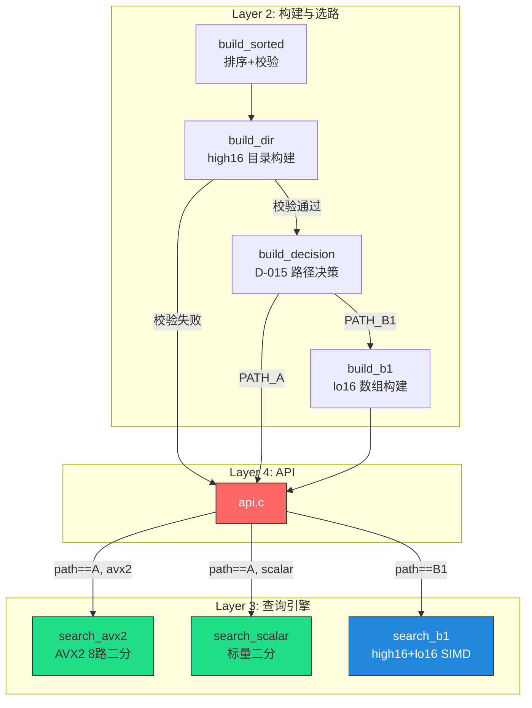

# 最终共识文档 — Phase 2 A+B1 双路径

## 1. 需求描述

### 1.1 功能需求

| 编号 | 功能 | 来源 | 说明 |
|------|------|------|------|
| FR-11 | high16 目录构建 `build_dir()` | 技术路线 §2.1 | 从排序数组构建 `dir[65537]`，记录每个高 16 位值的起始下标 |
| FR-12 | lo16 数组构建 `build_b1()` | 技术路线 §2.1 | 从排序数组提取低 16 位到 `lo16[n]` |
| FR-13 | D-015 自动路径选择 | 总需求文档 §5 | build_dir → dir_validate → max_sz 判定 → PATH_A 或 PATH_B1 |
| FR-14 | B1 路径查找集成 | 技术路线 §2.1 | `find()` 中按 `impl->path` 分支，PATH_B1 时调用 `search_b1_find()` |
| FR-15 | B1 COW 三指针原子交换 | 技术路线 §5.1 | `vals`/`lo16`/`dir` 逐个原子交换，release/acquire 配对 |
| FR-16 | B1 路径 rebuild | 总需求文档 §5 | rebuild 重新构建 B1 数组 + 重新选路 |
| FR-17 | 倾斜数据自动回退 | 总需求文档 §6.3 | max_sz > 0.1×n 检测 → fallback PATH_A |
| FR-18 | 版本号升级至 1.0.0 | 总需求文档 §5 | `int32_search_version()` 返回 "libint32search 1.0.0" |

### 1.2 非功能需求

| 编号 | 需求 | 目标值 |
|------|------|--------|
| NFR-10 | B1 查询性能 | 1M 均匀数据 ~75 cy/query（2.1x vs Path A） |
| NFR-11 | B1 内存占用 | 10M 数据 ≤ 84 MB |
| NFR-12 | B1 并发正确性 | ThreadSanitizer 零告警（单 writer + 多 reader） |
| NFR-13 | A vs B1 交叉验证 | 100 万次随机查询结果逐位一致 |
| NFR-14 | 自动选路正确性 | 1.5M 均匀 → B1；倾斜数据 → Path A |
| NFR-15 | 路径切换正确性 | rebuild 后路径自然切换，旧路径资源正确释放 |
| NFR-16 | Phase 1 回归 | Path A 路径行为完全不变，所有 Phase 1 测试 PASS |

---

## 2. 技术实现方案

### 2.1 总体方案

在 Phase 1.5 代码基础上，以最小侵入方式添加 B1 双路径支持：

- **新增** `build_dir.c/h`：high16 目录构建 + 一致性校验
- **新增** `build_b1.c/h`：lo16 数组构建
- **复用** `search_b1.c/h`：B1 查找算法（POC 已验证，零修改）
- **复用** `build_decision.c/h`：路径决策（POC 已验证，零修改）
- **修改** `internal.h`：新增 `_Atomic` lo16/dir 字段
- **修改** `api.c`：create/rebuild/find/destroy 双路径适配
- **新增** 4 个测试文件：B1 正确性、边界、选路、线程安全

### 2.2 双路径架构图



### 2.3 构建流程（create/rebuild 统一逻辑）

```
CONSTRUCT(data, n):
  1. vals = build_sort_and_validate(data, n)       ← 已有，不变
  2. dir  = build_dir(vals, n)                     ← 新增
  3. IF NOT dir_validate(dir, n):                  ← 新增
       path = PATH_A
       free(dir)
       free(lo16)  // 未分配时 free(NULL) 安全
       RETURN vals, path
  4. lo16 = build_b1(vals, n, dir)                 ← 新增
  5. path = build_decision_select_path(dir, n)     ← 新增（调用已有函数）
  6. IF path == PATH_A:
       free(dir); free(lo16)                       ← 放弃 B1 辅助数组
  7. RETURN vals, dir, lo16, path
```

### 2.4 find() 双路径调度

```c
int int32_search_find(int32_search_t handle, int32_t key, size_t *out_index) {
    if (handle == NULL) return INT32_SEARCH_ERR_NULL_HANDLE;
    if (out_index == NULL) return INT32_SEARCH_ERR_INVALID_ARG;

    int32_search_impl_t *impl = (int32_search_impl_t *)handle;
    atomic_size_fetch_add(&impl->reader_count, 1, memory_order_acquire);

    int32_t result;
    if (impl->path == PATH_B1) {
        const int32_t  *v = atomic_ptr_load(&impl->vals, memory_order_acquire);
        const uint16_t *l = atomic_ptr_load(&impl->lo16, memory_order_acquire);
        const int32_t  *d = atomic_ptr_load(&impl->dir, memory_order_acquire);
        size_t _n = atomic_size_load(&impl->n, memory_order_acquire);
        result = search_b1_find(v, l, d, _n, key, out_index);
    } else {
        int32_t *v = atomic_ptr_load(&impl->vals, memory_order_acquire);
        size_t _n = atomic_size_load(&impl->n, memory_order_acquire);
        result = impl->search_fn(v, _n, key, out_index);
    }

    atomic_size_fetch_sub(&impl->reader_count, 1, memory_order_release);
    return result;
}
```

### 2.5 B1 COW 三指针原子交换顺序

```
Writer (rebuild)                      Reader (find)
─────────────────                     ────────────────
构建 new_vals, new_dir, new_lo16
                                      atomic_add(&reader_count, 1, acquire)

atomic_store(&n, new_n, release)
                                      v = atomic_load(&vals, acquire)
atomic_exchange(&lo16, new_lo16, acq_rel)  ← 先次要
atomic_exchange(&dir,  new_dir,  acq_rel)  ← 再中间
atomic_exchange(&vals, new_vals, acq_rel)  ← 最后核心
                                      d = atomic_load(&dir, acquire)
                                      l = atomic_load(&lo16, acquire)
                                      search_b1_find(v, l, d, n, ...)

自旋等待 reader_count == 0            atomic_sub(&reader_count, 1, release)

释放 old_vals, old_dir, old_lo16
```

**一致性保证**：
- Writer 先更新 `lo16`、`dir`，最后更新 `vals`（release → acq_rel）
- Reader 先读 `vals`，再读 `dir`、`lo16`（acquire）
- Reader 读到新 `vals` 时，新 `lo16`、`dir` 已由 writer 的 acq_rel 确保可见
- Reader 读到旧 `vals` 时，后续 `lo16`、`dir` 也为旧（旧数据未被释放，因为 writer 在等待 reader_count）
- 前提：rebuild 不可并发（与 Phase 1.5 相同）

### 2.6 internal.h 结构变更

```c
// 变更前（Phase 1.5）：
typedef struct {
    _Atomic(int32_t *) vals;
    _Atomic size_t     n;
    int                path;
    int32_t           (*search_fn)(...);
    uint8_t            avx2_capable;
    _Atomic size_t     reader_count;
} int32_search_impl_t;

// 变更后（Phase 2）：
typedef struct {
    _Atomic(const int32_t  *) vals;
    _Atomic(const uint16_t *) lo16;      // 新增：B1 低 16 位数组
    _Atomic(const int32_t  *) dir;       // 新增：high16 目录
    _Atomic size_t            n;
    int                       path;
    int32_t                  (*search_fn)(...);  // 仅 Path A 使用
    uint8_t                   avx2_capable;
    _Atomic size_t            reader_count;
} int32_search_impl_t;
```

### 2.7 关键设计决策（Q1-Q5 决议）

| 决策 | 决议 | 理由 |
|------|------|------|
| Q1 dir/lo16 内存分配 | **普通 malloc/calloc** | lo16 用 `_mm256_loadu_si256`（非对齐加载）；dir 不操作 SIMD |
| Q2 路径切换 | **自然切换** | rebuild 无记忆性，每次独立决策；切换时旧路径资源正常释放 |
| Q3 B1 COW 原子交换 | **逐个原子交换 + 逆序约定** | `vals` 最后交换保证一致性；无 seq-lock（rebuild 不可并发） |
| Q4 target 符号处理 | **现有代码已正确** | `(uint32_t)target >> 16` 覆盖负数 |
| Q5 版本号 | **升级至 1.0.0** | Phase 2 完成后接口稳定 |
| Q6 find() 调度 | **按 path 分支** | 函数指针签名不兼容；分支预测器完美（path 在查询中不变） |
| Q7 dir_validate 失败 | **回退 Path A** | 满足 SR-03：构建阶段强制校验，失败回退 Path A |

### 2.8 技术约束

| 约束 | 说明 |
|------|------|
| C 标准 | C11（`stdatomic.h`、`_Atomic`、`memory_order_*`） |
| 编译器 | GCC ≥ 8.0（主力），MSVC 通过 CMake 支持 |
| SIMD | B1 依赖 `_mm256_loadu_si256` / `_mm256_cmpeq_epi16` / `_mm256_movemask_epi8` |
| 修改范围 | 新增 build_dir/b1；修改 api.c/internal.h；查询引擎零修改 |
| 查询引擎 | `search_avx2.c` / `search_scalar.c` / `search_b1.c` 代码不变 |
| 不新增错误码 | 复用现有 5 个错误码 |
| API 签名不变 | `create`/`find`/`rebuild`/`destroy`/`find_range`/`version` 签名零变化 |

---

## 3. 集成方案

### 3.1 与 Phase 1.5 代码的关系

```
Phase 1.5 文件                        Phase 2 变更
──────────────                        ────────────
include/int32_search.h               版本号注释更新
src/internal.h                       +_Atomic lo16, +_Atomic dir
src/api.c                            create/rebuild 集成 B1 选路；find B1 调度；destroy B1 清理
src/build_dir.c/h                    [新增]
src/build_b1.c/h                     [新增]
src/search_b1.c/h                    已存在，零修改
src/build_decision.c/h               已存在，零修改
src/search_avx2.c/h                  无变更
src/search_scalar.c/h                无变更
src/build_sorted.c/h                 无变更
src/platform_thread.h                无变更（当前宏已覆盖所需操作）
src/platform_memory.c/h              无变更
src/platform_cpu.c/h                 无变更
test/test_unit.c                     应全部继续通过
test/test_correctness.c              应全部继续通过
test/test_boundary.c                 应全部继续通过
test/test_scalar_fallback.c          应全部继续通过
test/test_fuzz.c                     应全部继续通过
test/test_thread.c                   应全部继续通过
test/test_b1_correctness.c           [新增]
test/test_b1_boundary.c              [新增]
test/test_b1_decision.c              [新增]
test/test_thread_b1.c                [新增]
benchmark/bench_main.c               无变更
Makefile                             +build_dir.o +build_b1.o 规则 + test 目标
README.txt                           更新编译命令
```

### 3.2 对 Phase 3 的前向兼容

- ✅ `int32_search_find_range` 存根继续保留，Phase 3 实现
- ✅ `b1_snapshot_t` 在 internal.h 中保留定义（Phase 3 布隆过滤器可扩展）
- ✅ SSE2/AVX-512 编译宏预留框架已存在，Phase 3 直接扩展
- ✅ Bloom filter `#ifdef USE_BLOOM_FILTER` 预留可用

---

## 4. 验收标准

### 4.1 编译验收

- [ ] `gcc -O3 -std=c11 -mavx2` 编译通过，零警告
- [ ] Makefile 所有目标（`lib`/`test`/`bench`/`test-force-avx2`）通过
- [ ] `-fsanitize=address,undefined` 编译零告警
- [ ] `-fsanitize=thread` 编译通过

### 4.2 功能验收

- [ ] `create()` 自动选路：均匀数据 → PATH_B1；倾斜数据 → PATH_A
- [ ] `find()` B1 路径命中/不命中返回正确结果
- [ ] `find()` Path A 路径行为与 Phase 1.5 完全一致
- [ ] `rebuild()` B1→A 路径切换：新数据倾斜时自动回退
- [ ] `rebuild()` A→B1 路径切换：新数据均匀时自动启用
- [ ] `rebuild()` 失败时旧数据不受影响
- [ ] `destroy()` B1 路径额外数组正确释放（无泄漏）
- [ ] `destroy(NULL)` 幂等

### 4.3 正确性验收（交叉验证）

- [ ] A vs B1 交叉验证：100 万次随机查询结果逐位一致
- [ ] n=0 到 n=64 所有边界值 B1 查询与 bsearch() 一致
- [ ] 空桶（dir[h] == dir[h+1]）B1 查询正确返回 NOT_FOUND
- [ ] 单桶全满（所有数据在高 16 位相同桶）B1 查询正确
- [ ] 极端值：INT32_MIN、INT32_MAX、0、-1 正确查询

### 4.4 自动选路验收

- [ ] 1.5M 均匀随机数据 → 选中 PATH_B1
- [ ] 倾斜数据（50% 数据在同一桶）→ 选中 PATH_A
- [ ] dir_validate 失败 → 回退 PATH_A
- [ ] max_sz > 0.1×n → PATH_A
- [ ] max_sz ≤ 2000 → PATH_B1

### 4.5 并发验收（ThreadSanitizer）

- [ ] B1 路径 1 reader + 1 writer 并发：TSan 零告警
- [ ] B1 路径 N readers + 1 writer 并发：TSan 零告警（N ≥ 4）
- [ ] B1 destroy 等待所有 reader 退出：TSan 零告警
- [ ] B1 rebuild 期间 find 持续返回正确结果

### 4.6 回归验收

- [ ] Phase 1 单元测试 9/9 继续 PASS
- [ ] Phase 1 边界测试 全部 PASS
- [ ] Phase 1 正确性交叉验证 500K 查询零差异
- [ ] Phase 1 标量回退测试 PASS
- [ ] Phase 1.5 线程测试 8/8 继续 PASS
- [ ] benchmark 10M Path A 性能不退化（< 1%）

### 4.7 内存安全验收

- [ ] ASan 编译测试零告警
- [ ] B1 路径 `rebuild` 循环 100 次后内存无增长
- [ ] B1 路径 `create` → `destroy` 无泄漏（Valgrind/ASan）
- [ ] 路径从 B1 切换到 A 时，旧 B1 辅助数组正确释放

---

## 5. 风险与缓解

| 风险 | 等级 | 缓解措施 |
|------|------|----------|
| B1 三指针原子交换一致性 | 高 | 严格 release/acq_rel/acquire 配对；TSan 验证；rebuild 不可并发前提 |
| `internal.h` 字段新增破坏现有 `.o` 链接 | 低 | `make clean && make` 全量重编译即可 |
| B1 路径在无 AVX2 CPU 上调用 | 中 | `build_decision` 仅在 `platform_cpu_has_avx2()` 为真时考虑 B1；无 AVX2 时固定 PATH_A |
| lo16 数组使用 `malloc` 非对齐可能降低 SIMD 性能 | 低 | `_mm256_loadu_si256` 非对齐加载在主流 CPU 上性能损失 < 3% |
| 构建期峰值内存翻倍 | 低 | 构建期间新旧 B1 数组共存 ~120MB（10M），释放后降至 ~60MB；在 ≤84MB 稳态预算内 |

---

## 6. 关联信息

- 父文档：[ALIGNMENT_task_003_phase2_ab1.md](ALIGNMENT_task_003_phase2_ab1.md)
- 后续文档：DESIGN_task_003_phase2_ab1.md
- 前置任务：[task_002_phase15_cow](file:///c:/Users/Administrator/Documents/trae_projects/Int32_search_algorithm/docs/tasks/task_002_phase15_cow/task_README.md) — Phase 1.5 多线程 COW（已完成）
- 前置任务：[task_001_phase1_mvp](file:///c:/Users/Administrator/Documents/trae_projects/Int32_search_algorithm/docs/tasks/task_001_phase1_mvp/task_README.md) — Phase 1 MVP（已完成）
- 核心代码：
  - [search_b1.c](file:///c:/Users/Administrator/Documents/trae_projects/Int32_search_algorithm/src/search_b1.c) — B1 查找（已验证）
  - [build_decision.c](file:///c:/Users/Administrator/Documents/trae_projects/Int32_search_algorithm/src/build_decision.c) — 路径决策（已验证）
  - [api.c](file:///c:/Users/Administrator/Documents/trae_projects/Int32_search_algorithm/src/api.c) — API 集成（需修改）
  - [internal.h](file:///c:/Users/Administrator/Documents/trae_projects/Int32_search_algorithm/src/internal.h) — 内部结构（需修改）
