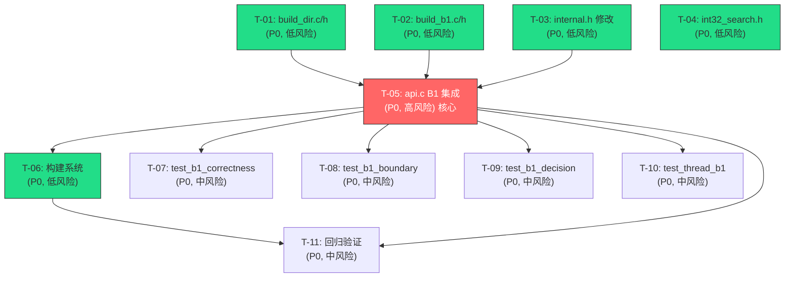

# 原子任务拆分 — Phase 2 A+B1 双路径

## 1. 任务总览

| 任务ID | 任务名称 | 优先级 | 风险 | 关键路径 | 预估行数 | 依赖 |
|--------|----------|--------|------|----------|----------|------|
| T-01 | build_dir.c/h — high16 目录构建 + 校验 | P0 | 低 | 是 | ~80 | 无 |
| T-02 | build_b1.c/h — lo16 数组构建 | P0 | 低 | 是 | ~40 | 无 |
| T-03 | internal.h — 结构体修改 | P0 | 低 | 是 | ~10 | 无 |
| T-04 | int32_search.h — 版本号升级 | P0 | 低 | 否 | ~3 | 无 |
| T-05 | api.c — B1 双路径集成 | P0 | **高** | 是 | +100, ~30 修改 | T-01, T-02, T-03 |
| T-06 | 构建系统更新 | P0 | 低 | 是 | ~15 | T-05 |
| T-07 | test_b1_correctness.c | P0 | 中 | 否 | ~120 | T-05 |
| T-08 | test_b1_boundary.c | P0 | 中 | 否 | ~130 | T-05 |
| T-09 | test_b1_decision.c | P0 | 中 | 否 | ~110 | T-05 |
| T-10 | test_thread_b1.c | P0 | 中 | 否 | ~160 | T-05 |
| T-11 | 回归验证 | P0 | 中 | 否 | 0 | T-05, T-06 |

**总预估**：~768 行新代码 + ~30 行修改。

---

## 2. 任务依赖图



**并行执行建议**：
- 第一波（并行）：T-01、T-02、T-03、T-04（无相互依赖）
- 第二波：T-05（依赖 T-01/T-02/T-03 全部完成）
- 第三波（并行）：T-06、T-07、T-08、T-09、T-10（依赖 T-05）
- 第四波：T-11（依赖 T-05、T-06）

---

## 3. 原子任务详细定义

---

### T-01: build_dir.c/h — high16 目录构建 + 校验

| 属性 | 值 |
|------|-----|
| **优先级** | P0 |
| **风险等级** | 低 |
| **关键路径** | 是 |
| **预估行数** | ~80 行 |
| **依赖** | 无 |

#### 输入契约

| 输入项 | 类型 | 说明 |
|--------|------|------|
| 设计文档 | DESIGN §2.1 | build_dir 完整接口和实现设计 |

#### 输出契约

| 输出项 | 类型 | 说明 |
|--------|------|------|
| `src/build_dir.h` | 文件 | 接口声明：`build_dir()` + `dir_validate()` + `INT32_SEARCH_DIR_SIZE` |
| `src/build_dir.c` | 文件 | 实现：目录构建 + 一致性校验 |
| 编译验证 | 命令 | `gcc -c -O3 -std=c11 -Isrc src/build_dir.c` 通过 |

#### 实现约束

**build_dir.h**：
```c
#ifndef INT32_SEARCH_BUILD_DIR_H
#define INT32_SEARCH_BUILD_DIR_H

#include <stdint.h>
#include <stddef.h>

#define INT32_SEARCH_DIR_SIZE 65537

int32_t *build_dir(const int32_t *vals, size_t n);
int dir_validate(const int32_t *dir, size_t n);

#endif
```

**build_dir.c**：
- 使用 `calloc(65537, sizeof(int32_t))` 分配 dir
- 第一遍：遍历 vals，对每个元素 `h = (uint16_t)((uint32_t)vals[i] >> 16)`，如果 `dir[h] == 0` 且是首次出现，则 `dir[h] = i`
- 第二遍：从高到低补全空洞，`dir[i] = 0 && i != 0` 时设为 `next_start`
- `dir[65536] = (int32_t)n`
- `dir_validate`：检查单调非降、值在 `[0, n]` 范围内、`dir[65536] == n`
- 失败时 `build_dir` 返回 NULL（calloc 失败）

#### 验收标准

- [ ] `gcc -c -O3 -std=c11` 编译通过，零警告
- [ ] 均匀数据：`dir[i+1] >= dir[i]`，`dir[65536] == n`
- [ ] 空数据：n=0 返回 NULL
- [ ] 全同数据：所有元素高 16 位相同，dir 只有一个非零项
- [ ] `dir_validate` 正常目录返回 1
- [ ] `dir_validate(NULL, n)` 返回 0
- [ ] `dir_validate(dir, n)` 当 `dir[65536] != n` 时返回 0

---

### T-02: build_b1.c/h — lo16 数组构建

| 属性 | 值 |
|------|-----|
| **优先级** | P0 |
| **风险等级** | 低 |
| **关键路径** | 是 |
| **预估行数** | ~40 行 |
| **依赖** | 无 |

#### 输入契约

| 输入项 | 类型 | 说明 |
|--------|------|------|
| 设计文档 | DESIGN §2.2 | build_b1 完整接口和实现设计 |

#### 输出契约

| 输出项 | 类型 | 说明 |
|--------|------|------|
| `src/build_b1.h` | 文件 | 接口声明：`build_b1()` |
| `src/build_b1.c` | 文件 | 实现：lo16 提取 |
| 编译验证 | 命令 | `gcc -c -O3 -std=c11 -Isrc src/build_b1.c` 通过 |

#### 实现约束

**build_b1.h**：
```c
#ifndef INT32_SEARCH_BUILD_B1_H
#define INT32_SEARCH_BUILD_B1_H

#include <stdint.h>
#include <stddef.h>

uint16_t *build_b1(const int32_t *vals, size_t n, const int32_t *dir);

#endif
```

**build_b1.c**：
- 使用 `malloc(n * sizeof(uint16_t))` 分配 lo16
- 遍历 vals，`lo16[i] = (uint16_t)(vals[i] & 0xFFFF)`
- 参数 `dir` 当前不使用（仅签名保留），但需要传入以确保接口统一
- 失败返回 NULL（malloc 失败）

#### 验收标准

- [ ] `gcc -c -O3 -std=c11` 编译通过，零警告
- [ ] `lo16[i] == (vals[i] & 0xFFFF)` for all i
- [ ] n=0 返回 NULL
- [ ] vals=NULL 返回 NULL
- [ ] lo16 数组为 `uint16_t` 类型，大小正确

---

### T-03: internal.h — 结构体修改

| 属性 | 值 |
|------|-----|
| **优先级** | P0 |
| **风险等级** | 低 |
| **关键路径** | 是 |
| **预估行数** | ~10 行修改 |
| **依赖** | 无 |

#### 输入契约

| 输入项 | 类型 | 说明 |
|--------|------|------|
| 设计文档 | DESIGN §2.3 | 修改后 `int32_search_impl_t` 结构定义 |
| 现有代码 | [src/internal.h](file:///c:/Users/Administrator/Documents/trae_projects/Int32_search_algorithm/src/internal.h) | 当前结构体定义 |

#### 输出契约

| 输出项 | 类型 | 说明 |
|--------|------|------|
| `src/internal.h` | 文件 | 修改后的内部头文件 |

#### 实现约束

- 新增 `_Atomic(const uint16_t *) lo16;` 在 `vals` 之后
- 新增 `_Atomic(const int32_t *) dir;` 在 `lo16` 之后
- 修改 `_Atomic(int32_t *) vals` → `_Atomic(const int32_t *) vals`（与新增字段 const 一致性）
- 字段顺序：`vals` → `lo16` → `dir` → `n` → `path` → `search_fn` → `avx2_capable` → `reader_count`
- 不修改 `PATH_A`/`PATH_B1`/`INT32_SEARCH_AVX2_MIN_N` 宏
- 不修改 `b1_snapshot_t` 定义

#### 验收标准

- [ ] 编译通过（需要后续 T-05 适配 api.c）
- [ ] `_Atomic` 字段声明语法正确
- [ ] `const` 修饰符与 `search_b1_find` 参数签名匹配

---

### T-04: int32_search.h — 版本号升级

| 属性 | 值 |
|------|-----|
| **优先级** | P0 |
| **风险等级** | 低 |
| **关键路径** | 否 |
| **预估行数** | ~3 行修改 |
| **依赖** | 无 |

#### 输入契约

| 输入项 | 类型 | 说明 |
|--------|------|------|
| 现有代码 | [include/int32_search.h](file:///c:/Users/Administrator/Documents/trae_projects/Int32_search_algorithm/include/int32_search.h) | 当前公开头文件 |

#### 输出契约

| 输出项 | 类型 | 说明 |
|--------|------|------|
| `include/int32_search.h` | 文件 | 版本号注释更新 |

#### 实现约束

- 在 `int32_search_version()` 的文档注释中更新版本号为 `"libint32search 1.0.0"`
- 在 `find()` 注释中补充 B1 路径说明："实现路径：Path A 时走 AVX2/标量二分；Path B1 时走高 16 位目录 + 低 16 位 SIMD 扫描"
- **不修改任何函数签名**
- **不新增错误码**

#### 验收标准

- [ ] `gcc -c -O3 -std=c11 -Iinclude` 编译通过
- [ ] C++ 兼容（`g++ -c -std=c++11` 仍可编译）

---

### T-05: api.c — B1 双路径集成

| 属性 | 值 |
|------|-----|
| **优先级** | P0 |
| **风险等级** | **高** |
| **关键路径** | 是 |
| **预估行数** | ~100 行新增 + ~30 行修改 |
| **依赖** | T-01, T-02, T-03 |

#### 输入契约

| 输入项 | 类型 | 说明 |
|--------|------|------|
| 设计文档 | DESIGN §2.4 | api.c 四个函数的完整实现契约 |
| T-01 输出 | `src/build_dir.h` | build_dir + dir_validate |
| T-02 输出 | `src/build_b1.h` | build_b1 |
| T-03 输出 | `src/internal.h` | 新结构体定义 |
| 现有代码 | [src/api.c](file:///c:/Users/Administrator/Documents/trae_projects/Int32_search_algorithm/src/api.c) | 当前实现 |
| 已有代码 | [src/search_b1.h](file:///c:/Users/Administrator/Documents/trae_projects/Int32_search_algorithm/src/search_b1.h) | search_b1_find |
| 已有代码 | [src/build_decision.h](file:///c:/Users/Administrator/Documents/trae_projects/Int32_search_algorithm/src/build_decision.h) | build_decision_select_path |

#### 输出契约

| 输出项 | 类型 | 说明 |
|--------|------|------|
| `src/api.c` | 文件 | 修改后的 API 实现 |
| 编译验证 | 命令 | `gcc -c -O3 -std=c11 -mavx2 -Iinclude -Isrc src/api.c` 通过 |

#### 子任务 5a: 新增 #include

在现有 `#include` 列表中新增：
```c
#include "build_dir.h"
#include "build_b1.h"
#include "build_decision.h"
#include "search_b1.h"
```

#### 子任务 5b: int32_search_create — 双路径构建

按 DESIGN §2.4.1 实现，关键变更：
1. 排序后调用 `build_dir()` → `dir_validate()` → `build_b1()` → `build_decision_select_path()`
2. 任何步骤失败 → 回退 `setup_path_a`
3. `PATH_B1` → 初始化 `vals`/`lo16`/`dir` 三个原子字段
4. `PATH_A` → 释放 `dir`/`lo16`，初始化 `lo16`/`dir` 为 NULL
5. `search_fn` 仅 Path A 时设置（B1 不用函数指针）
6. `impl->n` 非原子赋值（单线程阶段安全）
7. 日志新增：`selected_path=%s` 和最终 `path=%s, search_fn=%s`

#### 子任务 5c: int32_search_find — 双路径调度

按 DESIGN §2.4.2 实现：
1. `impl->path == PATH_B1` 时：
   - 原子 load `vals` → `dir` → `lo16`（先核心后次要）
   - 调用 `search_b1_find(v, l, d, _n, key, out_index)`
2. `impl->path != PATH_B1` 时：
   - 保持 Phase 1.5 逻辑（`impl->search_fn` 调度）
3. reader_count 的 acquire/release 对两个路径统一

#### 子任务 5d: int32_search_rebuild — B1 COW

按 DESIGN §2.4.3 实现：
1. 构建 `new_vals` → `new_dir` → `new_lo16`（含 dir_validate + 决策）
2. 失败回退 Path A
3. 若 `new_path == PATH_B1`：逐个原子交换 `lo16` → `dir` → `vals`（全部 acq_rel）
4. 若 `new_path == PATH_A`：`lo16`/`dir` 原子交换为 NULL，`vals` 正常交换
5. 更新 `impl->path = new_path`
6. 等待 `reader_count == 0`
7. 释放旧 vals（platform_aligned_free）、lo16（free）、dir（free）
8. **注意**：旧 lo16/dir 使用普通 `free()` 而非 `platform_aligned_free()`（它们是 malloc 分配的）

#### 子任务 5e: int32_search_destroy — B1 清理

按 DESIGN §2.4.4 实现：
1. 等待 `reader_count == 0`
2. 释放 `impl->vals`（platform_aligned_free）
3. 若 `impl->path == PATH_B1`：释放 `impl->lo16`（free）和 `impl->dir`（free）
4. memset + free impl

#### 子任务 5f: int32_search_version — 版本号

```c
const char *int32_search_version(void)
{
    return "libint32search 1.0.0";
}
```

#### 验收标准

- [ ] `gcc -O3 -std=c11 -mavx2` 编译通过，零警告
- [ ] `create` → `find` 命中/不命中正确（均匀数据 → B1；倾斜数据 → A）
- [ ] `create` → `rebuild` → `find` 返回新数据结果（B1 和 A 路径）
- [ ] `rebuild` 失败后 `find` 仍返回旧数据结果
- [ ] `rebuild(NULL, ...)` → `ERR_NULL_HANDLE`
- [ ] `rebuild(handle, NULL, n)` → `ERR_INVALID_ARG`
- [ ] `rebuild(handle, data, 0)` → `ERR_INVALID_ARG`
- [ ] 路径切换 B1→A：rebuild 倾斜数据后 find 仍正确
- [ ] 路径切换 A→B1：rebuild 均匀数据后 find 仍正确
- [ ] `destroy(NULL)` 不崩溃
- [ ] `version()` 返回 "libint32search 1.0.0"
- [ ] ASan/UBSan 编译零告警

---

### T-06: 构建系统更新

| 属性 | 值 |
|------|-----|
| **优先级** | P0 |
| **风险等级** | 低 |
| **关键路径** | 是 |
| **预估行数** | ~15 行修改 |
| **依赖** | T-05 |

#### 输入契约

| 输入项 | 类型 | 说明 |
|--------|------|------|
| 设计文档 | DESIGN §7 | Makefile/README.txt 修改点 |
| 现有代码 | [Makefile](file:///c:/Users/Administrator/Documents/trae_projects/Int32_search_algorithm/Makefile) | 当前构建文件 |
| 现有代码 | [README.txt](file:///c:/Users/Administrator/Documents/trae_projects/Int32_search_algorithm/README.txt) | 当前说明文件 |

#### 输出契约

| 输出项 | 类型 | 说明 |
|--------|------|------|
| `Makefile` | 文件 | 修改后的构建文件 |
| `README.txt` | 文件 | 更新编译命令 |
| 编译验证 | 命令 | `make lib` 成功产出 `libint32search.a` |

#### 实现约束

**Makefile**：
1. SRCS 新增 `$(SRCDIR)/build_dir.c`、`$(SRCDIR)/build_b1.c`、`$(SRCDIR)/build_decision.c`、`$(SRCDIR)/search_b1.c`
2. `api.o` 规则依赖新增 `build_dir.h`、`build_b1.h`、`build_decision.h`、`search_b1.h`
3. 新增 `test-b1` 目标（ASan）：
   ```makefile
   test-b1: $(LIB_NAME).a $(TESTDIR)/test_b1_correctness.c $(TESTDIR)/test_b1_boundary.c $(TESTDIR)/test_b1_decision.c
   	$(CC) $(CFLAGS) -fsanitize=address,undefined -g -DINT32_SEARCH_DEBUG \
   		-I$(INCDIR) -I$(SRCDIR) $(TESTDIR)/test_b1_correctness.c $(LIB_NAME).a \
   		-o int32search_b1_correctness_test -lm
   	./int32search_b1_correctness_test
   	$(CC) $(CFLAGS) -fsanitize=address,undefined -g -DINT32_SEARCH_DEBUG \
   		-I$(INCDIR) -I$(SRCDIR) $(TESTDIR)/test_b1_boundary.c $(LIB_NAME).a \
   		-o int32search_b1_boundary_test -lm
   	./int32search_b1_boundary_test
   	$(CC) $(CFLAGS) -fsanitize=address,undefined -g -DINT32_SEARCH_DEBUG \
   		-I$(INCDIR) -I$(SRCDIR) $(TESTDIR)/test_b1_decision.c $(LIB_NAME).a \
   		-o int32search_b1_decision_test -lm
   	./int32search_b1_decision_test
   ```
4. 新增 `test-thread-b1` 目标（TSan）
5. `clean` 规则新增 B1 测试产物清理
6. `.PHONY` 新增 `test-b1`、`test-thread-b1`

**README.txt**：
- 在测试命令区域新增 B1 测试命令

#### 验收标准

- [ ] `make lib` 成功
- [ ] `make test` 成功（Phase 1.5 测试全 PASS）
- [ ] `make test-b1` 编译成功（测试文件可后实现）
- [ ] `make test-thread-b1` 编译成功
- [ ] `make clean` 清理所有产物（含 B1 测试）
- [ ] 新增目标在 `.PHONY` 中

---

### T-07: test_b1_correctness.c — B1 正确性交叉验证

| 属性 | 值 |
|------|-----|
| **优先级** | P0 |
| **风险等级** | 中 |
| **关键路径** | 否 |
| **预估行数** | ~120 行 |
| **依赖** | T-05 |

#### 输入契约

| 输入项 | 类型 | 说明 |
|--------|------|------|
| API 契约 | `int32_search.h` | create/find/destroy 接口 |

#### 输出契约

| 输出项 | 类型 | 说明 |
|--------|------|------|
| `test/test_b1_correctness.c` | 文件 | B1 vs A 交叉验证测试 |
| 运行验证 | 命令 | `make test-b1` 零 FAIL |

#### 测试用例

```
test_b1_vs_a_hit_10k       — 10K 均匀数据，B1 命中结果与标量二分一致
test_b1_vs_a_miss_10k      — 10K 均匀数据，不命中 key 结果一致
test_b1_vs_a_large_1m      — 100 万次随机查询 B1 vs 标量（用 Force AVX2 同路径对比 A）
test_b1_vs_bsearch_100k    — 100K 数据 B1 与 C 标准库 bsearch() 一致
test_b1_negative_keys      — 负数 key（-1, -100, INT32_MIN）正确查找
test_b1_extreme_values     — INT32_MIN / INT32_MAX / 0 边界值
```

**实现要点**：
- 简单断言宏 `#define ASSERT(cond, msg)`
- 数据生成：构造均匀随机 int32_t 数组
- 对比方法：另建一个弱决策版本（固定 PATH_A 标量）或在 fuzz 中对比
- 100 万次查询对比

#### 验收标准

- [ ] 所有测试用例 PASS
- [ ] 100 万次 B1 vs Path A 零差异
- [ ] ASan/UBSan 零告警

---

### T-08: test_b1_boundary.c — B1 边界测试

| 属性 | 值 |
|------|-----|
| **优先级** | P0 |
| **风险等级** | 中 |
| **关键路径** | 否 |
| **预估行数** | ~130 行 |
| **依赖** | T-05 |

#### 输入契约

| 输入项 | 类型 | 说明 |
|--------|------|------|
| API 契约 | `int32_search.h` | create/find 接口 |

#### 输出契约

| 输出项 | 类型 | 说明 |
|--------|------|------|
| `test/test_b1_boundary.c` | 文件 | B1 边界测试 |
| 运行验证 | 命令 | 零 FAIL |

#### 测试用例

```
test_b1_n0                — n=0, create 返回 NULL
test_b1_n1_hit            — n=1, 命中
test_b1_n1_miss           — n=1, 不命中
test_b1_n2_to_n16         — n=2~16, SIMD 块内边界
test_b1_n17_to_n64        — n=17~64, 跨 SIMD 块
test_b1_empty_bucket      — 空桶（dir[h]==dir[h+1]）→ NOT_FOUND
test_b1_single_bucket     — 所有数据在同一桶（全相同高 16 位）
test_b1_all_buckets_test  — 数据分布所有桶（每个桶 1 个元素）
test_b1_first_bucket      — 第 0 桶查找
test_b1_last_bucket       — 第 65535 桶查找
test_b1_out_of_range      — key 的高 16 位超出所有桶范围
test_b1_n64_start         — start 位置刚好在 SIMD 边界（n=64, start=48）
```

#### 验收标准

- [ ] 所有测试用例 PASS
- [ ] B1 查找结果与 `bsearch()` 一致
- [ ] n=0~64 所有值无越界、无 crash
- [ ] ASan/UBSan 零告警

---

### T-09: test_b1_decision.c — 自动选路测试

| 属性 | 值 |
|------|-----|
| **优先级** | P0 |
| **风险等级** | 中 |
| **关键路径** | 否 |
| **预估行数** | ~110 行 |
| **依赖** | T-05 |

#### 输入契约

| 输入项 | 类型 | 说明 |
|--------|------|------|
| API 契约 | `int32_search.h` | create 接口 |
| 内部头文件 | `src/build_decision.h` | B1_MAX_BUCKET_THRESHOLD |

#### 输出契约

| 输出项 | 类型 | 说明 |
|--------|------|------|
| `test/test_b1_decision.c` | 文件 | 自动选路测试 |
| 运行验证 | 命令 | 零 FAIL |

#### 测试用例

```
test_decision_uniform_1_5m  — 1.5M 均匀随机数据 → PATH_B1
test_decision_uniform_100k  — 100K 均匀随机数据 → PATH_B1（max_bucket ≤ 2000）
test_decision_skewed_50pct  — 50% 数据集中同一桶 → PATH_A（max_sz > 0.1n）
test_decision_skewed_20pct  — 20% 数据集中同一桶 → PATH_A
test_decision_skewed_5pct   — 5% 数据集中同一桶 → PATH_B1（max_sz ≤ 0.1n）
test_decision_max_bucket_2000_b1 — 构造 max_bucket=2000 → PATH_B1
test_decision_max_bucket_2001_a  — 构造 max_bucket=2001 → PATH_A
test_decision_small_n_100   — n=100, max_bucket ≤ 2000 → PATH_B1
```

**实现要点**：
- 需要访问 `impl->path` 字段来判断选路结果。由于 `path` 不是公开 API，测试文件需要 `#include "internal.h"` 并直接读取内部字段
- 或通过间接方式验证：构造均匀 B1 数据后用 `find` 的性能/结果验证

#### 验收标准

- [ ] 所有测试用例 PASS
- [ ] 均匀数据正确选中 B1
- [ ] 倾斜数据正确回退 Path A
- [ ] 阈值边界（2000↔2001 和 n/10）精确检查
- [ ] ASan/UBSan 零告警

---

### T-10: test_thread_b1.c — B1 COW 并发测试

| 属性 | 值 |
|------|-----|
| **优先级** | P0 |
| **风险等级** | 中 |
| **关键路径** | 否 |
| **预估行数** | ~160 行 |
| **依赖** | T-05 |

#### 输入契约

| 输入项 | 类型 | 说明 |
|--------|------|------|
| API 契约 | `int32_search.h` | rebuild/find/destroy 接口 |

#### 输出契约

| 输出项 | 类型 | 说明 |
|--------|------|------|
| `test/test_thread_b1.c` | 文件 | B1 COW 并发测试 |
| 运行验证 | 命令 | `make test-thread-b1` 零 FAIL |

#### 测试用例

```
test_b1_rebuild_basic         — B1 单线程 rebuild 后 find 返回新数据
test_b1_rebuild_preserve_old  — B1 rebuild 失败时旧数据仍可用
test_b1_concurrent_read_rebuild — B1 1 reader + 1 writer 并发 10 秒
test_b1_concurrent_n_readers  — B1 4 readers + 1 writer 并发 10 秒
test_b1_path_switch_b1_to_a   — B1→A 路径切换：rebuild 倾斜数据
test_b1_path_switch_a_to_b1   — A→B1 路径切换：rebuild 均匀数据
test_b1_destroy_during_read   — B1 reader 活跃时 destroy 等待
test_b1_rebuild_loop_memory   — B1 循环 rebuild 100 次内存无增长
```

**实现要点**：
- 复用 Phase 1.5 `test_thread.c` 框架模式
- 数据规模 1000~10000（足够触发竞态）
- reader 线程循环 `find` 随机 key
- writer 线程循环 `rebuild` 新数据
- TSan 编译：`-fsanitize=thread -g`
- 所有测试最终 TSan 零告警

#### 验收标准

- [ ] `make test-thread-b1` 编译通过
- [ ] 8/8 测试用例 PASS
- [ ] ThreadSanitizer 零告警
- [ ] 并发测试运行 ≥ 10 秒无 crash
- [ ] B1→A 和 A→B1 路径切换正确

---

### T-11: 回归验证

| 属性 | 值 |
|------|-----|
| **优先级** | P0 |
| **风险等级** | 中 |
| **关键路径** | 否 |
| **预估行数** | 0（纯验证） |
| **依赖** | T-05, T-06 |

#### 输入契约

| 输入项 | 类型 | 说明 |
|--------|------|------|
| Phase 1 测试 | `test/test_unit.c` 等 | Phase 1 全部测试 |
| Phase 1.5 测试 | `test/test_thread.c` | Phase 1.5 COW 测试 |
| Benchmark | `benchmark/bench_main.c` | 性能回归 |

#### 输出契约

| 输出项 | 类型 | 说明 |
|--------|------|------|
| 回归报告 | 命令行输出 | 全部 PASS 或 失败列表 |

#### 验证步骤

1. `make clean && make lib`
2. `make test` — Phase 1 测试全部 PASS
3. `make test-force-avx2` — 强制 AVX2 路径 PASS
4. `make test-thread` — Phase 1.5 TSan 零告警
5. `make test-b1` — B1 正确性 + 边界 + 选路测试 PASS
6. `make test-thread-b1` — B1 TSan 零告警
7. `make bench` — 10M Path A 性能不退化（< 1%）
8. 手动 B1 bench 验证（可选）：1M 均匀数据 ~75 cy/query 级别

#### 验收标准

- [ ] Phase 1 单元测试 9/9 PASS
- [ ] Phase 1 边界测试全 PASS
- [ ] Phase 1 正确性测试全 PASS
- [ ] Phase 1 标量回退测试 PASS
- [ ] Phase 1 模糊测试 PASS
- [ ] Phase 1.5 线程测试 8/8 PASS
- [ ] B1 正确性测试全 PASS
- [ ] B1 边界测试全 PASS
- [ ] B1 选路测试全 PASS
- [ ] B1 线程测试 8/8 PASS
- [ ] `make test` + `make test-b1` + `make test-thread` + `make test-thread-b1` 全绿
- [ ] Benchmark 10M Path A 性能不退化（< 1%）
- [ ] `int32_search_version()` → "libint32search 1.0.0"

---

## 4. 执行顺序建议

```
阶段 A（并行，无依赖）:
  □ T-01: build_dir.c/h           [P0, 低风险, ~80行]
  □ T-02: build_b1.c/h            [P0, 低风险, ~40行]
  □ T-03: internal.h 修改         [P0, 低风险, ~10行]
  □ T-04: int32_search.h 修改     [P0, 低风险, ~3行]

阶段 B（依赖 A）:
  □ T-05: api.c B1 集成           [P0, 高风险, ~130行]  ← 核心

阶段 C（并行，依赖 B）:
  □ T-06: 构建系统                [P0, 低风险, ~15行]
  □ T-07: test_b1_correctness.c   [P0, 中风险, ~120行]
  □ T-08: test_b1_boundary.c      [P0, 中风险, ~130行]
  □ T-09: test_b1_decision.c      [P0, 中风险, ~110行]
  □ T-10: test_thread_b1.c        [P0, 中风险, ~160行]

阶段 D（依赖 C）:
  □ T-11: 回归验证                [P0, 中风险, 0行]
```

---

## 5. 风险汇总

| 风险 | 关联任务 | 等级 | 缓解 |
|------|----------|------|------|
| api.c B1 集成逻辑错误 | T-05 | **高** | 严格按 DESIGN 实现；T-07~T-10 全量测试覆盖 |
| B1 COW 三指针竞态 | T-05, T-10 | **高** | 严格 release/acq_rel/acquire 配对；TSan 验证 |
| build_dir 空洞补全逻辑错误 | T-01 | 中 | test_b1_boundary 全桶/空桶/最后桶覆盖 |
| Path A 性能退化 | T-11 | 低 | benchmark 回归验证 |
| `const` 修饰符与旧代码不兼容 | T-03, T-05 | 中 | `const` 转换是安全的（只读语义），编译器警告检查 |
| B1→A 路径切换时 find() 读 NULL lo16/dir | T-05, T-10 | 中 | search_b1_find 有 NULL 检查；path 分支在 find 入口 |
| `build_decision.c` 已有但未链接 | T-06 | 低 | Makefile 新增编译规则 |

---

## 6. 关联信息

- 父文档：[DESIGN_task_003_phase2_ab1.md](DESIGN_task_003_phase2_ab1.md)
- 前置任务：[task_002_phase15_cow](file:///c:/Users/Administrator/Documents/trae_projects/Int32_search_algorithm/docs/tasks/task_002_phase15_cow/task_README.md)
- 前置任务：[task_001_phase1_mvp](file:///c:/Users/Administrator/Documents/trae_projects/Int32_search_algorithm/docs/tasks/task_001_phase1_mvp/task_README.md)
- 关联代码：
  - [api.c](file:///c:/Users/Administrator/Documents/trae_projects/Int32_search_algorithm/src/api.c) — 核心修改
  - [internal.h](file:///c:/Users/Administrator/Documents/trae_projects/Int32_search_algorithm/src/internal.h) — 结构体修改
  - [search_b1.c](file:///c:/Users/Administrator/Documents/trae_projects/Int32_search_algorithm/src/search_b1.c) — 不变
  - [build_decision.c](file:///c:/Users/Administrator/Documents/trae_projects/Int32_search_algorithm/src/build_decision.c) — 不变
