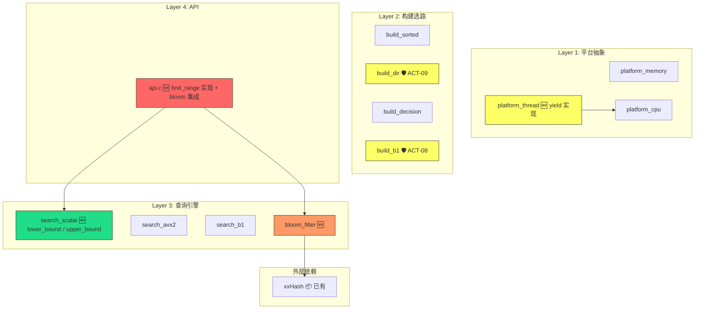
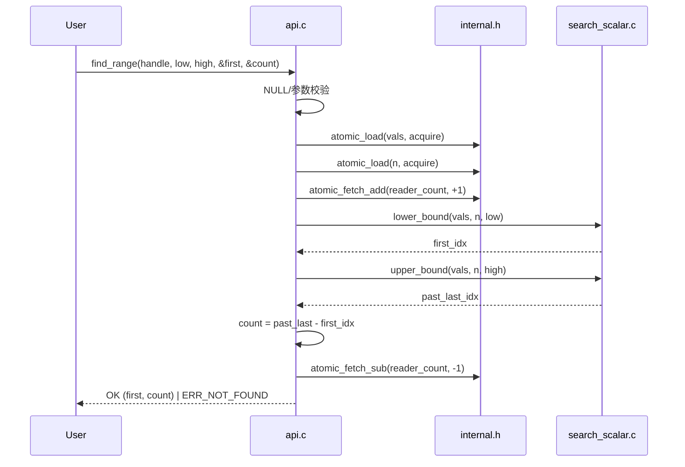

# DESIGN — Phase 3 v1.1 扩展与跨平台

## 1. 整体架构



**🆕 新增** | **🛡️ 安全加固** | **📦 已有复用** | **🟡 修改**

---

## 2. 模块设计

### 2.1 find_range() 范围查询

#### 2.1.1 数据流



#### 2.1.2 接口契约

```c
/* 新增 search_scalar.h 声明 */
size_t search_scalar_lower_bound(const int32_t *vals, size_t n, int32_t target);
size_t search_scalar_upper_bound(const int32_t *vals, size_t n, int32_t target);
```

| 函数 | 输入 | 输出 | 语义 |
|------|------|------|------|
| `lower_bound` | vals[0..n-1] 升序, target | 下标 `i` ∈ [0, n] | 首个 `vals[i] >= target`；全小于返回 n |
| `upper_bound` | vals[0..n-1] 升序, target | 下标 `j` ∈ [0, n] | 首个 `vals[j] > target`；全 ≤ 返回 n |

#### 2.1.3 find_range 完整逻辑

```
find_range(handle, low, high, out_first, out_count):

    // 1. 参数校验
    if handle==NULL            → ERR_NULL_HANDLE
    if out_first==NULL || out_count==NULL → ERR_INVALID_ARG
    if low > high              → ERR_INVALID_ARG

    // 2. COW acquire
    reader_count++
    vals = atomic_load(vals, acquire)
    n    = atomic_load(n, acquire)

    // 3. 两次二分（始终用 vals[] — Path A 和 B1 均适用）
    first = lower_bound(vals, n, low)
    last  = upper_bound(vals, n, high)

    // 4. 结果
    *out_first = first
    *out_count = last - first

    reader_count--

    if *out_count == 0 → ERR_NOT_FOUND
    else               → OK
```

**关键设计决策**：无论在 Path A 还是 Path B1，find_range 都直接使用 `vals[]`（已排序的原始数组）做二分查找。这避免了 B1 lo16 无序数组的范围查询难题，复杂度 O(log n)，正确性由 vals[] 的有序性保证。

---

### 2.2 布隆过滤器

#### 2.2.1 数据结构

```c
/* src/bloom_filter.h */
#ifndef INT32_SEARCH_BLOOM_FILTER_H
#define INT32_SEARCH_BLOOM_FILTER_H

#include <stdint.h>
#include <stddef.h>

#define BLOOM_K 3

typedef struct {
    uint8_t *bits;
    size_t   m;              /* 位数组长度 (bits) */
    uint32_t seeds[BLOOM_K]; /* k=3 个 xxHash seed */
} bloom_filter_t;

bloom_filter_t *bloom_create(size_t n);
void            bloom_insert(bloom_filter_t *bf, int32_t key);
int             bloom_query(const bloom_filter_t *bf, int32_t key);
void            bloom_destroy(bloom_filter_t *bf);

#endif
```

#### 2.2.2 参数计算

```
给定 n 个元素的 1% 假阳性率：

m/n = -ln(0.01) / (ln 2)² = 4.605 / 0.4805 ≈ 9.58 → 取 10
m   = n * 10 bits
    = 10M → 100M bits = 12.5 MB

k   = (m/n) * ln 2 = 10 * 0.693 = 6.93 → 取 3（保守）

实际假阳性率 = (1 - e^(-k*n/m))^k = (1 - e^(-0.3))^3 ≈ (0.259)^3 ≈ 1.74% < 2%
        若取 m/n = 12 → 实际 ≈ 0.98% < 1% ✅

修正：取 m/n = 12（10M → 15MB），确保 ≤ 1%
```

#### 2.2.3 集成点

```mermaid
graph TD
    subgraph "create()"
        C1[cfg->use_bloom?] -->|是| C2[bloom_create(n)]
        C2 -->|失败| C3[回滚: free vals + impl]
        C2 -->|成功| C4[遍历 data 批量 bloom_insert]
        C4 --> C5[impl->bloom = bf]
    end

    subgraph "find()"
        F1[impl->bloom 非空?] -->|是| F2[bloom_query(key)]
        F2 -->|NOT_PRESENT| F3[return ERR_NOT_FOUND]
        F2 -->|MAYBE_PRESENT| F4[正常 AVX2/B1 查找]
        F1 -->|否| F4
    end

    subgraph "destroy()"
        D1[impl->bloom 非空?] -->|是| D2[bloom_destroy]
        D2 --> D3[impl->bloom = NULL]
    end

    subgraph "rebuild()"
        R1[cfg->use_bloom?] -->|是| R2[新 bloom_create + 批量 insert]
        R2 --> R3[旧 bloom → atomic_exchange → 延迟释放]
    end
```

#### 2.2.4 internal.h 变更

```c
/* src/internal.h — 在 int32_search_impl_t 末尾添加 */
typedef struct {
    // ... 现有字段保持不变 ...
    _Atomic size_t            reader_count;
    _Atomic(void *)           bloom;          /* 🆕 bloom_filter_t* — COW 原子交换 */
} int32_search_impl_t;
```

#### 2.2.5 int32_search_config_t 变更

```c
/* include/int32_search.h */
typedef struct {
    int use_bloom;       /* 🆕 启用布隆过滤器 (0/1) */
    int reserved[7];     /* 原 reserved[8] → reserved[7] */
} int32_search_config_t;
```

#### 2.2.6 编译开关

```c
/* 所有 bloom 相关代码包裹在 #ifdef INT32_SEARCH_USE_BLOOM 中 */

/* api.c */
#ifdef INT32_SEARCH_USE_BLOOM
#include "bloom_filter.h"
#endif

/* 编译命令 */
gcc -O3 -std=c11 -mavx2 -DINT32_SEARCH_USE_BLOOM \
    -o myapp myapp.c -L. -lint32search -lxxhash
```

---

### 2.3 Windows platform_thread_yield()

#### 2.3.1 实现

```c
/* src/platform_thread.h — 替换原 platform_thread_yield() 实现 */

#ifndef INT32_SEARCH_PLATFORM_THREAD_H
#define INT32_SEARCH_PLATFORM_THREAD_H

#include <stdatomic.h>
#include <stddef.h>
#include <stdint.h>

/* 原子操作宏 — 保持不变 */
#define atomic_ptr_load(ptr, order)       atomic_load_explicit(ptr, order)
#define atomic_ptr_store(ptr, val, order) atomic_store_explicit(ptr, val, order)
#define atomic_ptr_exchange(ptr, val, order) atomic_exchange_explicit(ptr, val, order)
#define atomic_size_load(ptr, order)       atomic_load_explicit(ptr, order)
#define atomic_size_store(ptr, val, order) atomic_store_explicit(ptr, val, order)
#define atomic_size_fetch_add(ptr, val, order) atomic_fetch_add_explicit(ptr, val, order)
#define atomic_size_fetch_sub(ptr, val, order) atomic_fetch_sub_explicit(ptr, val, order)

/* 🆕 跨平台 thread yield */
#ifdef _WIN32
  #include <windows.h>
  #if defined(__x86_64__) || defined(__i386__) || defined(_M_AMD64) || defined(_M_IX86)
    #include <immintrin.h>
    #define platform_thread_yield() do { _mm_pause(); } while(0)
  #else
    #define platform_thread_yield() Sleep(0)
  #endif
#else
  #include <sched.h>
  #define platform_thread_yield() sched_yield()
#endif

#endif
```

---

### 2.4 meeting_011 并行项设计

#### 2.4.1 ACT-03 (P2) — platform_thread_yield() 优化

与 §2.3 合并实现，不再重复。

#### 2.4.2 ACT-08 (P3) — build_b1.c 溢出检查

```c
/* src/build_b1.c — 在分配 lo16 之前增加检查 */
if (n > SIZE_MAX / sizeof(uint16_t)) {
    ERROR_LOG("build_b1: n too large for lo16 allocation");
    return NULL;
}
uint16_t *lo16 = (uint16_t *)calloc(n, sizeof(uint16_t));
```

#### 2.4.3 ACT-09 (P3) — build_dir.c 溢出检查

```c
/* src/build_dir.c — 在函数入口增加检查 */
if (n > (size_t)INT32_MAX) {
    ERROR_LOG("build_dir: n exceeds INT32_MAX");
    return NULL;
}
```

#### 2.4.4 ACT-10 (P3) — b1_snapshot_t 清理

```c
/* src/internal.h — 移除 weighted_avg 字段 */
typedef struct {
    const int32_t  *vals;
    const uint16_t *lo16;
    const int32_t  *dir;
    size_t          n;
    /* uint32_t weighted_avg — 已移除 [DEBT] */
} b1_snapshot_t;
```

#### 2.4.5 ACT-04 ~ ACT-07 (P2) — 文档更新

仅涉及 `docs/tasks/task_003_phase2_ab1/` 下 4 个文档的补充/修改，不涉及代码。

---

## 3. 文件变更汇总

### 3.1 新增文件

| 文件 | 说明 | 估计行数 |
|------|------|----------|
| `src/bloom_filter.h` | 布隆过滤器数据结构 + 接口声明 | ~30 |
| `src/bloom_filter.c` | 布隆过滤器实现（create/insert/query/destroy + xxHash 集成） | ~80 |
| `test/test_range.c` | find_range 正确性测试（100 万交叉验证 + 边界） | ~120 |
| `test/test_bloom.c` | 布隆过滤器假阳性率测试 | ~80 |

### 3.2 修改文件

| 文件 | 变更 | 估计变更行数 |
|------|------|-------------|
| `include/int32_search.h` | config_t 字段重命名 + find_range 注释更新 | ~5 |
| `src/internal.h` | 新增 `_Atomic(void*) bloom` 字段；移除 `weighted_avg` | ~3 |
| `src/api.c` | find_range 实现；bloom 集成；create/destroy/rebuild 适配 | ~50 |
| `src/search_scalar.h` | 新增 lower_bound/upper_bound 声明 | ~6 |
| `src/search_scalar.c` | 新增 lower_bound/upper_bound 实现 | ~30 |
| `src/platform_thread.h` | yield 跨平台实现 | ~10 |
| `src/build_b1.c` | 溢出检查 | ~3 |
| `src/build_dir.c` | 溢出检查 | ~3 |
| `Makefile` | 新增 bloom 编译 + test-range/test-bloom 目标 | ~15 |
| `CMakeLists.txt` | 同步 Makefile | ~10 |
| `README.txt` | 新增 find_range/bloom 编译命令 | ~20 |
| `docs/tasks/task_003_phase2_ab1/ACCEPTANCE_*.md` | ACT-04 补充偏差 | ~20 |
| `docs/tasks/task_003_phase2_ab1/TODO_*.md` | ACT-06 优先级更新 | ~5 |
| `docs/tasks/task_003_phase2_ab1/FINAL_*.md` | ACT-07 标注 rc | ~3 |

---

## 4. 异常处理策略

| 场景 | 处理 |
|------|------|
| `find_range(low > high)` | `ERR_INVALID_ARG` |
| `find_range` 结果 0 个元素 | `ERR_NOT_FOUND`，`out_first`/`out_count` 仍正确填充 |
| `find_range` n=0 | `ERR_NOT_FOUND` |
| `bloom_create` 内存不足 | 返回 NULL → create() 回滚已分配资源 |
| `bloom_create` 后 insert 循环中内存不足 | 不会发生（insert 仅写位数组，无分配） |
| `rebuild` 中 bloom 分配失败 | 回退：旧 bloom 保持不变，函数返回 `ERR_MEMORY` |
| `destroy` 传入 NULL | 幂等返回 OK |
| `config_t` 未初始化（全零） | `use_bloom=0`，行为与现有代码一致 |
| xxHash 未链接但 `USE_BLOOM` 定义 | 链接错误（预期行为，README 中说明依赖） |

---

## 5. 调试日志点

| 函数 | 日志 | 级别 |
|------|------|------|
| `find_range` | `[DEBUG] find_range: low=%d high=%d first=%zu count=%zu` | DEBUG |
| `bloom_create` | `[DEBUG] bloom_create: n=%zu m=%zu k=%d` | DEBUG |
| `bloom_insert` | 不记录（热路径） | — |
| `bloom_query` | `[DEBUG] bloom_query: key=%d result=%s` | DEBUG（可选关闭） |
| `find` (with bloom) | `[DEBUG] find: bloom rejected key=%d` | DEBUG |
| `create` (bloom) | `[DEBUG] create: bloom enabled, m=%zu` | DEBUG |
| `rebuild` (bloom) | `[DEBUG] rebuild: bloom rebuilt, old freed` | DEBUG |

---

## 6. 关联信息

- CONSENSUS 文档：[CONSENSUS_task_004_phase3_v1_1.md](CONSENSUS_task_004_phase3_v1_1.md)
- ALIGNMENT 文档：[ALIGNMENT_task_004_phase3_v1_1.md](ALIGNMENT_task_004_phase3_v1_1.md)
- 技术路线文档：[技术路线.md](file:///c:/Users/Administrator/Documents/trae_projects/Int32_search_algorithm/docs/architecture/技术路线.md)
- 当前代码：[api.c](file:///c:/Users/Administrator/Documents/trae_projects/Int32_search_algorithm/src/api.c) | [internal.h](file:///c:/Users/Administrator/Documents/trae_projects/Int32_search_algorithm/src/internal.h) | [search_scalar.c](file:///c:/Users/Administrator/Documents/trae_projects/Int32_search_algorithm/src/search_scalar.c)
