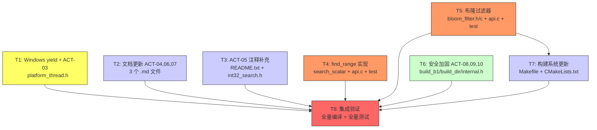

# TASK — Phase 3 v1.1 扩展与跨平台

## 1. 任务依赖图



**图例**：🟡 平台层 | 🔵 文档 | 🟠 功能实现 | 🟢 安全/清理 | 🔴 集成验证

---

## 2. 原子任务清单

### 2.1 任务概览

| 任务 | 名称 | 优先级 | 风险 | 关键路径 | 估计工作量 |
|------|------|--------|------|----------|-----------|
| T1 | Windows yield + ACT-03 | P0 | 低 | 否 | 5 分钟 |
| T2 | 文档更新 ACT-04,06,07 | P1 | 低 | 否 | 15 分钟 |
| T3 | 注释补充 ACT-05 | P1 | 低 | 否 | 10 分钟 |
| T4 | find_range 实现 | P0 | 中 | **是** | 30 分钟 |
| T5 | 布隆过滤器 | P0 | 中 | **是** | 45 分钟 |
| T6 | 安全加固 ACT-08,09,10 | P2 | 低 | 否 | 10 分钟 |
| T7 | 构建系统更新 | P0 | 低 | **是** | 15 分钟 |
| T8 | 集成验证 | P0 | 低 | **是** | 15 分钟 |

**总估计工作量**：~2 小时 25 分钟

---

### 2.2 T1: Windows yield + ACT-03 (P0)

#### 输入契约

| 项 | 内容 |
|-----|------|
| **依赖** | 无 |
| **输入文件** | `src/platform_thread.h`（当前空实现） |
| **环境** | GCC / MinGW-W64，`stdatomic.h` 已可用 |

#### 输出契约

| 项 | 内容 |
|-----|------|
| **交付物** | 修改后的 `src/platform_thread.h` |
| **验收** | `gcc -c -std=c11 platform_thread.h` 编译通过；Linux 下 `sched_yield()` 路径正确 |
| **变更行数** | ~10 行 |

#### 实现约束

严格按照 DESIGN §2.3 实现：

```c
#ifdef _WIN32
  #include <windows.h>
  #if defined(__x86_64__) || defined(__i386__) || defined(_M_AMD64) || defined(_M_IX86)
    #include <immintrin.h>
    #define platform_thread_yield() do { _mm_pause(); } while(0)
  #else
    #define platform_thread_yield() Sleep(0)
  #endif
#else
  #include <sched.h>
  #define platform_thread_yield() sched_yield()
#endif
```

---

### 2.3 T2: 文档更新 ACT-04,06,07 (P1)

#### 输入契约

| 项 | 内容 |
|-----|------|
| **依赖** | 无 |
| **输入文件** | `ACCEPTANCE_task_003_phase2_ab1.md`、`TODO_task_003_phase2_ab1.md`、`FINAL_task_003_phase2_ab1.md` |
| **数据来源** | meeting_011 决议 D-087、D-088、D-089 |

#### 输出契约

| 项 | 内容 |
|-----|------|
| **交付物** | 3 个修改后的 .md 文件 |
| **验收** | 偏差 A/B/C 已记录在 ACCEPTANCE；TODO 优先级已按 D-087 更新；FINAL 已标注 1.0.0-rc |

#### 子任务

| # | ACT | 文件 | 操作 |
|---|-----|------|------|
| T2a | ACT-04 | `ACCEPTANCE_task_003_phase2_ab1.md` | 补充偏差 A (calloc→malloc+-1 sentinel)、偏差 B (DESIGN ^0x8000 缺失)、偏差 C (weighted_avg 残留) |
| T2b | ACT-06 | `TODO_task_003_phase2_ab1.md` | TODO-04 P2→P1, TODO-12 P2→P1, TODO-08 P2→P3, TODO-09 P2→P3 |
| T2c | ACT-07 | `FINAL_task_003_phase2_ab1.md` | 标注 "1.0.0-rc" 候选状态 |

---

### 2.4 T3: 注释补充 ACT-05 (P1)

#### 输入契约

| 项 | 内容 |
|-----|------|
| **依赖** | 无 |
| **输入文件** | `README.txt`、`include/int32_search.h` |

#### 输出契约

| 项 | 内容 |
|-----|------|
| **交付物** | 修改后的 README.txt 和 int32_search.h |
| **验收** | find_range() 注释标注 "@note Phase 3 已实现"；create() 注释补充自动选路说明 |

#### 子任务

| # | 操作 |
|---|------|
| T3a | README.txt MinGW 节添加 4 套 B1 测试完整编译命令 |
| T3b | int32_search.h 中 create() 注释补充自动选路说明 |
| T3c | int32_search.h 中 find_range() 注释更新（从 "@note Stub: Phase 3 实现" 改为已实现描述） |

---

### 2.5 T4: find_range 实现 (P0, 关键路径)

#### 输入契约

| 项 | 内容 |
|-----|------|
| **依赖** | 无（search_scalar.c 已有 `search_scalar_find` 作为参考） |
| **输入文件** | `src/search_scalar.h`、`src/search_scalar.c`、`src/api.c`、`include/int32_search.h`、`src/internal.h` |
| **参考** | DESIGN §2.1 |

#### 输出契约

| 项 | 内容 |
|-----|------|
| **交付物** | 修改后的 search_scalar.h/c（新增 lower_bound + upper_bound）；修改后的 api.c（find_range 完整实现）；新增 test/test_range.c |
| **验收** | </br>- `gcc -O3 -std=c11 -mavx2` 编译通过</br>- Path A 100 万随机 find_range vs bsearch() 完全一致</br>- Path B1 100 万随机 find_range vs bsearch() 完全一致</br>- n=0~64 边界测试通过</br>- ASan/UBSan 零告警</br>- ThreadSanitizer 并发 find_range + rebuild 零告警 |

#### 子任务

| # | 文件 | 操作 | 验证 |
|---|------|------|------|
| T4a | `src/search_scalar.h` | 声明 `search_scalar_lower_bound()` 和 `search_scalar_upper_bound()` | 编译 |
| T4b | `src/search_scalar.c` | 实现 lower_bound（首个 >= target）和 upper_bound（首个 > target） | 单元验证：n=0,1,2,5 手动用例 |
| T4c | `src/api.c` | 替换 find_range stub → COW acquire + lower_bound + upper_bound + COW release | 同 T4e |
| T4d | `include/int32_search.h` | `reserved[8]` → `int use_bloom; int reserved[7]` | 编译 |
| T4e | `test/test_range.c` | 生成 100 万随机数组 + 随机区间，交叉验证 vs bsearch()；边界用例（n=0~64，空区间，全区间） | `make test-range` |

#### 接口精确契约

```c
/* search_scalar.h — 新增 */
size_t search_scalar_lower_bound(const int32_t *vals, size_t n, int32_t target);
/* 返回: 首个 i 使得 vals[i] >= target；若所有元素 < target 返回 n */
/* 前置: vals 升序排列；n=0 时返回 0 */

size_t search_scalar_upper_bound(const int32_t *vals, size_t n, int32_t target);
/* 返回: 首个 i 使得 vals[i] > target；若所有元素 <= target 返回 n */
/* 前置: vals 升序排列；n=0 时返回 0 */

/* api.c — find_range 行为 */
int int32_search_find_range(handle, low, high, out_first, out_count);
/* handle=NULL       → ERR_NULL_HANDLE */
/* low > high        → ERR_INVALID_ARG */
/* out_first/out_count NULL → ERR_INVALID_ARG */
/* n=0               → ERR_NOT_FOUND, out_first=0, out_count=0 */
/* 无元素在 [low,high] → ERR_NOT_FOUND, out_first=首个>=low 位置, out_count=0 */
/* 有元素            → OK, out_first=首个下标, out_count=个数 */
```

---

### 2.6 T5: 布隆过滤器 (P0, 关键路径)

#### 输入契约

| 项 | 内容 |
|-----|------|
| **依赖** | T4d（int32_search.h config_t 变更） |
| **输入文件** | `src/xxhash/`（已有）、`src/internal.h`、`src/api.c` |
| **参考** | DESIGN §2.2 |

#### 输出契约

| 项 | 内容 |
|-----|------|
| **交付物** | 新增 `src/bloom_filter.h`、`src/bloom_filter.c`；修改 `src/internal.h`、`src/api.c`；新增 `test/test_bloom.c` |
| **验收** | </br>- `-DINT32_SEARCH_USE_BLOOM` 编译通过</br>- 未启用时零开销</br>- 10M 数据 bloom 假阳性率 ≤ 1%</br>- find() 不命中时 bloom 正确拦截</br>- find() 命中时不误拒</br>- ASan/UBSan 零告警 |

#### 子任务

| # | 文件 | 操作 | 验证 |
|---|------|------|------|
| T5a | `src/bloom_filter.h` | 定义 `bloom_filter_t` 结构体 + `bloom_create/insert/query/destroy` 声明 | 编译 |
| T5b | `src/bloom_filter.c` | 实现 4 个函数：create(m/n=12, k=3 固定 seed)、insert(xxHash 3 次设位)、query(3 次检查)、destroy | 单元验证 |
| T5c | `src/internal.h` | `int32_search_impl_t` 新增 `_Atomic(void *) bloom` 字段 | 编译 |
| T5d | `src/api.c` | create() 中 `#ifdef INT32_SEARCH_USE_BLOOM` → bloom_create + 批量 insert；find() 中 bloom_query 预筛；destroy() 中 bloom_destroy；rebuild() 中 bloom COW 交换 | 同 T5f |
| T5e | `Makefile` + `CMakeLists.txt` | 新增 bloom_filter.c 编译 + `-lxxhash` 链接 | 编译 |
| T5f | `test/test_bloom.c` | 10M 数据假阳性率测试（生成 10M 随机 key → 插入 bloom → 用 1M 未插入 key 测假阳性）；命中不误拒测试 | `make test-bloom` |

#### 设计参数

```
m/n = 12  (确保 1% 假阳性率)
k   = 3   (xxHash + seed=0x9747b28c, 0x5d3a11e7, 0x1f8c3e96)
seeds 硬编码在 bloom_filter.c
```

---

### 2.7 T6: 安全加固 ACT-08,09,10 (P2)

#### 输入契约

| 项 | 内容 |
|-----|------|
| **依赖** | 无 |
| **输入文件** | `src/build_b1.c`、`src/build_dir.c`、`src/internal.h` |

#### 输出契约

| 项 | 内容 |
|-----|------|
| **交付物** | 修改后的 3 个文件 |
| **验收** | 编译通过；溢出检查逻辑正确（静态审查） |

#### 子任务

| # | ACT | 文件 | 操作 |
|---|-----|------|------|
| T6a | ACT-08 | `src/build_b1.c` | 在 calloc 前增加 `if (n > SIZE_MAX / sizeof(uint16_t)) return NULL;` |
| T6b | ACT-09 | `src/build_dir.c` | 在函数入口增加 `if (n > (size_t)INT32_MAX) return NULL;` |
| T6c | ACT-10 | `src/internal.h` | 从 `b1_snapshot_t` 移除 `uint32_t weighted_avg` 字段 |

---

### 2.8 T7: 构建系统更新 (P0, 关键路径)

#### 输入契约

| 项 | 内容 |
|-----|------|
| **依赖** | T5e（bloom 文件就绪后更新 Makefile/CMake） |
| **输入文件** | `Makefile`、`CMakeLists.txt`、`README.txt` |

#### 输出契约

| 项 | 内容 |
|-----|------|
| **交付物** | 修改后的 Makefile、CMakeLists.txt、README.txt |
| **验收** | `make all` 编译通过；`make test-range` 通过；`make test-bloom` 通过 |

#### 子任务

| # | 操作 |
|---|------|
| T7a | Makefile 新增 `bloom_filter.o` 编译 + `test-range`/`test-bloom` 测试目标 |
| T7b | CMakeLists.txt 同步 Makefile 变更 |
| T7c | README.txt 新增 find_range 测试 + bloom 编译命令 |

---

### 2.9 T8: 集成验证 (P0, 关键路径)

#### 输入契约

| 项 | 内容 |
|-----|------|
| **依赖** | T1, T2, T3, T4, T5, T6, T7 |
| **输入** | 所有已修改文件 |

#### 输出契约

| 项 | 内容 |
|-----|------|
| **交付物** | 全量编译 + 全量测试报告 |
| **验收** | </br>- `make clean && make all` 零错误零警告</br>- `make test` 全部通过</br>- `make test-range` 通过</br>- `make test-bloom` 通过</br>- `make test-b1` 通过（回归）</br>- `make test-thread` 通过（回归）</br>- `make test-thread-b1` 通过（回归）</br>- ASan/UBSan 零告警 |

---

## 3. 执行顺序建议

```
Wave 0（无依赖，可立即并行）：
  ├── T1: Windows yield + ACT-03
  ├── T2: 文档更新 ACT-04,06,07
  ├── T3: 注释补充 ACT-05
  ├── T4: find_range 实现
  └── T6: 安全加固 ACT-08,09,10

Wave 1（依赖 Wave 0 中的 T4d）：
  └── T5: 布隆过滤器（依赖 int32_search.h config_t 变更）

Wave 2（依赖 T5）：
  └── T7: 构建系统更新

Wave 3（依赖所有）：
  └── T8: 集成验证
```

---

## 4. 风险矩阵

| 风险 | 等级 | 影响任务 | 缓解措施 |
|------|------|----------|----------|
| xxHash 链接符号冲突 | 低 | T5 | 使用条件编译 `#ifdef` 隔离，未启用不影响现有代码 |
| bloom COW 竞态条件 | 中 | T5 | 复用现有 COW 框架（已验证的 reader_count + atomic_exchange 模式） |
| find_range 边界 bug | 中 | T4 | 100 万随机交叉验证 + 边界专项测试覆盖 n=0~64 |
| Windows MinGW `_mm_pause` 不可用 | 低 | T1 | 回退到 `Sleep(0)` |

---

## 5. 关联信息

- DESIGN 文档：[DESIGN_task_004_phase3_v1_1.md](DESIGN_task_004_phase3_v1_1.md)
- CONSENSUS 文档：[CONSENSUS_task_004_phase3_v1_1.md](CONSENSUS_task_004_phase3_v1_1.md)
- meeting_011 行动项：[04_action_items.md](file:///c:/Users/Administrator/Documents/trae_projects/Int32_search_algorithm/docs/meetings/meeting_index/meeting_011_phase2_audit_review/04_action_items.md)
