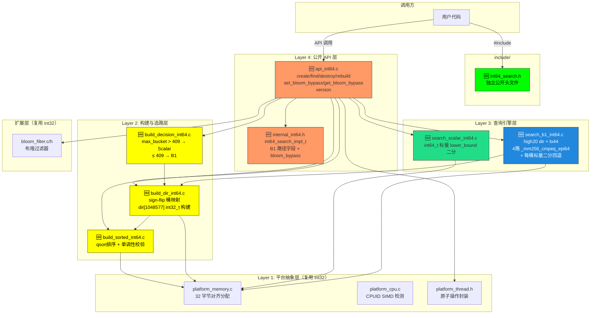
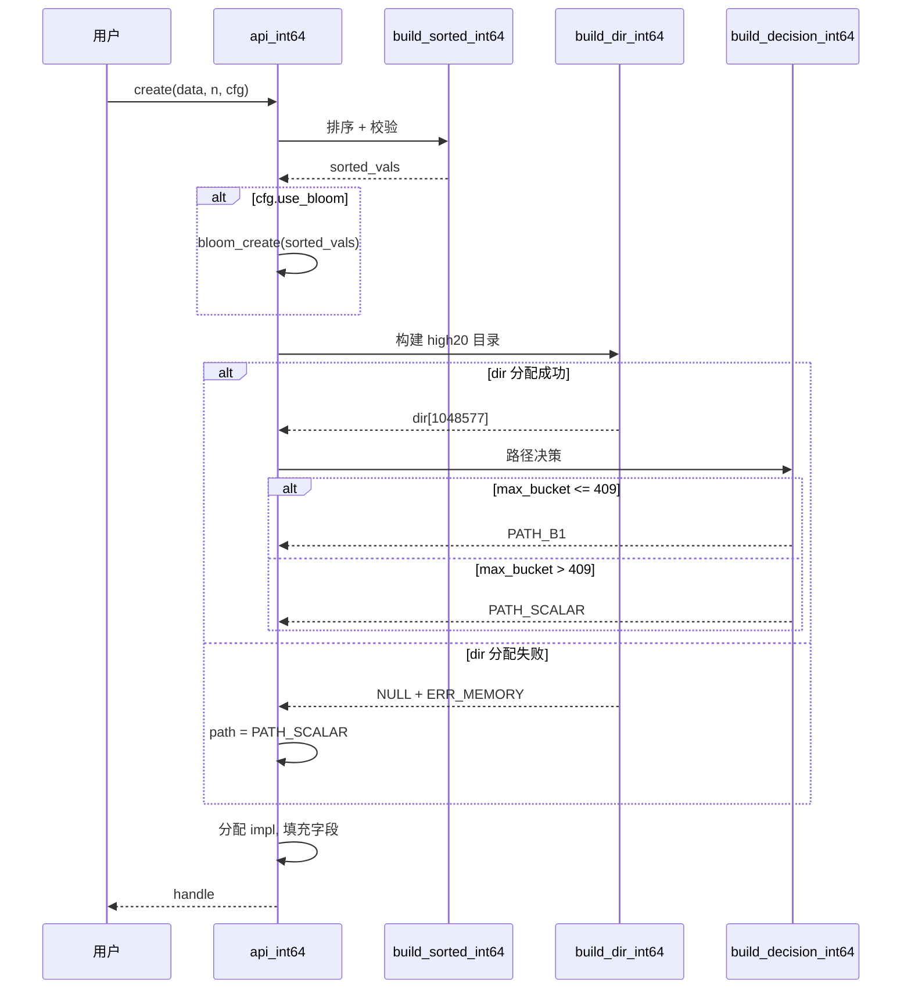
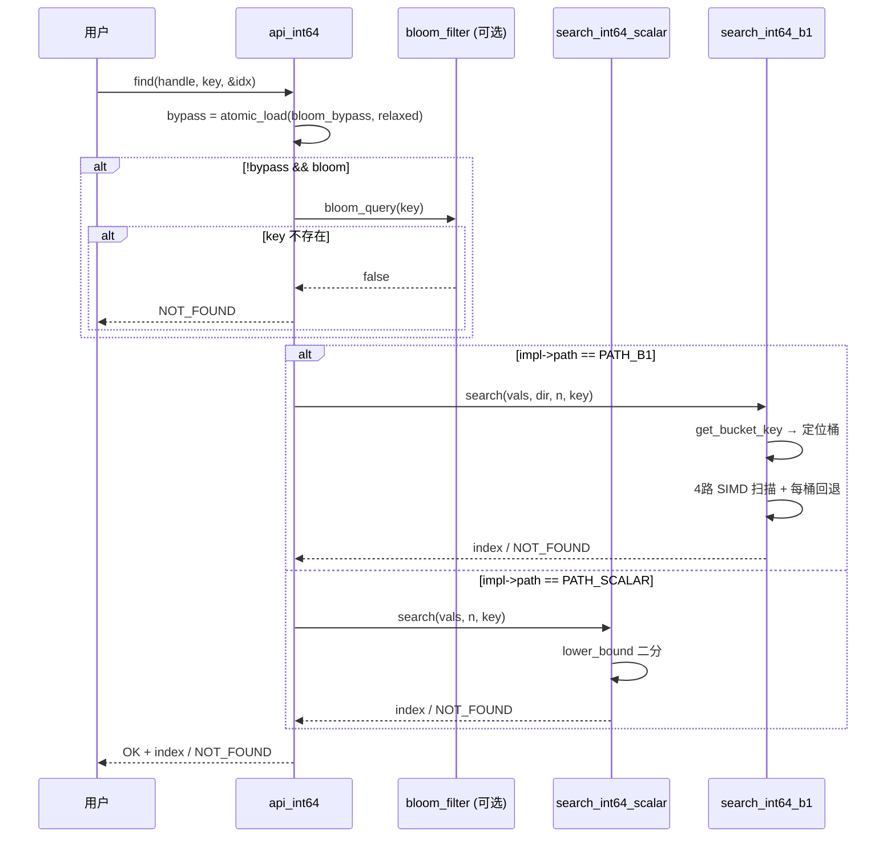

# 系统设计文档 — Int64 二期扩展 (Path B1 主线 + Bloom Bypass)

## 1. 整体架构图



🆕 = 新增  不变 = 复用 int32

---

## 2. 分层设计

### 2.1 Layer 1: 平台抽象层（零新增）

| 模块 | 来源 | 说明 |
|------|------|------|
| `platform_memory.c/h` | int32 | `_mm_malloc`/`_mm_free` 封装，32 字节对齐 |
| `platform_cpu.c/h` | int32 | CPUID 检测，虽不选 AVX2 二分但仍需 AVX2 能力检测 |
| `platform_thread.h` | int32 | 原子操作封装，用于 bloom_bypass |

**编译**：直接链接 int32 的 `.o` 文件。

### 2.2 Layer 2: 构建与选路层

#### build_sorted_int64.c

```
输入: const int64_t *data, size_t n
输出: int64_t *sorted_vals, error_code

流程:
1. platform_memory_alloc(n * sizeof(int64_t))
2. memcpy + qsort(cmp_int64)
3. 单调性校验: for i in 1..n-1: assert(vals[i] >= vals[i-1])
4. 返回 sorted_vals 指针
```

#### build_dir_int64.c

```
输入: const int64_t *sorted_vals, size_t n
输出: int32_t *dir[1048577], error_code
约束: n <= INT32_MAX (断言)

流程:
1. _mm_malloc(INT64_DIR_SIZE * sizeof(int32_t))
   若失败 → 返回 ERR_MEMORY → 调用方回退到 PATH_SCALAR (无需 dir)
2. 初始化 dir[0..1048576] = -1
3. 遍历 vals[j]:
     h = get_bucket_key(vals[j])  /* sign-flip 内联函数 */
     若 dir[h] == -1 → dir[h] = (int32_t)j
4. dir[1048576] = (int32_t)n  /* 哨兵 */
5. 后向填充空桶: for i=1048575 downto 0:
     若 dir[i] == -1 → dir[i] = dir[i+1]
6. 校验: dir[i] <= dir[i+1] for all i; dir[1048576] == n
   若失败 → 返回 ERR_CORRUPT → 调用方回退
```

Sign-flip 内联函数（单一实现，构建和查询共用）：

```c
static inline uint32_t get_bucket_key(int64_t key) {
    return (uint32_t)(((uint64_t)key ^ ((uint64_t)1 << 63)) >> 44);
}
```

#### build_decision_int64.c

```
输入: const int32_t *dir, size_t n
输出: int path (PATH_B1 或 PATH_SCALAR)

流程:
1. 若 dir == NULL → PATH_SCALAR (分配失败降级)
2. dir_validate(dir, n) 失败 → PATH_SCALAR
3. 扫描 max_bucket = max(dir[i+1] - dir[i]) for i in 0..1048575
4. max_bucket > 409 → PATH_SCALAR
5. 否则 → PATH_B1
```

### 2.3 Layer 3: 查询引擎层

#### search_scalar_int64.c

```c
/* 标量 lower_bound 二分 — 正确性黄金基准 + Scalar Fallback */
size_t search_int64_scalar(const int64_t *vals, size_t n, int64_t target) {
    size_t lo = 0, hi = n;
    while (lo < hi) {
        size_t mid = lo + (hi - lo) / 2;
        if (vals[mid] < target) lo = mid + 1;
        else hi = mid;
    }
    return (lo < n && vals[lo] == target) ? lo : (size_t)-1;
}
```

#### search_b1_int64.c

```c
/* B1: high20 dir + lo44 4路 cmpeq 扫描 + 每桶回退 */
size_t search_int64_b1(const int64_t *vals, const int32_t *dir,
                        size_t n, int64_t target) {
    if (n == 0 || !vals || !dir) return (size_t)-1;

    uint32_t h = get_bucket_key(target);
    int32_t start = dir[h];
    int32_t end   = dir[h + 1];
    if (start >= end) return (size_t)-1;

    int32_t bucket_sz = end - start;

    /* 每桶回退: bucket 过大时桶内二分 */
    if (bucket_sz > B1_FALLBACK_THRESHOLD)  /* 409 */
        return search_int64_scalar(vals + start, bucket_sz, target);

    /* 4路 SIMD cmpeq 扫描 */
    int32_t i = start;
    for (; i + 4 <= end; i += 4) {
        __m256i key4 = _mm256_set1_epi64x(target);
        __m256i vec4 = _mm256_loadu_si256((const __m256i *)(vals + i));
        __m256i eq   = _mm256_cmpeq_epi64(key4, vec4);
        int mask = _mm256_movemask_pd(_mm256_castsi256_pd(eq));
        if (mask != 0) {
            int idx = i + __builtin_ctz(mask);
            if (vals[idx] == target) return (size_t)idx;
        }
    }
    /* 标量尾部 */
    for (; i < end; i++)
        if (vals[i] == target) return (size_t)i;

    return (size_t)-1;
}
```

### 2.4 Layer 4: 公开 API 层

#### int64_search.h（独立公开头文件）

```c
#ifndef INT64_SEARCH_H
#define INT64_SEARCH_H

#include <stdint.h>
#include <stddef.h>

#ifdef __cplusplus
extern "C" { 
#endif

#define INT64_SEARCH_OK              0
#define INT64_SEARCH_ERR_NOT_FOUND  -1
#define INT64_SEARCH_ERR_NULL_HANDLE -2
#define INT64_SEARCH_ERR_MEMORY      -3
#define INT64_SEARCH_ERR_INVALID_ARG -4
#define INT64_SEARCH_ERR_TOO_LARGE   -5

typedef void* int64_search_t;

typedef struct {
    int use_bloom;
    int reserved[7];
} int64_search_config_t;

int64_search_t int64_search_create(const int64_t *data, size_t n,
                                    const int64_search_config_t *cfg);
int int64_search_find(int64_search_t handle, int64_t key,
                       size_t *out_index);
int int64_search_destroy(int64_search_t handle);
int int64_search_rebuild(int64_search_t handle,
                          const int64_t *data, size_t n);
const char *int64_search_version(void);
int int64_search_set_bloom_bypass(int64_search_t handle, int bypass);
int int64_search_get_bloom_bypass(int64_search_t handle);

/* Phase 3 reserved */
int int64_search_find_range(int64_search_t handle, int64_t low,
                             int64_t high, size_t *out_first,
                             size_t *out_count);

#ifdef __cplusplus
}
#endif
#endif
```

#### internal_int64.h（内部结构体）

```c
#define PATH_SCALAR 0
#define PATH_B1     1

#define B1_MAX_BUCKET_THRESHOLD_INT64  409
#define B1_FALLBACK_THRESHOLD          409
#define INT64_DIR_SIZE                 1048577

typedef struct {
    int             path;               /* PATH_B1 或 PATH_SCALAR */
    size_t          n;                  /* 元素数量 */
    const int64_t  *vals;              /* 排序后的 int64_t 数组 */
    const int32_t  *dir;               /* high20 目录 (B1 only) */
    _Atomic(void *) bloom;            /* bloom_filter 句柄，可为 NULL */
    _Atomic(int)    bloom_bypass;      /* 0=正常，1=绕过 bloom */
} int64_search_impl_t;
```

#### api_int64.c 核心流程

```
create(data, n, cfg):
1. build_sorted_int64(data, n) → sorted_vals
2. 若 cfg->use_bloom → bloom_create(sorted_vals, n)
3. build_dir_int64(sorted_vals, n) → dir (可能为 NULL 若分配失败)
4. path = build_decision_int64(dir, n)
5. 分配 int64_search_impl_t, 填充字段
6. atomic_init(bloom_bypass, 0)
7. 返回 handle

find(handle, key, &out_index):
1. 若 !handle → ERR_NULL_HANDLE
2. int bypass = atomic_load(&impl->bloom_bypass, memory_order_relaxed)
3. 若 !bypass && bloom != NULL && !bloom_query(bloom, key) → NOT_FOUND
4. 若 impl->path == PATH_B1 → search_int64_b1(vals, dir, n, key)
   否则 → search_int64_scalar(vals, n, key)

destroy(handle):
1. 若 !handle → 幂等返回
2. 若 bloom → bloom_destroy
3. free(vals), free(dir)
4. free(impl)

rebuild(handle, data, n):
1. 同 create 步骤 1-4（新路径可能不同）
2. 保留 bloom_bypass 值不变
3. 释放旧 vals, dir（单线程假设，无 COW）
```

---

## 3. 接口契约

### 3.1 函数签名契约

| 函数 | 输入 | 输出 | 错误码 |
|------|------|------|--------|
| `int64_search_create` | data, n, cfg | handle | OK / ERR_MEMORY / ERR_INVALID_ARG / ERR_TOO_LARGE |
| `int64_search_find` | handle, key | out_index, return code | OK + index / NOT_FOUND / ERR_NULL_HANDLE |
| `int64_search_destroy` | handle | void | 幂等 |
| `int64_search_rebuild` | handle, data, n | return code | OK / ERR_MEMORY / ERR_INVALID_ARG / ERR_NULL_HANDLE / ERR_TOO_LARGE |
| `int64_search_version` | void | const char* | — |
| `int64_search_set_bloom_bypass` | handle, bypass | return code | OK / ERR_NULL_HANDLE |
| `int64_search_get_bloom_bypass` | handle | bypass value / negative error | current bypass (0/1) / ERR_NULL_HANDLE |

### 3.2 内部函数契约

| 函数 | 输入 | 输出 |
|------|------|------|
| `build_sorted_int64` | const int64_t *data, size_t n | int64_t *sorted, 错误码 |
| `build_dir_int64` | const int64_t *vals, size_t n | int32_t *dir, 错误码 |
| `build_decision_int64` | const int32_t *dir, size_t n | PATH_B1 或 PATH_SCALAR |
| `search_int64_scalar` | vals, n, target | index 或 (size_t)-1 |
| `search_int64_b1` | vals, dir, n, target | index 或 (size_t)-1 |
| `get_bucket_key` | int64_t key | uint32_t bucket_index (0..1048575) |

---

## 4. 数据流

### 4.1 构建流程



### 4.2 查询流程



---

## 5. 错误处理策略

### 5.1 分配失败降级

| 失败点 | 处理 |
|--------|------|
| `build_dir_int64` _mm_malloc 失败 | 返回 NULL, api_int64 设置 path=PATH_SCALAR, 不回退整个 create |
| `build_sorted_int64` _mm_malloc 失败 | 回滚 create, 返回 ERR_MEMORY |
| `_mm_malloc impl` 失败 | 回滚 create, 释放已分配资源, 返回 ERR_MEMORY |
| `bloom_create` 失败 | no-op, 按 cfg.use_bloom=0 行为继续 |

### 5.2 关键日志点

```c
/* Debug 模式 (INT64_SEARCH_DEBUG=1) */
#define I64_DLOG(fmt, ...) do { \
    if (g_int64_search_debug) \
        fprintf(stderr, "[int64_search] " fmt "\n", ##__VA_ARGS__); \
} while(0)

/* 关键日志点 */
I64_DLOG("create: n=%zu, use_bloom=%d", n, cfg->use_bloom);
I64_DLOG("build_decision: max_bucket=%d, path=%s", max_bucket,
         path == PATH_B1 ? "B1" : "SCALAR");
I64_DLOG("dir_validate FAILED: i=%d, dir[i]=%d, dir[i+1]=%d");
I64_DLOG("rebuild: n=%zu, old_path=%d, new_path=%d");
```

### 5.3 调试开关

```c
/* 编译时: -DINT64_SEARCH_DEBUG=1 */
#ifndef INT64_SEARCH_DEBUG
#define INT64_SEARCH_DEBUG 0
#endif
extern int g_int64_search_debug;
```

---

## 6. 现有 int32 代码库影响分析

| 影响 | 说明 |
|------|------|
| 零修改 | Phase 1 所有新增文件均为独立文件（`*_int64.c` / `*_int64.h`） |
| 零删除 | 不影响任何现有 `src/` 下文件 |
| 零 API 变更 | `int32_search.h` 完全不动 |
| 共享 .o | `platform_memory.o` / `platform_cpu.o` / `bloom_filter.o` 直接链接 |
| 可能冲突 | 无。所有新符号有 `int64_` 前缀 |

---

## 7. 关联信息

- **需求基线**：[总需求文档.md](../../../requirements/总需求文档.md)
- **技术路线**：[技术路线.md](../../../architecture/技术路线.md)
- **共识文档**：[CONSENSUS_int64_b1.md](CONSENSUS_int64_b1.md)
- **对齐文档**：[ALIGNMENT_int64_b1.md](ALIGNMENT_int64_b1.md)
- **POC 报告**：[poc_int64_report.md](../../../decisions/poc_int64_report.md)
- **决议**：meeting_015 D-108~D-114
