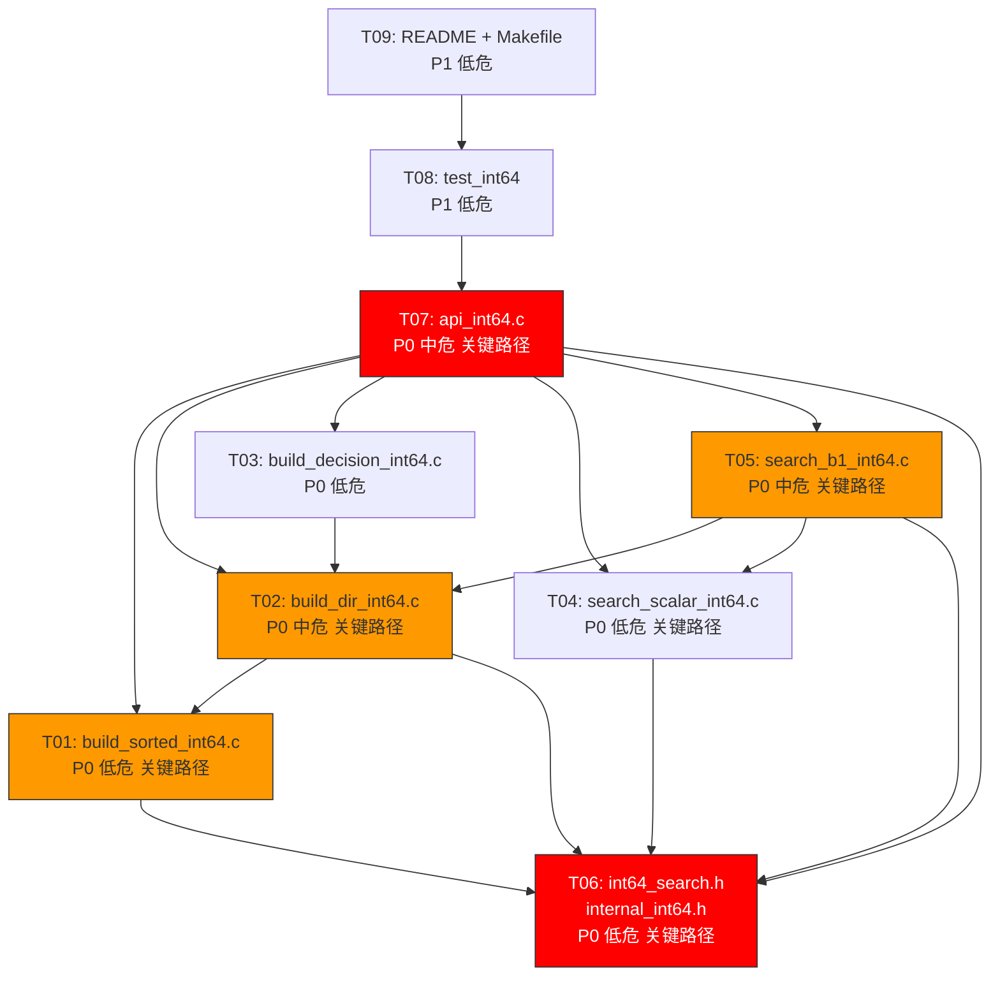

# 原子任务拆分 — Int64 二期扩展 (Path B1 主线 + Bloom Bypass)

## 任务依赖图



---

## 任务总览

| 编号 | 任务 | 优先级 | 风险 | 关键路径 | 预估复杂度 |
|------|------|--------|------|----------|-----------|
| T01 | `build_sorted_int64.c` | P0 | 低 | 是 | 小（~80 行） |
| T02 | `build_dir_int64.c` | P0 | 中 | 是 | 中（~120 行） |
| T03 | `build_decision_int64.c` | P0 | 低 | 否 | 小（~50 行） |
| T04 | `search_scalar_int64.c` | P0 | 低 | 是 | 小（~20 行） |
| T05 | `search_b1_int64.c` | P0 | 中 | 是 | 中（~100 行） |
| T06 | `int64_search.h` + `internal_int64.h` | P0 | 低 | 是 | 小（~80 行） |
| T07 | `api_int64.c` | P0 | 中 | 是 | 中（~200 行） |
| T08 | `test_int64` | P1 | 低 | 否 | 大（~400 行） |
| T09 | `README.txt` + `Makefile` | P1 | 低 | 否 | 小（~30 行） |

---

## T01: build_sorted_int64.c [P0]

### 输入契约
- **输入数据**: `const int64_t *data`, `size_t n`
- **环境依赖**: `platform_memory.h`（32 字节对齐分配）、`stdlib.h`（qsort）
- **约束**: n ≥ 0，data 调用方管理生命周期

### 输出契约
- **主输出**: `int64_t *sorted_vals`（排序后的数组，调用方负责释放）
- **错误码**: `INT64_SEARCH_OK` / `ERR_MEMORY` / `ERR_INVALID_ARG`
- **副作用**: 无全局状态修改
- **后置条件**: sorted_vals 单调非递减（严格情况下允许相等）

### 实现约束
- **命名**: `int64_build_sorted()`
- **返回**: `int` 错误码，通过 `int64_t **out` 输出指针
- **排序**: `qsort(cmp_int64)` — 使用现有 POC 中的比较函数
- **内存**: `platform_memory_alloc(n * sizeof(int64_t))`
- **校验**: 遍历确认 `vals[i+1] >= vals[i]`

### 验收标准
- [ ] n=0 返回 OK + NULL
- [ ] n=1/2/3 正常
- [ ] n=1M 编译通过，排序正确
- [ ] 重复元素正确处理
- [ ] INT64_MIN/MAX 极值正确

### 参考代码
- POC: [src/poc_int64_b1.c](file:///c:/Users/Administrator/Documents/trae_projects/Int32_search_algorithm/src/poc_int64_b1.c#L61-L65) `cmp_int64`
- 现有: [src/build_sorted.c](file:///c:/Users/Administrator/Documents/trae_projects/Int32_search_algorithm/src/build_sorted.c)

---

## T02: build_dir_int64.c [P0]

### 输入契约
- **输入数据**: `const int64_t *sorted_vals`, `size_t n`（n ≤ INT32_MAX）
- **环境依赖**: `platform_memory.h`、`internal_int64.h`（INT64_DIR_SIZE=1048577）
- **前置条件**: sorted_vals 已排序单调非递减

### 输出契约
- **主输出**: `int32_t *dir`（1048577 元素，调用方负责释放）
- **哨兵**: `dir[1048576] = (int32_t)n`
- **空桶行为**: dir[i] == dir[i+1] for 空桶（start==end → NOT_FOUND）
- **后置条件**: for all i, dir[i] ≤ dir[i+1]; dir[1048576] == n
- **错误码**: OK / ERR_MEMORY / ERR_TOO_LARGE (n > INT32_MAX)

### 实现约束
- **sign-flip**: 必须使用 `internal_int64.h` 中定义的 `get_bucket_key()` 内联函数
- **操作**: 禁止在 build_dir 中内联实现 sign-flip 公式
- **构建算法**:
  1. `_mm_malloc(INT64_DIR_SIZE * sizeof(int32_t))`
  2. 初始化 dir[0..1048576] = -1
  3. 遍历: `h = get_bucket_key(vals[j])`, 若 dir[h]== -1 → dir[h] = (int32_t)j
  4. dir[1048576] = (int32_t)n
  5. 后向填充: `for i=1048575..0: if dir[i]==-1 → dir[i] = dir[i+1]`

### 验收标准
- [ ] n=0 返回有效 dir（全哨兵值 0）
- [ ] n=1M uniform 构建正确
- [ ] 空桶前向填充正确（所有空桶 start==end）
- [ ] sign-flip 映射正确（INT64_MIN → 桶 0, INT64_MAX → 桶 1048575）
- [ ] n > INT32_MAX → ERR_TOO_LARGE
- [ ] 分配失败 → ERR_MEMORY + NULL

### 参考代码
- POC: [src/poc_int64_b1.c:134-155](file:///c:/Users/Administrator/Documents/trae_projects/Int32_search_algorithm/src/poc_int64_b1.c#L134-L155) `build_dir_int64`

---

## T03: build_decision_int64.c [P0]

### 输入契约
- **输入数据**: `const int32_t *dir`, `size_t n`（dir 可为 NULL）
- **环境依赖**: `internal_int64.h`（B1_MAX_BUCKET_THRESHOLD_INT64=409）
- **前置条件**: 若 dir != NULL，已由 build_dir 正确构建

### 输出契约
- **主输出**: `int path` — `PATH_B1` (1) 或 `PATH_SCALAR` (0)
- **副作用**: 无

### 实现约束
- **决策逻辑**:
  1. 若 dir == NULL → PATH_SCALAR（构建时分配失败降级）
  2. dir_validate: 扫描 `dir[i] > dir[i+1]` → 失败则 PATH_SCALAR
  3. 扫描 max_bucket = max(dir[i+1] - dir[i])
  4. max_bucket > 409 → PATH_SCALAR
  5. 否则 → PATH_B1

### 验收标准
- [ ] dir=NULL → PATH_SCALAR
- [ ] max_bucket=8 → PATH_B1
- [ ] max_bucket=409 → PATH_B1（边界等于阈值）
- [ ] max_bucket=410 → PATH_SCALAR
- [ ] dir 损坏（dir[i] > dir[i+1]） → PATH_SCALAR

---

## T04: search_scalar_int64.c [P0]

### 输入契约
- **输入数据**: `const int64_t *vals`, `size_t n`, `int64_t target`
- **环境依赖**: 无（纯标量）
- **前置条件**: vals 已排序（或 n=0）

### 输出契约
- **主输出**: `size_t` — 匹配索引，或 `SIZE_MAX` 表示未找到
- **语义**: lower_bound 变体：返回第一个 vals[i] == target 的 i
- **副作用**: 无

### 实现约束
- **算法**: 标准 lower_bound 二分
- **不变量**: lo ≤ 目标位置 ≤ hi
- **边界**: n=0 → SIZE_MAX; n=1 正常处理

### 验收标准
- [ ] n=0 → SIZE_MAX
- [ ] n=1 命中/未命中
- [ ] n=3 命中首/中/尾 + 未命中
- [ ] INT64_MIN/MAX target 正确
- [ ] 10000 次 vs bsearch() 交叉验证零差异

---

## T05: search_b1_int64.c [P0]

### 输入契约
- **输入数据**: `const int64_t *vals`, `const int32_t *dir`, `size_t n`, `int64_t target`
- **环境依赖**: `internal_int64.h`（get_bucket_key、B1_FALLBACK_THRESHOLD=409）、AVX2
- **前置条件**: vals 已排序，dir 已构建，n ≤ INT32_MAX

### 输出契约
- **主输出**: `size_t` — 匹配索引，或 `SIZE_MAX` 表示未找到
- **副作用**: 无
- **性能**: 10M uniform ~318 cy/q (5.30x vs Scalar)

### 实现约束
- **桶定位**: `get_bucket_key(target)` → start = dir[h], end = dir[h+1]
- **空桶**: start ≥ end → SIZE_MAX
- **每桶回退**: bucket_sz > 409 → 调用 `search_int64_scalar(vals+start, bucket_sz, target)`
- **SIMD 扫描**: 4 路 `_mm256_cmpeq_epi64` + `_mm256_movemask_pd`
- **二次校验**: `vals[pos] == target`（防御假阳性）
- **标量尾部**: for (; i < end; i++) tail scan

### 验收标准
- [ ] 10000 次 vs search_int64_scalar 交叉验证零差异
- [ ] n=0 返回 SIZE_MAX
- [ ] n=1 正常工作
- [ ] 空桶返回 SIZE_MAX
- [ ] 每桶回退生效（bucket > 409 时走标量二分）
- [ ] SIMD 边界安全（i+4 ≤ end，标量尾部）
- [ ] get_bucket_key 直接调用 internal_int64.h 定义（不本地实现）

### 参考代码
- POC: [src/poc_int64_b1.c:170-203](file:///c:/Users/Administrator/Documents/trae_projects/Int32_search_algorithm/src/poc_int64_b1.c#L170-L203) `search_int64_b1`
- POC: [src/poc_int64_b1_crossover.c](file:///c:/Users/Administrator/Documents/trae_projects/Int32_search_algorithm/src/poc_int64_b1_crossover.c)

---

## T06: int64_search.h + internal_int64.h [P0]

### 输入契约
- **设计输入**: DESIGN §2.4 接口契约 §3

### 输出契约
- **公开头文件**: `include/int64_search.h`
  - 7 种错误码（OK/NOT_FOUND/NULL_HANDLE/MEMORY/INVALID_ARG/TOO_LARGE）
  - 不透明句柄 `typedef void* int64_search_t`
  - config_t (use_bloom + reserved[7])
  - 8 个 API 声明（含 doxygen 注释）
- **内部头文件**: `src/internal_int64.h`
  - `int64_search_impl_t` 结构体
  - PATH_SCALAR=0, PATH_B1=1
  - 阈值常量（409）
  - `get_bucket_key()` 内联函数

### 验收标准
- [ ] `int64_search.h` 可独立 `#include`（无内部依赖）
- [ ] `internal_int64.h` 的 `get_bucket_key()` 可被 build_dir 和 search_b1 同时使用
- [ ] 所有 API 有 doxygen 风格注释
- [ ] 错误码命名空间与其他库不冲突

---

## T07: api_int64.c [P0]

### 输入契约
- **依赖模块**: T01-T06 全部
- **共享 .o**: `platform_memory.o`, `platform_cpu.o`, `bloom_filter.o`

### 输出契约
- **实现的 API**:
  - `int64_search_create` — 构建流程编排
  - `int64_search_find` — 查询 + bloom bypass 检查
  - `int64_search_destroy` — 资源释放（幂等）
  - `int64_search_rebuild` — 重建数据（保留 bloom_bypass）
  - `int64_search_version` — 返回 "libint64search 0.1.0"
  - `int64_search_set_bloom_bypass` — atomic_store(relaxed) + 参数校验
  - `int64_search_get_bloom_bypass` — atomic_load(relaxed)

### 实现约束
- **create 流程**:
  1. build_sorted → sorted_vals
  2. 若 cfg.use_bloom → bloom_create
  3. build_dir → dir（可能 NULL）
  4. build_decision → path
  5. calloc impl, 填充字段
  6. atomic_init(bloom_bypass, 0)
- **find 热路径**:
  1. NULL 检查
  2. atomic_load(bloom_bypass, relaxed)
  3. 若 !bypass && bloom → bloom_query
  4. switch(path): B1 → search_b1; SCALAR → search_scalar
- **rebuild**: 保留 bloom_bypass, 重建 vals/dir, 重新决策 path
- **destroy**: 幂等, 释放 bloom/vals/dir/impl

### 验收标准
- [ ] create + find + destroy 端到端工作
- [ ] rebuild 后 find 结果正确
- [ ] bloom_bypass 切换前后存在 key 结果一致
- [ ] NULL handle 所有 API 返回正确错误码
- [ ] 无内存泄漏（Valgrind/ASan）

---

## T08: test_int64 [P1]

### 输入契约
- **依赖模块**: T07 (api_int64.c 完整实现)
- **测试框架**: 项目现有 CHECK 宏模式

### 输出契约
- **测试文件**: `test/test_int64.c`
- **测试覆盖**:

| 层级 | 测试内容 | 用例数 |
|------|---------|--------|
| L1 接口契约 | NULL/非法参数/边界 n | 6 |
| L2 正确性 | B1 vs Scalar vs bsearch 交叉验证 | 3 |
| L3 路径决策 | uniform→B1, zipf→Scalar 验证 | 3 |
| L4 bloom_bypass | 5 项 POC 验证套件 | 5 |
| L5 性能 | 10M uniform < 400 cy/q | 1 |

- **总新增用例**: ~18

### 验收标准
- [ ] 所有测试 PASS
- [ ] ASan/UBSan 零告警
- [ ] `make test-int64` 可一键运行

---

## T09: README + Makefile [P1]

### 输入契约
- **依赖模块**: T08 (测试可运行)
- **参考**: 现有 `README.txt`、`Makefile`

### 输出契约
- **README.txt**: 新增 libint64search 专区
  - 逐条 gcc 编译命令（9 个 .o + ar 打包）
  - POC 归档编译命令
  - 使用示例
- **Makefile**: 新增目标
  - `make lib-int64` — 编译 libint64search.a
  - `make test-int64` — 编译并运行测试
  - `make clean-int64` — 清理 int64 产物
  - 不修改现有 int32 目标

### 验收标准
- [ ] `make lib-int64` 产出 `libint64search.a`
- [ ] `make test-int64` 全部 PASS
- [ ] `make clean-int64` 不删除 int32 .o 文件

---

## 执行顺序建议

```
Day 1 — 基础设施:
  T06  int64_search.h + internal_int64.h          (1h)
  T01  build_sorted_int64.c                        (1h)
  T04  search_scalar_int64.c                       (0.5h)

Day 2 — 核心引擎:
  T02  build_dir_int64.c                           (2h)
  T03  build_decision_int64.c                      (0.5h)
  T05  search_b1_int64.c                           (2h)

Day 3 — 集成与测试:
  T07  api_int64.c                                 (2h)
  T08  test_int64                                  (2h)

Day 4 — 收尾:
  T09  README.txt + Makefile                       (1h)
  审计 + ASan/UBSan 回归                            (1h)
```

---

## 关联信息

- **设计文档**：[DESIGN_int64_b1.md](DESIGN_int64_b1.md)
- **共识文档**：[CONSENSUS_int64_b1.md](CONSENSUS_int64_b1.md)
- **对齐文档**：[ALIGNMENT_int64_b1.md](ALIGNMENT_int64_b1.md)
- **POC 代码**: `src/poc_int64_b1.c`, `src/poc_int64_b1_crossover.c`, `src/poc_bloom_bypass.c`
