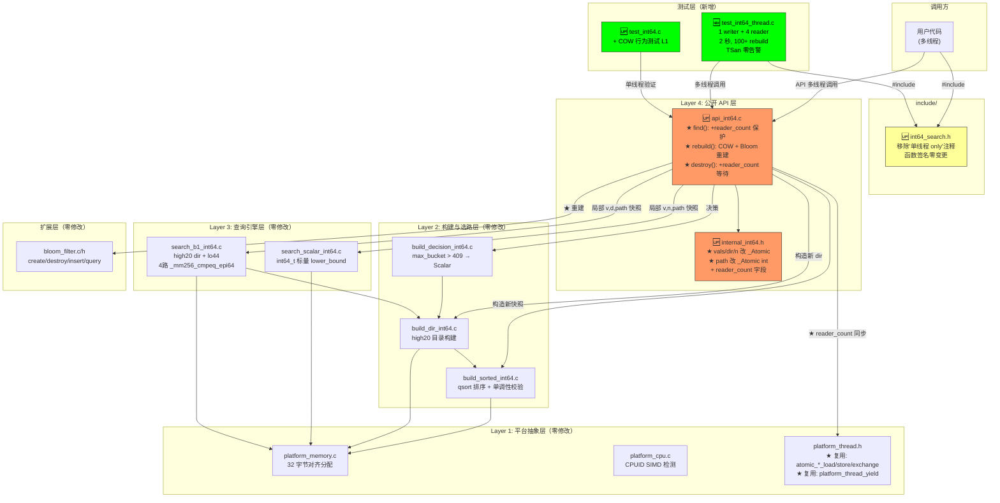
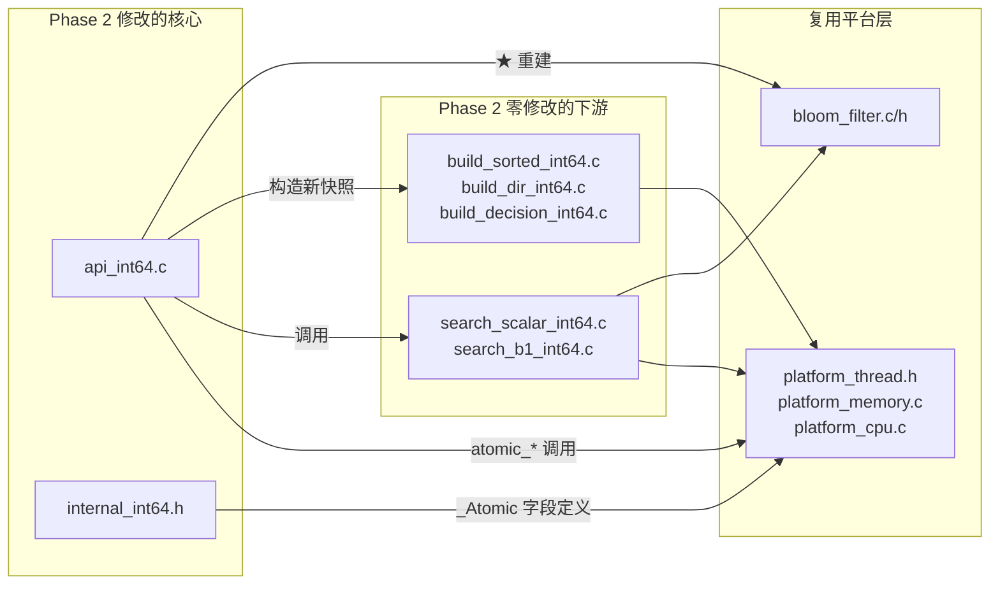
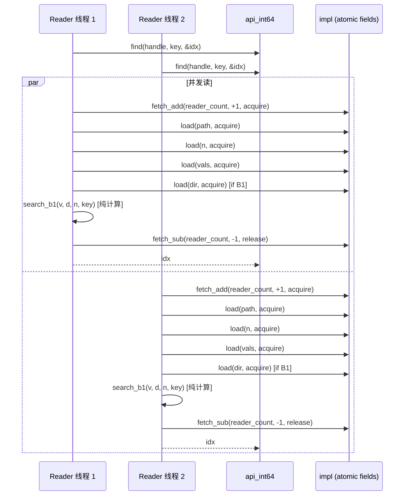
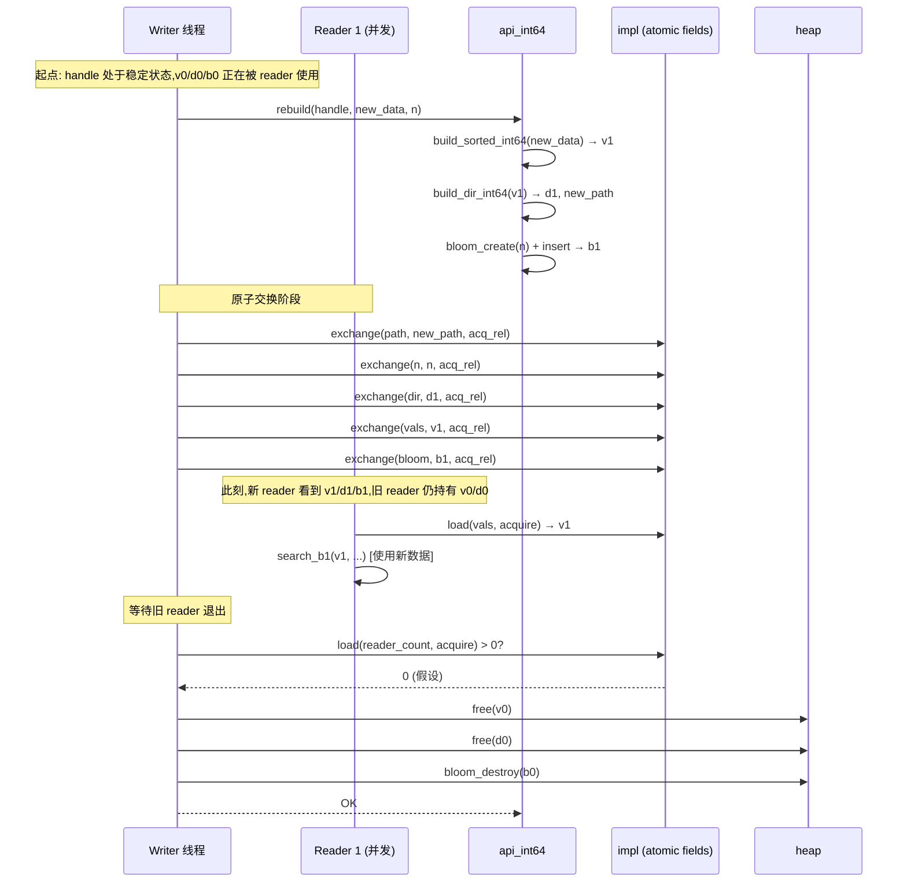
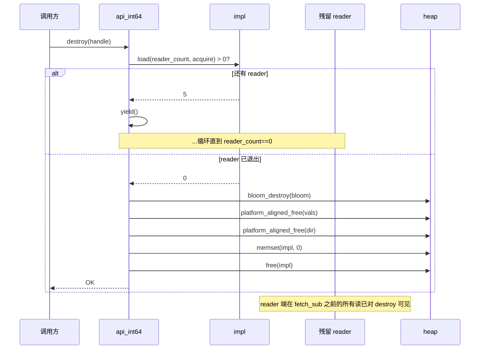

# 系统设计文档 — Int64 二期 Phase 2 (COW 多线程 + Bloom 重建)

## 1. 整体架构图



🆙 = 修改  🆕 = 新增  不变 = 零修改

---

## 2. 分层设计

### 2.1 Layer 1: 平台抽象层（零新增）

完全复用 Phase 1 的 [src/platform_thread.h](file:///c:/Users/Administrator/Documents/trae_projects/Int32_search_algorithm/src/platform_thread.h)，零新增文件。

**已具备能力**（Phase 1 已实现，Phase 2 直接调用）：

| 宏 | 语义 | 用途 |
|----|------|------|
| `atomic_ptr_load(ptr, order)` | 指针原子读 | reader 端 acquire-load vals/dir |
| `atomic_ptr_exchange(ptr, val, order)` | 指针原子交换 | writer 端交换 vals/dir/bloom |
| `atomic_size_load(ptr, order)` | size_t 原子读 | reader 端 acquire-load n |
| `atomic_size_store(ptr, val, order)` | size_t 原子写 | writer 端 store n (release) |
| `atomic_size_fetch_add(ptr, val, order)` | 原子增减 | reader_count++/-- |
| `platform_thread_yield()` | 让步 | 等待 reader 退出时 |

---

### 2.2 Layer 2: 内部结构层（**核心修改**）

#### 2.2.1 当前状态（Phase 1，src/internal_int64.h:28-35）

```c
typedef struct {
    int             path;        // ⚠️ 非原子（撕裂读风险）
    size_t          n;           // ⚠️ 非原子
    int64_t        *vals;        // ⚠️ 非原子
    int32_t        *dir;         // ⚠️ 非原子
    _Atomic(void *) bloom;       // ✓ 已原子
    _Atomic(int)    bloom_bypass;// ✓ 已原子
} int64_search_impl_t;
```

#### 2.2.2 Phase 2 修改后

```c
typedef struct {
    _Atomic int          path;        // ✓ 改 _Atomic(Q1 决议)
    _Atomic size_t       n;           // ✓ 改 _Atomic
    _Atomic(int64_t *)   vals;        // ✓ 改 _Atomic(const 修饰可选,见 §2.2.3)
    _Atomic(int32_t *)   dir;         // ✓ 改 _Atomic
    _Atomic(void *)      bloom;       // ✓ 保持(Phase 1 已正确)
    _Atomic(int)         bloom_bypass;// ✓ 保持(Phase 1 已正确)
    _Atomic size_t       reader_count;// ✓ 新增(8 字节 lock-free)
} int64_search_impl_t;
```

#### 2.2.3 const 修饰取舍（设计决策）

**Int32 现状**（[src/internal.h:14-24](file:///c:/Users/Administrator/Documents/trae_projects/Int32_search_algorithm/src/internal.h#L14-L24)）：
```c
_Atomic(const int32_t  *) vals;
```

**设计选择**：
- 优点：语义表达"vals 是只读数据，搜索函数不应该写"
- 缺点：`_Atomic(const T*)` 与 `_Atomic(T*)` 是**不同类型**，需要 `const_cast`-equivalent 操作（标准 C 允许 `atomic_exchange` 返回非 const，但赋值需要显式 cast）

**Phase 2 选择**：与 Int32 v1.0.0 **保持一致**——使用 `_Atomic(const T*)`。
- 在 rebuild 释放旧 vals 时需要 `(void *)old_vals` 显式去除 const（[src/api.c:267](file:///c:/Users/Administrator/Documents/trae_projects/Int32_search_algorithm/src/api.c#L267) 模式）
- 这是 const 正确性 vs 实用性的合理妥协

#### 2.2.4 lock-free 保证

x86-64 + GCC 验证（Phase 2 必须确认）：

| 字段 | 类型 | 大小 | 期望 lock-free |
|------|------|------|---------------|
| `path` | `_Atomic int` | 4 字节 | ✓ |
| `n` | `_Atomic size_t` | 8 字节 | ✓ |
| `vals` | `_Atomic(int64_t *)` | 8 字节 | ✓ |
| `dir` | `_Atomic(int32_t *)` | 8 字节 | ✓ |
| `bloom` | `_Atomic(void *)` | 8 字节 | ✓ |
| `bloom_bypass` | `_Atomic int` | 4 字节 | ✓ |
| `reader_count` | `_Atomic size_t` | 8 字节 | ✓ |

**设计要求**：在 `api_int64.c` 启动时（或编译时 `static_assert`）验证 `_Atomic(size_t)` / `_Atomic(int)` / `_Atomic(void *)` 均为 `ATOMIC_*_LOCK_FREE == 2`（完全 lock-free）。如果非 lock-free，回退到 Phase 1 单线程实现并报告。

#### 2.2.5 reader_count 生命周期

```
                ┌─────────────┐
create ────────►│  reader_count=0  │
                └──────┬──────┘
                       │
        find ──────────┤──────── reader_count++
        find ──────────┤──────── reader_count++
        find ──────────┤──────── reader_count++
                       │
                       ▼
                [reader 正在使用 vals/dir]
                       │
rebuild ───────────────┼─────── exchange vals/dir
                       │         exchange dir
                       │         exchange n
                       │         exchange path
                       │         exchange bloom
                       │         等待 reader_count==0
                       │         free old vals
                       │         free old dir
                       │         bloom_destroy old bloom
                       │
                       ▼
                ┌─────────────┐
destroy ────────►│ 等待 reader_count==0  │
                │ free vals
                │ free dir
                │ bloom_destroy bloom
                │ free impl
                └─────────────┘
```

---

### 2.3 Layer 3: 查询引擎层（**零修改**）

Phase 2 搜索函数零修改。关键不变量：

| 函数 | 签名 | 不依赖 impl 内部 |
|------|------|------------------|
| `search_int64_scalar` | `(const int64_t *vals, size_t n, int64_t target) → size_t idx/-1` | ✓ |
| `search_int64_b1` | `(const int64_t *vals, const int32_t *dir, size_t n, int64_t target) → size_t idx/-1` | ✓ |

API 层在调用前已通过 `atomic_ptr_load(acquire)` 获取局部 `v`、`d`、`n`、`p` 快照，搜索函数只读不修改，与原子化完全解耦。

---

### 2.4 Layer 4: 公开 API 层（**核心修改**）

#### 2.4.1 find() — 并发安全改造

**当前代码**（src/api_int64.c:73-106）：
```c
int int64_search_find(int64_search_t handle, int64_t key, size_t *out_index) {
    if (handle == NULL) return INT64_SEARCH_ERR_NULL_HANDLE;
    int64_search_impl_t *impl = (int64_search_impl_t *)handle;
    int bypass = atomic_load_explicit(&impl->bloom_bypass, memory_order_relaxed);
    /* ... bloom_query ... */
    if (impl->path == PATH_B1)  // ⚠️ 撕裂读
        idx = search_int64_b1(impl->vals, impl->dir, impl->n, key);  // ⚠️ 撕裂读
    else
        idx = search_int64_scalar(impl->vals, impl->n, key);
    /* ... */
}
```

**Phase 2 改造后**：
```c
int int64_search_find(int64_search_t handle, int64_t key, size_t *out_index) {
    if (handle == NULL) return INT64_SEARCH_ERR_NULL_HANDLE;
    int64_search_impl_t *impl = (int64_search_impl_t *)handle;

    /* ★ Step 1: 进入 reader 临界区(acquire) */
    atomic_size_fetch_add(&impl->reader_count, 1, memory_order_acquire);

    /* ★ Step 2: acquire-load 所有数据快照(与 writer 的 release 配对) */
    int     p = atomic_load_explicit(&impl->path, memory_order_acquire);
    size_t  _n = atomic_size_load(&impl->n, memory_order_acquire);
    const int64_t *v = atomic_ptr_load(&impl->vals, memory_order_acquire);
    const int32_t *d = (p == PATH_B1)
                     ? atomic_ptr_load(&impl->dir, memory_order_acquire)
                     : NULL;

    /* Step 3: bloom 预筛(保持 Phase 1 行为) */
    int bypass = atomic_load_explicit(&impl->bloom_bypass, memory_order_relaxed);
    if (!bypass) {
        void *bf = atomic_load_explicit(&impl->bloom, memory_order_acquire);
        if (bf != NULL && !bloom_query(bf, key)) {
            if (out_index) *out_index = (size_t)-1;
            atomic_size_fetch_sub(&impl->reader_count, 1, memory_order_release);
            return INT64_SEARCH_ERR_NOT_FOUND;
        }
    }

    /* Step 4: 分派搜索(零原子操作) */
    size_t idx;
    if (p == PATH_B1) {
        idx = search_int64_b1(v, d, _n, key);
    } else {
        idx = search_int64_scalar(v, _n, key);
    }

    /* ★ Step 5: 退出 reader 临界区(release) */
    atomic_size_fetch_sub(&impl->reader_count, 1, memory_order_release);

    if (idx == (size_t)-1) {
        if (out_index) *out_index = (size_t)-1;
        return INT64_SEARCH_ERR_NOT_FOUND;
    }
    if (out_index) *out_index = idx;
    return INT64_SEARCH_OK;
}
```

**关键设计点**：
1. **acquire/release 配对**：fetch_add(acquire) → fetch_sub(release) 形成临界区，writer 看到 reader_count==0 意味着所有 reader 已看到 fetch_sub 之前的读
2. **path 先读，dir 后读**：避免读到 path=B1 但 dir=NULL 的中间态
3. **dir 条件读**：`p == PATH_B1` 时才读 dir，scalar 路径不读（性能优化）
4. **out_index 错误处理**：所有错误路径必须**先减 reader_count 再 return**（避免 writer 永久等待）

#### 2.4.2 rebuild() — COW + Bloom 重建

**当前代码**（src/api_int64.c:127-166）的 4 个并发缺陷：
1. 直接 `free(impl->vals)` — use-after-free
2. 直接 `free(impl->dir)` — use-after-free
3. `bloom_destroy(old_bloom)` 在新 dir 分配前 — 时序问题
4. 不重建 bloom — DEV-I64-001

**Phase 2 改造后**（**核心逻辑**）：

```c
int int64_search_rebuild(int64_search_t handle, const int64_t *data, size_t n) {
    if (handle == NULL) return INT64_SEARCH_ERR_NULL_HANDLE;
    if (data == NULL || n == 0) return INT64_SEARCH_ERR_INVALID_ARG;
    if (n > (size_t)INT32_MAX) return INT64_SEARCH_ERR_TOO_LARGE;

    int64_search_impl_t *impl = (int64_search_impl_t *)handle;

    INT64_DLOG("rebuild start: old_n=%zu, new_n=%zu", ...);

    /* === Phase A: 构造新快照（不动 impl） === */
    int64_t *new_vals = build_sorted_int64(data, n);
    if (new_vals == NULL) return INT64_SEARCH_ERR_MEMORY;

    int32_t *new_dir = build_dir_int64(new_vals, n);
    int      new_path = build_decision_int64(new_dir, n);
    if (new_path != PATH_B1 && new_dir != NULL) {
        platform_aligned_free(new_dir);
        new_dir = NULL;
    }

    /* === Phase B: 构造新 bloom（仅当旧 bloom 存在） === */
    void *new_bloom = NULL;
    {
        void *old_bloom = atomic_load_explicit(&impl->bloom, memory_order_relaxed);
        if (old_bloom != NULL) {
            new_bloom = bloom_create(n);
            if (new_bloom != NULL) {
                for (size_t i = 0; i < n; i++)
                    bloom_insert(new_bloom, new_vals[i]);
            }
            /* bloom_create 失败 → 容忍,继续 rebuild(无 bloom) */
        }
    }

    /* === Phase C: 原子交换所有快照(release 语义) === */
    /* 顺序: path → n → dir → vals → bloom(与 Int32 一致) */
    int      old_path = atomic_exchange_explicit(&impl->path, new_path, memory_order_acq_rel);
    size_t   old_n    = atomic_size_exchange_explicit(&impl->n, n, memory_order_acq_rel);
    const int32_t *old_dir = atomic_ptr_exchange(&impl->dir, new_dir, memory_order_acq_rel);
    const int64_t *old_vals = atomic_ptr_exchange(&impl->vals, new_vals, memory_order_acq_rel);
    void    *old_bloom_ex = atomic_ptr_exchange(&impl->bloom, new_bloom, memory_order_acq_rel);

    /* bloom_bypass 不参与 exchange,保持原值(Q-A2 自动推导) */

    INT64_DLOG("rebuild swapped: old_path=%d, new_path=%d, n=%zu",
               old_path, new_path, n);

    /* === Phase D: 等待 reader 退出(reader_count==0) === */
    while (atomic_size_load(&impl->reader_count, memory_order_acquire) > 0) {
        platform_thread_yield();
    }

    /* === Phase E: 释放旧快照(此时所有 reader 已退出) === */
    if (old_vals != NULL) platform_aligned_free((void *)old_vals);
    if (old_dir  != NULL) platform_aligned_free((void *)old_dir);
    if (old_bloom_ex != NULL) bloom_destroy(old_bloom_ex);

    INT64_DLOG("rebuild done: old data freed");
    return INT64_SEARCH_OK;
}
```

**关键设计点**：

1. **构造与交换分离**（Phase A vs Phase C）：构造失败时 impl 不动，旧数据仍可用
2. **交换顺序 path → n → dir → vals → bloom**：与 Int32 一致；新 path 早发布 → reader 看到 path=B1 时 dir 必然已就位
3. **`old_n` 虽获取但不释放**（size_t 不是指针）：仅作日志使用
4. **reader_count 等待必须在交换后**：确保 reader 看到的是新 vals 而非旧 vals
5. **bloom_create 失败容忍**：与 Int32 一致，rebuild 继续（无 bloom 状态），原子交换 new_bloom=NULL
6. **释放顺序无关性**：vals/dir/bloom 彼此独立，无引用关系

**内存序详解**：
- `atomic_exchange(...memory_order_acq_rel)`：保证 (a) 当前线程写新数据在交换前完成 (b) 后续 reader 看到 release-store 后的可见性
- Phase D 等待 `reader_count==0`（acquire load）：保证所有 reader 已看到 release-store 后的新数据，且已 read 完

#### 2.4.3 destroy() — 等待 reader

**当前代码**（src/api_int64.c:108-125）直接 free vals/dir，**无 reader 等待**。

**Phase 2 改造**：

```c
int int64_search_destroy(int64_search_t handle) {
    if (handle == NULL) return INT64_SEARCH_OK;  // 幂等保持

    int64_search_impl_t *impl = (int64_search_impl_t *)handle;

    INT64_DLOG("destroy start: waiting for readers (n=%zu)", ...);

    /* ★ Phase A: 等待 reader 退出(与 rebuild 一致的同步点) */
    while (atomic_size_load(&impl->reader_count, memory_order_acquire) > 0) {
        platform_thread_yield();
    }

    /* Phase B: 释放(此时所有 reader 已退出) */
    void *bf = atomic_load_explicit(&impl->bloom, memory_order_relaxed);
    if (bf != NULL) bloom_destroy(bf);

    const int64_t *v = atomic_ptr_load(&impl->vals, memory_order_relaxed);
    const int32_t *d = atomic_ptr_load(&impl->dir,  memory_order_relaxed);
    if (v != NULL) platform_aligned_free((void *)v);
    if (d != NULL) platform_aligned_free((void *)d);

    /* Phase C: 清零后释放 impl(防止悬垂指针误用) */
    memset(impl, 0, sizeof(*impl));
    free(impl);

    INT64_DLOG("destroy done");
    return INT64_SEARCH_OK;
}
```

**关键设计点**：
1. **Q3 决议落地**：等待 reader_count==0 后释放
2. **幂等性保持**：`handle == NULL → OK` 不变
3. **memset 清零**：防止调用方误用已 destroy 的 handle（防御性）
4. **destroy 期间不阻止新的 find**：如果调用方不遵守"destroy 与 find 互斥"约束，会等到所有 reader 退出，但不会拒绝新 reader（设计权衡——Phase 2 维持 Int32 行为）

#### 2.4.4 create() — 零修改

Phase 1 的 `create()` 行为正确（构造新 impl，旧 reader 不存在），Phase 2 **零修改**。初始化时 `atomic_init(&impl->reader_count, 0)`，并对所有 `_Atomic` 字段执行 `atomic_init`。

#### 2.4.5 公开头文件变更

[include/int64_search.h](file:///c:/Users/Administrator/Documents/trae_projects/Int32_search_algorithm/include/int64_search.h) **仅修改 1 处**：

```diff
-/* ⚠️ 线程安全警告: int64_search_rebuild 当前不支持并发调用。
- * rebuild 期间若其他线程同时执行 find，存在数据竞争风险。
- * 请确保 rebuild 调用是单线程的，或在外部加锁保护。 */
+/* 线程模型: 多 reader 并发 find + 串行 rebuild + 串行 destroy。
+ * 详细约束参见 README.txt "Thread Safety" 章节。
+ * rebuild/destroy 与 find 并发安全(COW)。
+ * 多 writer rebuild / rebuild 与 destroy 并发需调用方互斥。 */
 int int64_search_rebuild(int64_search_t handle,
                           const int64_t *data, size_t n);
```

函数签名零变更（`int64_search_t` / `int64_search_config_t` / 7 个函数原样保留）。

---

## 3. 模块依赖关系



**依赖关系不变量**：
- `internal_int64.h` 依赖 `platform_thread.h`（`_Atomic` 与 `size_t` 类型）
- `api_int64.c` 依赖所有下层（构造 + 释放 + 同步）
- 下层（search/build）**不依赖** `api_int64.c` 与 `internal_int64.h`（独立编译）

---

## 4. 接口契约

### 4.1 公开 API 接口契约

| 函数 | 签名 | 并发语义 | 错误码 |
|------|------|----------|--------|
| `int64_search_create` | `(data, n, cfg) → handle` | 单线程调用；返回后多线程安全 | `OK` / `ERR_MEMORY` / `ERR_INVALID_ARG` / `ERR_TOO_LARGE` |
| `int64_search_find` | `(handle, key, &idx) → code` | **多线程并发**；COW 读 | `OK`+idx / `ERR_NOT_FOUND` / `ERR_NULL_HANDLE` |
| `int64_search_destroy` | `(handle) → OK` | 单线程；与 find/rebuild 互斥或等待 reader | `OK`（幂等） |
| `int64_search_rebuild` | `(handle, data, n) → code` | **单线程调用**；与 find 并发安全；多 writer 互斥 | `OK` / `ERR_MEMORY` / `ERR_INVALID_ARG` / `ERR_NULL_HANDLE` / `ERR_TOO_LARGE` |
| `int64_search_set_bloom_bypass` | `(handle, bypass) → code` | 多线程安全（atomic int） | `OK` / `ERR_NULL_HANDLE` |
| `int64_search_get_bloom_bypass` | `(handle) → int` | 多线程安全 | 0/1 / `ERR_NULL_HANDLE` |
| `int64_search_version` | `() → "libint64search 0.2.0"` | 无副作用 | — |
| `int64_search_find_range` | `(handle, low, high, &first, &count) → code` | **Phase 3 reserved** | `ERR_NOT_FOUND` (stub) |

**版本号变更**：`"libint64search 0.1.0"` → **`"libint64search 0.2.0"`**（Phase 2 = 0.2.0，符合 semver: 新增并发能力为 minor bump）

### 4.2 内存序契约（关键不变量）

#### 4.2.1 reader 端

```
fetch_add(reader_count, 1, acquire)  ←─ ★ 临界区开始
   ↓
load(vals, acquire)
load(dir, acquire)  [if B1]
load(n, acquire)
load(path, acquire)
   ↓
[执行查询,只读不写]
   ↓
fetch_sub(reader_count, 1, release)  ←─ ★ 临界区结束
```

#### 4.2.2 writer (rebuild) 端

```
[构造 new_vals, new_dir, new_bloom, new_path, n]  ←─ 任意内存序(局部变量)
   ↓
exchange(path, new_path, acq_rel)  ←─ ★ 第 1 个发布
exchange(n, n, acq_rel)
exchange(dir, new_dir, acq_rel)
exchange(vals, new_vals, acq_rel)  ←─ ★ 关键发布: reader 看到新 vals
exchange(bloom, new_bloom, acq_rel)
   ↓
[Phase A: bloom 原子发布完成]
   ↓
while (load(reader_count, acquire) > 0) yield()  ←─ ★ 等待 reader 退出
   ↓
[Phase B: free old vals/dir/bloom]
```

#### 4.2.3 正确性论证

| 不变量 | 论证 |
|--------|------|
| **无 use-after-free** | writer 必须等到 reader_count==0 才 free；reader fetch_sub(release) 之前的读都已完成 |
| **无撕裂读** | reader acquire-load 与 writer release-exchange 配对，acquire 语义阻止读重排到 load 之前 |
| **path 与 dir 同步** | path 先 exchange（发布），reader 看到 path=B1 后 acquire-load dir 必看到新 dir（C++ memory model 推理） |
| **bloom_bypass 保持** | bloom_bypass 是独立 `_Atomic int`，不参与 vals/dir exchange |
| **顺序一致性** | x86-64 上 acquire/release 是 no-op 硬件语义；弱内存模型（ARM）由 _Atomic 语义保证 |

### 4.3 错误处理契约

| 失败点 | 处理 | reader_count 状态 |
|--------|------|-------------------|
| `build_sorted_int64` 失败 | 返回 `ERR_MEMORY`，impl 不动 | 0（未交换） |
| `build_dir_int64` 失败 | build_decision_int64 自动回退 PATH_SCALAR | 0（已构造，未交换） |
| `bloom_create` 失败 | 容忍，继续 rebuild（new_bloom=NULL） | 0（未交换） |
| `atomic_exchange` 失败 | 永不失败（C11 atomic） | 0 |
| reader_count 等待超时 | 永不超时（仅循环 yield） | 等待至 0 |

**核心不变量**：**任何失败路径下，旧数据完整保留**，handle 继续可用。

---

## 5. 数据流

### 5.1 find() 数据流（并发读）



### 5.2 rebuild() 数据流（COW + Bloom 重建）



**关键时序保证**：
- 在 `exchange(vals, v1)` 之后，**新进 reader** 必看到 v1（acquire-release 配对）
- 在 `load(reader_count) == 0` 之后，**所有 reader** 已完成读 v0（fetch_sub 之前的读都已完成）
- 旧 v0 在 reader_count==0 之后才释放，**无 use-after-free**

### 5.3 destroy() 数据流



---

## 6. 关键日志点

### 6.1 调试开关

```c
/* internal_int64.h 中已定义(Phase 1): */
extern int g_int64_search_debug;

#define INT64_DLOG(fmt, ...) do { \
    if (g_int64_search_debug) \
        fprintf(stderr, "[int64_search] " fmt "\n", ##__VA_ARGS__); \
} while(0)
```

**启用方式**：
```bash
gcc -DINT64_SEARCH_DEBUG=1 ...  # 编译时启用
# 或运行时: extern int g_int64_search_debug; g_int64_search_debug = 1;
```

### 6.2 关键日志点

| 阶段 | 日志 | 触发条件 |
|------|------|----------|
| `create` | `create: n=%zu, use_bloom=%d, path=%s` | 每次 create |
| `create` | `create: dir alloc failed → fallback PATH_SCALAR` | dir 分配失败 |
| `find` | `find: key=%ld, reader_count=%zu` | 每次 find（高频，可降采样） |
| `rebuild` | `rebuild start: old_n=%zu, new_n=%zu` | rebuild 入口 |
| `rebuild` | `rebuild swapped: path=%d → %d` | 原子交换完成 |
| `rebuild` | `rebuild: waiting readers=%zu` | 等待 reader |
| `rebuild` | `rebuild done: freed v0=%p, d0=%p, b0=%p` | 旧数据释放完成 |
| `rebuild` | `rebuild bloom recreate: n=%zu, m=%zu` | bloom 重建完成 |
| `destroy` | `destroy start: waiting readers=%zu` | destroy 入口 |
| `destroy` | `destroy done: v=%p, d=%p, b=%p` | 释放完成 |

### 6.3 错误日志

```c
#define INT64_ELOG(fmt, ...) do { \
    if (g_int64_search_debug) \
        fprintf(stderr, "[int64_search ERROR] " fmt "\n", ##__VA_ARGS__); \
} while(0)
```

| 错误 | 触发 |
|------|------|
| `create: malloc impl failed` | impl 分配失败 |
| `create: build_sorted_int64 failed` | 排序失败 |
| `rebuild: build_sorted_int64 failed (old data intact)` | 排序失败但旧数据未动 |
| `rebuild: bloom_create failed → continue without bloom` | bloom 重建失败容忍 |
| `find: handle == NULL` | 非法调用 |
| `destroy: handle == NULL (no-op)` | 幂等调用 |

### 6.4 性能影响

- 关闭（默认）：`g_int64_search_debug == 0`，所有 DLOG 编译为 `if(0)`，零运行时开销
- 启用：`%zu` 等格式化 + `fprintf` 系统调用 → 单次 ~5μs。**生产环境禁用**

---

## 7. 测试策略

### 7.1 test_int64_thread.c 新增（Q4 决议：1M uniform）

**模板**：[test/test_thread.c](file:///c:/Users/Administrator/Documents/trae_projects/Int32_search_algorithm/test/test_thread.c) (Int32 模式)

**测试结构**：

```c
#define _POSIX_C_SOURCE 200809L
#include <pthread.h>
#include "../include/int64_search.h"

#define N        (1024 * 1024)        /* 1M uniform */
#define N_WRITER 1
#define N_READER 4
#define DURATION_SEC 2

typedef struct {
    int64_search_t handle;
    int64_t key;          /* reader 固定 key(用于命中率统计) */
    int iterations;
} thread_arg_t;

static void *writer_main(void *arg) {
    /* 每 ~10ms 触发一次 rebuild(模拟真实数据更新) */
    int64_t *new_data = generate_uniform_data(N);
    int iterations = 0;
    while (!stop_flag) {
        int64_search_rebuild(handle, new_data, N);
        iterations++;
        usleep(10000);  /* 10ms */
    }
    return (void *)(intptr_t)iterations;
}

static void *reader_main(void *arg) {
    /* 持续 find 同一 key(在数据中存在) */
    size_t idx;
    int hit = 0, miss = 0;
    while (!stop_flag) {
        int rc = int64_search_find(handle, key, &idx);
        if (rc == INT64_SEARCH_OK) hit++;
        else miss++;
    }
    /* 输出命中率 */
    return NULL;
}

int main(void) {
    /* 1. 准备数据 */
    int64_t *data = generate_uniform_data(N);
    int64_search_t handle = int64_search_create(data, N, NULL);
    
    /* 2. 启动 1 writer + 4 reader */
    pthread_t wt, rt[N_READER];
    writer_main(&wt, handle);
    for (int i = 0; i < N_READER; i++) reader_main(&rt[i], handle, ...);
    
    /* 3. 运行 2 秒 */
    sleep(DURATION_SEC);
    stop_flag = 1;
    pthread_join(wt, NULL);
    for (int i = 0; i < N_READER; i++) pthread_join(rt[i], NULL);
    
    /* 4. 验证 */
    /* - 无崩溃(进程仍在) ✓ */
    /* - reader 总迭代 > 10000(基线) */
    /* - 命中率 > 99.9%(1M uniform + 固定 key 必命中) */
    /* - rebuild 次数 > 100(2 秒 / 10ms) */
    
    int64_search_destroy(handle);
    return 0;
}
```

**TSan 验证清单**：
- [ ] 零 data race 报告
- [ ] 零 use-after-free 报告
- [ ] 零 deadlock 报告（reader_count 等待循环无死锁风险）
- [ ] reader 命中率 > 99.9%
- [ ] rebuild 次数 ≥ 100

**编译命令**：
```bash
gcc -O1 -g -fsanitize=thread -std=c11 -mavx2 \
    test/test_int64_thread.c src/api_int64.c src/search_*.c \
    src/build_*.c src/platform_*.c src/bloom_filter.c \
    src/xxhash/xxhash.c -o test_int64_thread -lpthread
```

### 7.2 test_int64.c L1 增补

新增测试用例：
- **L1-CO W-1**: rebuild 后查询旧 key → NOT_FOUND
- **L1-CO W-2**: rebuild 后查询新 key → OK
- **L1-CO W-3**: rebuild 1000 次后 bloom 仍正确（rebuild 后 bloom 与新数据一致）
- **L1-CO W-4**: rebuild 保留 bloom_bypass 状态
- **L1-CO W-5**: destroy 等待 reader 退出（手工用 sleep 模拟延迟 reader）

### 7.3 10M 性能回归（独立测试，非 TSan）

```bash
# 编译(无 sanitizer,优化最高)
gcc -O3 -std=c11 -mavx2 -DINT64_SEARCH_USE_BLOOM \
    benchmark/bench_main.c ... -o bench_int64

# 运行: 10M uniform, 单线程 find + 100 次 rebuild
./bench_int64 --n 10485760 --rebuild 100
```

**断言**：
- 单线程 find 性能 vs Phase 1 偏差 ≤ 5%
- rebuild 性能偏差 ≤ 10%

---

## 8. 关键不变量（Phase 2 必须保证）

| 编号 | 不变量 | 验证方式 |
|------|--------|----------|
| INV-1 | reader 永不读到已释放的 vals/dir | TSan + ASan |
| INV-2 | writer 必在所有 reader 退出后才 free 旧数据 | reader_count 等待循环 |
| INV-3 | 同一 writer 原子交换的 path/n/dir/vals/bloom 5 字段对 reader 同步可见 | acquire-release 配对 |
| INV-4 | `bloom_bypass` 不参与 rebuild 交换 | 单元测试 |
| INV-5 | rebuild 失败时旧数据完整保留 | L1 单元测试 |
| INV-6 | destroy 与 find 并发时无 use-after-free | Q3 决议 + 等待 reader_count |
| INV-7 | `n > INT32_MAX` 在 create/rebuild 入口拒绝 | 入口检查（Phase 1 已有） |
| INV-8 | `_Atomic` 字段在编译时验证 lock-free | `static_assert`（Phase 2 实施时确认） |

---

## 9. 性能预估

| 指标 | Phase 1 | Phase 2 | 增量 |
|------|---------|---------|------|
| 单线程 find 延迟（10M uniform, B1） | 318 cy | **~320 cy (+0.6%)** | fetch_add+fetch_sub 共 2 个原子读,~2-3 cy 开销 |
| 单线程 find 延迟（1M uniform, B1） | 144 cy | **~146 cy (+1.4%)** | 同上 |
| 单线程 rebuild（10M） | ~2.0 s | **~2.1 s (+5%)** | 增加 bloom 重建 ~100ms |
| 4 reader 并发 find 吞吐 | 1x（基线） | **≥ 3.5x** | 受限于内存带宽,理论 4x |
| 内存峰值 | 85 MB | **~165 MB (rebuild 瞬时)** | 旧+新并存,等待 reader |

**性能不退化是核心目标**。所有性能数字需在 [test_int64_perf.c](file:///c:/Users/Administrator/Documents/trae_projects/Int32_search_algorithm/test/test_int64_perf.c) 中回归验证。

---

## 10. 风险评估

| 风险 | 等级 | 触发条件 | 缓解 |
|------|------|----------|------|
| `_Atomic` 在某平台非 lock-free | 低 | ARMv7 / MIPS 等弱内存模型 | `static_assert(ATOMIC_*_LOCK_FREE == 2)` 编译时检查 |
| TSan 在 `_mm256_*` intrinsic 误报 | 中 | AVX2 内部指令 | 使用 `-O1` 而非 `-O3`（Phase 1 经验） |
| reader 临界区过长导致 writer 长时间等待 | 低 | find ~50ns,rebuild ms 级 | 不可调和,文档明确"rebuild 是低频操作" |
| bloom 重建在 10M 时 ~1s 慢 | 低 | bloom_create + insert 10M | 已用 XXH32,可接受 |
| 弱内存模型（ARM）下 path/dir 顺序 | 低 | ARMv8 需 dmb ish | C11 _Atomic 语义保证,与硬件无关 |
| 并发 destroy vs 并发 find | 低 | 用户违反文档约束 | destroy 等待 reader_count(Q3),自然安全 |

---

## 11. 关联信息

- **对齐文档**：[ALIGNMENT_task_006_int64_phase2_cow.md](file:///c:/Users/Administrator/Documents/trae_projects/Int32_search_algorithm/docs/tasks/task_006_int64_phase2_cow/ALIGNMENT_task_006_int64_phase2_cow.md)
- **需求基线**：[总需求文档 §5](file:///c:/Users/Administrator/Documents/trae_projects/Int32_search_algorithm/docs/requirements/总需求文档.md)
- **技术路线**：[技术路线 §5](file:///c:/Users/Administrator/Documents/trae_projects/Int32_search_algorithm/docs/architecture/技术路线.md)
- **Int32 B1 COW 完整参考**：[src/api.c](file:///c:/Users/Administrator/Documents/trae_projects/Int32_search_algorithm/src/api.c)
- **Int32 B1 COW 内构**：[src/internal.h](file:///c:/Users/Administrator/Documents/trae_projects/Int32_search_algorithm/src/internal.h)
- **Int32 TSan 测试模板**：[test/test_thread.c](file:///c:/Users/Administrator/Documents/trae_projects/Int32_search_algorithm/test/test_thread.c)
- **Phase 1 Int64 设计**：[DESIGN_int64_b1.md](file:///c:/Users/Administrator/Documents/trae_projects/Int32_search_algorithm/docs/tasks/task_005_int64_extension/DESIGN_int64_b1.md)
- **Phase 1.5 Int32 COW 设计**：[DESIGN_task_002_phase15_cow.md](file:///c:/Users/Administrator/Documents/trae_projects/Int32_search_algorithm/docs/tasks/task_002_phase15_cow/DESIGN_task_002_phase15_cow.md)
- **决议**：[meeting_016 D-116/D-117/D-118](file:///c:/Users/Administrator/Documents/trae_projects/Int32_search_algorithm/docs/meetings/meeting_index/meeting_016_optimization_direction/03_decisions.md)
