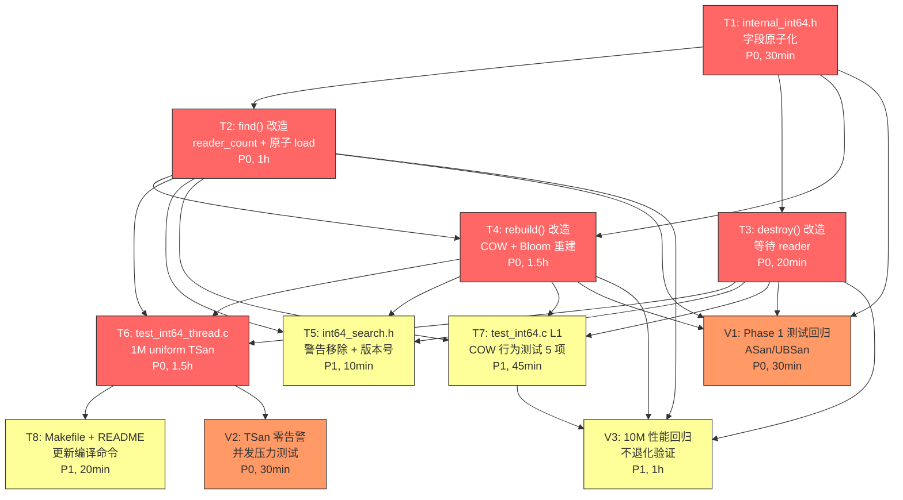

# 原子任务拆分 — Int64 二期 Phase 2

## 1. 拆分总览

Phase 2 工作拆分为 **11 个原子任务**，按依赖顺序编号：

| # | 任务 | 优先级 | 风险 | 关键路径 | 依赖 | 估算 |
|---|------|--------|------|----------|------|------|
| T1 | `internal_int64.h` 字段原子化 | P0 | 中 | ✅ | — | 30 分钟 |
| T2 | `api_int64.c` find() 改造（reader_count + 原子 load） | P0 | 高 | ✅ | T1 | 1 小时 |
| T3 | `api_int64.c` destroy() 改造（等待 reader_count） | P0 | 低 | ✅ | T1 | 20 分钟 |
| T4 | `api_int64.c` rebuild() 改造（COW + Bloom 重建） | P0 | 高 | ✅ | T1, T2 | 1.5 小时 |
| T5 | `include/int64_search.h` 警告移除 + 版本号升级 | P1 | 极低 | ❌ | T1, T2, T3, T4 | 10 分钟 |
| T6 | `test_int64_thread.c` 新增（1M uniform TSan） | P0 | 中 | ✅ | T1, T2, T3, T4 | 1.5 小时 |
| T7 | `test_int64.c` L1 COW 行为测试增补（5 项） | P1 | 低 | ❌ | T1, T2, T3, T4 | 45 分钟 |
| T8 | `Makefile` + `README.txt` 更新 | P1 | 极低 | ❌ | T6 | 20 分钟 |
| V1 | Phase 1 单线程测试回归验证 | P0 | 极低 | ✅ | T1, T2, T3, T4 | 30 分钟 |
| V2 | TSan 并发测试零告警验证 | P0 | 中 | ✅ | T6 | 30 分钟 |
| V3 | 10M 性能回归验证 | P1 | 中 | ❌ | T1, T2, T3, T4, T7 | 1 小时 |

**关键路径**：T1 → T2/T3 → T4 → V1/V2

**总工作量估算**：~8.5 小时（约 1 个工作日）

---

## 2. 任务依赖图



**说明**：
- 🔴 红色 = P0 关键路径任务
- 🟠 橙色 = P0 验证任务（非代码）
- 🟡 黄色 = P1 任务
- V1-V3 是**纯验证任务**（无代码变更），可作为质量门控

---

## 3. 原子任务详细规格

---

### T1: `internal_int64.h` 字段原子化

**优先级**: P0
**风险等级**: 中（类型变更影响所有使用 impl 的代码）
**关键路径**: ✅
**依赖**: 无
**估算**: 30 分钟

#### 输入契约
- **前置依赖**: 无
- **输入数据**: 当前 `src/internal_int64.h:28-35`（Phase 1 版本）
- **环境依赖**: `src/platform_thread.h`（已提供 `_Atomic` 类型支持）

#### 输出契约
- **输出数据**: 修改后的 `src/internal_int64.h`，定义：
  - `_Atomic int` path（原 int）
  - `_Atomic size_t` n（原 size_t）
  - `_Atomic(const int64_t *)` vals（原 int64_t*）
  - `_Atomic(const int32_t *)` dir（原 int32_t*）
  - `_Atomic(void *)` bloom（保持）
  - `_Atomic(int)` bloom_bypass（保持）
  - `_Atomic size_t` reader_count（**新增**）
- **交付物**: 修改后的 `src/internal_int64.h`
- **验收标准**:
  - [ ] 7 个 `_Atomic` 字段全部就位
  - [ ] 编译通过零警告
  - [ ] `_Static_assert(ATOMIC_LONG_LOCK_FREE == 2, ...)` 等编译时 lock-free 验证添加

#### 实现约束
- **技术栈**: C11 `_Atomic`，GCC stdatomic.h
- **接口规范**: 与 Int32 `src/internal.h:14-24` 保持字段命名一致
- **质量要求**: 零警告、`-Wcast-align` 干净

#### 实现要点
```c
typedef struct {
    _Atomic int          path;        /* 改 _Atomic(Q1 决议) */
    _Atomic size_t       n;           /* 改 _Atomic */
    _Atomic(const int64_t *)   vals;  /* 改 _Atomic(const) */
    _Atomic(const int32_t *)   dir;   /* 改 _Atomic(const) */
    _Atomic(void *)      bloom;       /* 保持 */
    _Atomic(int)         bloom_bypass;/* 保持 */
    _Atomic size_t       reader_count;/* 新增 */
} int64_search_impl_t;

/* 编译时 lock-free 验证(GCC 特有) */
_Static_assert(__atomic_always_lock_free(sizeof(int), 0),
               "path _Atomic int must be lock-free");
_Static_assert(__atomic_always_lock_free(sizeof(size_t), 0),
               "n _Atomic size_t must be lock-free");
_Static_assert(__atomic_always_lock_free(sizeof(void *), 0),
               "pointer _Atomic must be lock-free");
```

#### 依赖关系
- **后置任务**: T2, T3, T4（所有 API 改造）
- **并行任务**: 无

---

### T2: `api_int64.c` find() 改造

**优先级**: P0
**风险等级**: 高（热路径性能敏感、内存序正确性）
**关键路径**: ✅
**依赖**: T1
**估算**: 1 小时

#### 输入契约
- **前置依赖**: T1（impl 字段已 _Atomic 化）
- **输入数据**: 当前 `src/api_int64.c:73-106`（Phase 1 find 实现）
- **环境依赖**: T1 提供的 `_Atomic` 字段

#### 输出契约
- **输出数据**: 修改后的 find 函数，5 步严格顺序：
  1. `fetch_add(reader_count, 1, acquire)` ← 临界区开始
  2. `load(path, acquire)` + `load(n, acquire)` + `load(vals, acquire)` [+ `load(dir, acquire)` if B1]
  3. bloom 预筛(保持 Phase 1 行为)
  4. 分派 search_int64_b1/scalar
  5. `fetch_sub(reader_count, 1, release)` ← 临界区结束
- **交付物**: 修改后的 `src/api_int64.c::int64_search_find`
- **验收标准**:
  - [ ] 5 步顺序与 DESIGN §2.4.1 一致
  - [ ] 所有错误路径先 fetch_sub 再 return（防 writer 永久等待）
  - [ ] out_index == NULL 不应崩溃（保持 Phase 1 行为）
  - [ ] `-O0/-O1/-O2/-O3` 编译均通过

#### 实现约束
- **技术栈**: C11 atomic + acquire/release 语义
- **接口规范**: 函数签名零变更
- **质量要求**: 单线程性能不退化（±5%）

#### 实现模板
参见 [DESIGN §2.4.1](file:///c:/Users/Administrator/Documents/trae_projects/Int32_search_algorithm/docs/tasks/task_006_int64_phase2_cow/DESIGN_task_006_int64_phase2_cow.md)

#### 依赖关系
- **后置任务**: T4（rebuild 改造需要 T2 的 reader_count 模式）, T6（TSan 测试需要 T2 的实现）
- **并行任务**: T3（destroy 改造，与 T2 并行,无依赖）

---

### T3: `api_int64.c` destroy() 改造

**优先级**: P0
**风险等级**: 低（仅等待循环 + 释放）
**关键路径**: ✅
**依赖**: T1
**估算**: 20 分钟

#### 输入契约
- **前置依赖**: T1
- **输入数据**: 当前 `src/api_int64.c:108-125`（Phase 1 destroy）
- **环境依赖**: `platform_thread.h` 的 `platform_thread_yield`

#### 输出契约
- **输出数据**: 修改后的 destroy 函数：
  1. `handle == NULL` 幂等返回 OK（保持）
  2. 等待 `reader_count == 0`（Q3 决议）
  3. 释放 bloom、vals、dir
  4. `memset(impl, 0)` 防悬垂
  5. `free(impl)`
- **交付物**: 修改后的 `src/api_int64.c::int64_search_destroy`
- **验收标准**:
  - [ ] destroy 与并发 find 互不冲突（Q3 决议落地）
  - [ ] `handle == NULL` 仍返回 OK
  - [ ] 等待循环不死锁（Q3 + platform_thread_yield 验证）
  - [ ] 无内存泄漏（valgrind/ASan 验证）

#### 实现约束
- 与 T2 使用相同的 reader_count 同步模式
- 失败路径不存在（destroy 只返回 OK 或被 OOM 中断）

#### 依赖关系
- **后置任务**: T4, T6
- **并行任务**: T2（与 T3 完全独立）

---

### T4: `api_int64.c` rebuild() 改造（COW + Bloom 重建）

**优先级**: P0
**风险等级**: 高（多字段原子交换、顺序、错误恢复）
**关键路径**: ✅
**依赖**: T1, T2
**估算**: 1.5 小时

#### 输入契约
- **前置依赖**: T1（字段原子化）+ T2（find 同步模式）
- **输入数据**: 当前 `src/api_int64.c:127-166`（Phase 1 rebuild）
- **环境依赖**: `bloom_filter.h::bloom_create/insert/destroy`

#### 输出契约
- **输出数据**: 5 阶段 rebuild 函数：
  - **Phase A**: 构造 new_vals, new_dir, new_path, new_bloom（构造失败时 impl 不动）
  - **Phase B**: 构造 new_bloom（仅当旧 bloom 存在；失败容忍）
  - **Phase C**: 5 字段原子交换 path → n → dir → vals → bloom（acq_rel）
  - **Phase D**: 等待 reader_count == 0
  - **Phase E**: 释放 old_vals, old_dir, old_bloom
- **交付物**: 修改后的 `src/api_int64.c::int64_search_rebuild`
- **验收标准**:
  - [ ] 5 阶段顺序与 DESIGN §2.4.2 一致
  - [ ] 任意 Phase A/B 失败 → impl 不动,旧数据完整
  - [ ] 5 字段全部 acq_rel exchange
  - [ ] bloom_bypass 字段不参与交换（Q-A2）
  - [ ] 内存泄漏零（valgrind 验证）

#### 实现约束
- 与 Int32 `src/api.c:178-277` 模式严格对齐
- 内存序：exchange 用 acq_rel
- bloom_create 失败容忍（new_bloom = NULL 继续）

#### 实现模板
参见 [DESIGN §2.4.2](file:///c:/Users/Administrator/Documents/trae_projects/Int32_search_algorithm/docs/tasks/task_006_int64_phase2_cow/DESIGN_task_006_int64_phase2_cow.md)

#### 依赖关系
- **后置任务**: T5, T6, T7, V1, V3
- **并行任务**: 无（必须在 T2 后）

---

### T5: `include/int64_search.h` 警告移除 + 版本号升级

**优先级**: P1
**风险等级**: 极低（仅文档注释 + 字符串）
**关键路径**: ❌
**依赖**: T1, T2, T3, T4
**估算**: 10 分钟

#### 输入契约
- **前置依赖**: T1-T4 完成（rebuild/find/destroy 已线程安全）
- **输入数据**: 当前 `include/int64_search.h:31-33`（"单线程 only"警告注释）

#### 输出契约
- **输出数据**: 修改后的 int64_search.h：
  - 移除 line 31-33 的 ⚠️ 警告注释
  - 替换为新的线程模型注释（COW + 多 reader + 串行 rebuild）
  - 版本号声明 `0.1.0` → `0.2.0`（api_int64.c::int64_search_version）
- **交付物**: 修改后的 `include/int64_search.h`, `src/api_int64.c::int64_search_version`
- **验收标准**:
  - [ ] 头文件无 "单线程 only" 字样
  - [ ] 新注释明确 COW 线程模型
  - [ ] `int64_search_version()` 返回 `"libint64search 0.2.0"`
  - [ ] 公开 API 函数签名零变更

#### 实现约束
- 注释改写参考 Int32 v1.0.0 注释风格
- 版本号遵循 semver（minor bump 因新增能力）

#### 依赖关系
- **后置任务**: T8（README 引用）
- **并行任务**: T7（与 T5 完全独立）

---

### T6: `test_int64_thread.c` 新增（TSan 并发压力测试）

**优先级**: P0
**风险等级**: 中（pthread 编程 + TSan 兼容性）
**关键路径**: ✅
**依赖**: T1, T2, T3, T4
**估算**: 1.5 小时

#### 输入契约
- **前置依赖**: T1-T4 全部完成（API 全部线程安全）
- **输入数据**: Int32 模板 [test/test_thread.c](file:///c:/Users/Administrator/Documents/trae_projects/Int32_search_algorithm/test/test_thread.c)
- **环境依赖**: pthread 库（Linux 全平台原生支持）

#### 输出契约
- **输出数据**: 新增 `test/test_int64_thread.c`，包含：
  - 1 writer + 4 reader 线程
  - 1M uniform 数据（80MB）
  - 测试时长 2 秒
  - 验证项：进程不崩溃、reader 总迭代 > 10000、命中率 > 99.9%、rebuild 次数 ≥ 100
- **交付物**: 新增 `test/test_int64_thread.c`
- **验收标准**:
  - [ ] 编译命令 `gcc -O1 -g -fsanitize=thread ...` 通过
  - [ ] TSan 运行零告警
  - [ ] reader 总迭代 > 10000（性能基线）
  - [ ] rebuild 次数 ≥ 100
  - [ ] 进程退出码 0

#### 实现约束
- **测试规模**: 1M uniform（Q4 决议）
- **线程数**: 1 writer + 4 reader
- **编译优化**: `-O1`（避免 TSan 在 AVX2 intrinsic 误报）
- **代码量**: ~120-150 行

#### 实现模板
参见 [DESIGN §7.1](file:///c:/Users/Administrator/Documents/trae_projects/Int32_search_algorithm/docs/tasks/task_006_int64_phase2_cow/DESIGN_task_006_int64_phase2_cow.md)

#### 依赖关系
- **后置任务**: V2（TSan 验证）, T8
- **并行任务**: T7（与 T6 完全独立）

---

### T7: `test_int64.c` L1 COW 行为测试增补（5 项）

**优先级**: P1
**风险等级**: 低（已有 test_int64.c 模板）
**关键路径**: ❌
**依赖**: T1, T2, T3, T4
**估算**: 45 分钟

#### 输入契约
- **前置依赖**: T1-T4 全部完成
- **输入数据**: 当前 `test/test_int64.c` + Phase 1 L1 测试模板
- **环境依赖**: 无

#### 输出契约
- **输出数据**: 在 `test_int64.c` L1 段增补 5 项 COW 行为测试：
  - L1-COW-1: rebuild 后查询旧 key → NOT_FOUND
  - L1-COW-2: rebuild 后查询新 key → OK
  - L1-COW-3: rebuild 1000 次后 bloom 仍正确（修复 DEV-I64-001 验证）
  - L1-COW-4: rebuild 保留 bloom_bypass 状态
  - L1-COW-5: destroy 等待 reader 退出（手工 sleep 模拟）
- **交付物**: 修改后的 `test/test_int64.c`
- **验收标准**:
  - [ ] 5 项新测试全部通过
  - [ ] 现有 Phase 1 L1-L7 测试全部继续通过
  - [ ] 无编译警告
  - [ ] 代码风格与 Phase 1 一致

#### 实现约束
- 沿用 Phase 1 L1 测试的 `TEST_ASSERT` 宏
- 不引入新依赖

#### 依赖关系
- **后置任务**: V1（Phase 1 回归）, V3（10M 性能）
- **并行任务**: T6（独立）

---

### T8: `Makefile` + `README.txt` 更新

**优先级**: P1
**风险等级**: 极低（构建脚本 + 文档）
**关键路径**: ❌
**依赖**: T6
**估算**: 20 分钟

#### 输入契约
- **前置依赖**: T6 完成（test_int64_thread.c 存在）
- **输入数据**: 当前 `Makefile`（含 `test-int64` 目标）+ `README.txt`
- **环境依赖**: 无

#### 输出契约
- **输出数据**:
  - **Makefile**: 新增 `test-int64-thread` 目标（编译 + 运行 TSan）
  - **README.txt**:
    - 标注 Int64 多线程安全
    - 更新 Int64 编译命令（含 `-DINT64_SEARCH_USE_BLOOM` 可选）
    - 标注 `test-int64-thread` 用途
- **交付物**: 修改后的 `Makefile`, `README.txt`
- **验收标准**:
  - [ ] `make test-int64-thread` 可用
  - [ ] README.txt 描述与新功能一致
  - [ ] 用户编译命令可直接 copy-paste

#### 实现约束
- Makefile 风格与现有 `test-int64` 目标一致
- README.txt 沿用下划线命名 + gcc 命令风格（user 习惯）

#### 依赖关系
- **后置任务**: 无（CI 可选）
- **并行任务**: 无

---

### V1: Phase 1 单线程测试回归验证

**优先级**: P0
**风险等级**: 极低（无代码变更,纯验证）
**关键路径**: ✅
**依赖**: T1, T2, T3, T4
**估算**: 30 分钟

#### 输入契约
- **前置依赖**: T1-T4 完成
- **输入数据**: 现有 Phase 1 测试套件
- **环境依赖**: 无

#### 输出契约
- **输出数据**: 验证报告（命令行输出）：
  - `gcc -O3 -std=c11 -mavx2 -DINT64_SEARCH_USE_BLOOM ...` 编译通过
  - `make test-int64` 全部通过
  - `make test CFLAGS="... -fsanitize=address,undefined"` 零告警
  - `test_int64_zipf`（阈值 409 验证）通过
  - `test_int64_perf`（10M uniform 性能）baseline 数据
- **交付物**: 验证日志（粘贴到 ACCEPTANCE 文档）
- **验收标准**:
  - [ ] 编译零警告
  - [ ] 现有 Phase 1 所有测试 100% 通过
  - [ ] ASan/UBSan 零告警

#### 实现约束
- 纯验证任务,无需代码变更

#### 依赖关系
- **后置任务**: 无（可作为质量门控）
- **并行任务**: V2

---

### V2: TSan 并发测试零告警验证

**优先级**: P0
**风险等级**: 中（TSan 误报需 workaround）
**关键路径**: ✅
**依赖**: T6
**估算**: 30 分钟

#### 输入契约
- **前置依赖**: T6 完成
- **输入数据**: T6 产出的 test_int64_thread.c
- **环境依赖**: TSan (`-fsanitize=thread`)

#### 输出契约
- **输出数据**: TSan 验证日志：
  - 编译命令 + 运行命令
  - 零 data race 报告
  - 零 use-after-free 报告
  - reader 命中率 > 99.9%
  - rebuild 次数 ≥ 100
- **交付物**: TSan 日志（粘贴到 ACCEPTANCE 文档）
- **验收标准**:
  - [ ] 零 data race
  - [ ] 零 use-after-free
  - [ ] reader 性能不退化（vs 单线程基线）

#### 实现约束
- 编译优化: `-O1`（避免 TSan 误报）
- 必要时 TSan 抑制属性（罕见情况）

#### 依赖关系
- **后置任务**: 无
- **并行任务**: V1, V3

---

### V3: 10M 性能回归验证

**优先级**: P1
**风险等级**: 中（性能对比需稳定环境）
**关键路径**: ❌
**依赖**: T1, T2, T3, T4, T7
**估算**: 1 小时

#### 输入契约
- **前置依赖**: T1-T4 + T7 全部完成
- **输入数据**: 现有 `benchmark/bench_main.c` + Phase 1 性能 baseline
- **环境依赖**: 无（用 `test_int64_perf.c` 也可）

#### 输出契约
- **输出数据**: 10M uniform 性能对比表：
  - 单线程 find 延迟（vs Phase 1 偏差 ≤ ±5%）
  - 单线程 rebuild 延迟（vs Phase 1 偏差 ≤ ±10%）
  - 内存占用（不变或 +8 字节）
- **交付物**: 性能对比表（写入 ACCEPTANCE 文档）
- **验收标准**:
  - [ ] 单线程 find 偏差 ≤ 5%
  - [ ] 单线程 rebuild 偏差 ≤ 10%
  - [ ] 内存峰值 ≤ 165 MB（10M uniform, rebuild 瞬时）

#### 实现约束
- 5 次测量取中位数（Phase 1 标准做法）
- 锁定 CPU 频率（如可能）减少噪声

#### 依赖关系
- **后置任务**: 无
- **并行任务**: V1, V2

---

## 4. 任务调度策略

### 4.1 推荐执行顺序

```
Day 1 上午:
  T1 (30min) → T2 (1h) → T3 (20min, 并行准备) → T4 (1.5h)
  → V1 (30min) ← 第一次回归

Day 1 下午:
  T6 (1.5h) → T8 (20min) → V2 (30min) ← TSan 验证
  T7 (45min, 与 T6 并行)
  T5 (10min, 任意时刻)
  V3 (1h) ← 性能回归
```

### 4.2 并行可行性

- **T2 + T3**: 完全独立,可并行实施（不同函数）
- **T6 + T7**: 测试代码独立,完全并行
- **T5 + T6 + T7**: 文档/测试,可在 T4 完成后并行

### 4.3 风险缓解

| 风险任务 | 缓解措施 |
|----------|----------|
| T2 find() 改造 | 先实现单线程路径（disable reader_count 同步）作为 sanity check，再加同步 |
| T4 rebuild() 改造 | 5 阶段逐步实施：Phase A → B → C → D → E，每阶段单独 commit |
| T6 TSan 误报 | 使用 `-O1` 而非 `-O3`；参考 Int32 test_thread.c 模板的 suppress 用法 |
| V3 性能退化 | 若 > 5%，检查 fetch_add/fetch_sub 位置（避免在热路径内） |

---

## 5. 验收标准汇总（D-116 明确 + 性能 + 文档）

### 5.1 必须满足（来自 ALIGNMENT §6.1）

- [ ] **T1 + V1**: `_Atomic` 字段编译时 lock-free 验证
- [ ] **V1**: Phase 1 所有测试 100% 通过（ASan/UBSan 零告警）
- [ ] **T2 + V2**: find 与并发 rebuild 期间全部正确返回
- [ ] **T3 + V2**: destroy 与并发 find 无 use-after-free
- [ ] **T4 + T7-L1-COW-4**: rebuild 后 bloom_bypass 状态保持
- [ ] **T4 + T7-L1-COW-3**: rebuild 后 bloom 与新数据一致（修复 DEV-I64-001）
- [ ] **T6 + V2**: TSan 零告警

### 5.2 性能验收（V3）

- [ ] 单线程 find 偏差 ≤ 5%
- [ ] 单线程 rebuild 偏差 ≤ 10%
- [ ] 4 reader 并发 find 吞吐 ≥ 3.5x 单线程（理论 4x，受内存带宽限制）

### 5.3 文档验收（T5 + T8）

- [ ] `include/int64_search.h` 无 "单线程 only" 字样
- [ ] `README.txt` 标注 Int64 多线程安全
- [ ] `Makefile` 含 `test-int64-thread` 目标
- [ ] 版本号 0.1.0 → 0.2.0

---

## 6. 任务状态机

每个任务遵循以下状态流转：

```
PENDING → RUNNING → SUCCESS
                ↓
              FAILED (≤ 2 次 → 重试)
                ↓ (≥ 3 次)
              BLOCKED → REPLAN
```

任务状态记录在 `task_README.md` 的子任务列表中,每次状态变更同步更新 `updated_at`。

---

## 7. 关联信息

- **对齐文档**：[ALIGNMENT_task_006_int64_phase2_cow.md](file:///c:/Users/Administrator/Documents/trae_projects/Int32_search_algorithm/docs/tasks/task_006_int64_phase2_cow/ALIGNMENT_task_006_int64_phase2_cow.md)
- **设计文档**：[DESIGN_task_006_int64_phase2_cow.md](file:///c:/Users/Administrator/Documents/trae_projects/Int32_search_algorithm/docs/tasks/task_006_int64_phase2_cow/DESIGN_task_006_int64_phase2_cow.md)
- **Int32 B1 COW 完整参考**：[src/api.c](file:///c:/Users/Administrator/Documents/trae_projects/Int32_search_algorithm/src/api.c)
- **Int32 TSan 测试模板**：[test/test_thread.c](file:///c:/Users/Administrator/Documents/trae_projects/Int32_search_algorithm/test/test_thread.c)
- **Int32 内构 COW 模式**：[src/internal.h](file:///c:/Users/Administrator/Documents/trae_projects/Int32_search_algorithm/src/internal.h)
- **Phase 1 Int64 最终报告**：[FINAL_int64_b1.md](file:///c:/Users/Administrator/Documents/trae_projects/Int32_search_algorithm/docs/tasks/task_005_int64_extension/FINAL_int64_b1.md)
- **决议**：[meeting_016 D-116/D-117/D-118](file:///c:/Users/Administrator/Documents/trae_projects/Int32_search_algorithm/docs/meetings/meeting_index/meeting_016_optimization_direction/03_decisions.md)
